# OpenHarmony Telephony Core Service SIM 子系统软件设计文档

> **文档版本：** v2.0  
> **仓库：** `openharmony/telephony_core_service`  
> **分支：** `master`  
> **分析基线：** `cd3bca9ca9b1b0c163ba05a3cef5bba5ae2ac038`  
> **文档日期：** 2026-08-18  
> **许可证：** Apache License 2.0  
> **系统能力：** `SystemCapability.Telephony.CoreService`、`SystemCapability.Telephony.CoreService.Esim`

---

## 1. 文档目的

本文分析 `openharmony/telephony_core_service` 仓库中 SIM、UICC、ISIM、RUIM、CSIM 和 eSIM 相关实现，描述：

- 功能范围；
- 软件架构；
- 4+1 架构视图；
- 模块划分与职责；
- 扩展机制；
- 数据模型；
- 对外接口；
- 关键业务流程；
- 并发与异步模型；
- 安全与可靠性设计；
- 构建、部署和测试；
- 现有风险、技术债及改进建议。

本文面向：

- Telephony 子系统开发人员；
- SIM/eSIM 功能维护人员；
- 芯片和 RIL 适配人员；
- 系统应用开发人员；
- 软件架构师；
- 测试和安全工程师。

---

## 2. 版本变更记录

| 版本 | 日期 | 主要变更 |
|---|---|---|
| v1.0 | 2026-08-18 | 首次形成 SIM 子系统功能、架构、扩展和业务流程设计文档 |
| v2.0 | 2026-08-18 | 新增 4+1 架构视图，包括逻辑视图、开发视图、进程视图、物理视图和场景视图；补充视图间映射及架构约束 |
| v2.1 | 2026-09-09 | 记录首个只读 Subscription 投影切片及当前源码基线差异 |

---

## 3. 分析范围

### 3.1 范围内

本文重点分析：

1. SIM 卡状态管理；
2. PIN、PUK、PIN2、PUK2 和 SIM Lock；
3. SIM/UICC 文件读取、更新和解析；
4. IMSI、ICCID、SPN、GID、MSISDN、MCC/MNC 等卡信息；
5. SIM 电话簿；
6. SIM 短信存储；
7. STK；
8. 多卡账户和默认卡管理；
9. 主卡和射频协议切换；
10. 运营商配置匹配；
11. SIM 鉴权；
12. 运营商特权；
13. eSIM/eUICC Profile 管理；
14. SIM 相关 IPC、权限、事件、持久化和测试。

### 3.2 范围外

以下内容只描述接口边界，不深入其内部实现：

- Modem 固件；
- RIL Adapter 的具体厂商实现；
- Telephony State Registry 内部实现；
- Telephony Data Provider 内部实现；
- IMS Core Service 内部实现；
- 产品私有 Telephony Extension；
- SM-DP+、SM-DS 服务端实现；
- 系统设置和 STK UI 的具体交互页面。

---

## 4. 子系统定位与功能摘要

SIM 子系统运行于 Telephony Core Service System Ability 中，是系统 API、Telephony 业务组件和 RIL Adapter/Modem 之间的业务编排层。

其主要职责包括：

### 4.1 卡状态管理

- 检测插卡、拔卡和 Radio 状态变化；
- 获取 Modem 返回的卡状态和卡类型；
- 转换为 OpenHarmony `SimState`、`CardType` 和 `LockReason`；
- 向内部观察者、Common Event 和 State Registry 发布状态；
- 处理状态注册失败后的重新提交。

### 4.2 SIM 文件管理

- 支持透明 EF、线性定长 EF；
- 支持 GET RESPONSE、READ BINARY、READ RECORD；
- 支持 UPDATE BINARY、UPDATE RECORD；
- 支持 SIM、USIM、RUIM、CSIM、ISIM 文件路径；
- 加载和解析 IMSI、ICCID、SPN、GID、MSISDN、PNN、OPL、EHPLMN 等数据；
- 处理 SIM Refresh 和文件重新加载。

### 4.3 SIM 安全

- PIN/PIN2 解锁；
- PUK/PUK2 解锁；
- PIN/PIN2 修改；
- PIN 锁和 FDN 锁开关；
- 网络个性化锁解锁；
- EAP-SIM/EAP-AKA 鉴权；
- SIM 原始 IO；
- 返回剩余尝试次数。

### 4.4 多卡账户

- 管理 slot ID 与 SIM ID 的映射；
- 维护 SIM 账户数据库；
- 管理激活状态；
- 管理默认语音卡、短信卡和数据卡；
- 管理主卡；
- 管理用户显示名称、号码和卡标签；
- 支持历史 eSIM Profile 账户。

### 4.5 运营商能力

- 基于 MCC/MNC、IMSI、ICCID、SPN、GID 匹配运营商；
- 加载运营商配置；
- 管理 opkey、opname 和扩展 opkey；
- 加载语音信箱配置；
- 解析并校验 UICC Carrier Privilege。

### 4.6 增值功能

- SIM 电话簿；
- SIM 短信；
- STK；
- 语音信箱；
- 呼叫转移标志；
- eSIM Profile 下载、启停、切换和删除。

---

# 5. 4+1 架构视图

## 5.1 4+1 视图概述

本文使用 4+1 架构视图描述 SIM 子系统：

| 视图 | 关注点 | 主要读者 |
|---|---|---|
| 逻辑视图 | 核心业务对象、职责和依赖关系 | 架构师、开发人员 |
| 开发视图 | 源码目录、构建目标、模块边界 | 开发人员、构建人员 |
| 进程视图 | 线程、事件、异步调用、并发与同步 | 开发人员、性能工程师 |
| 物理视图 | 进程、System Ability、系统组件和硬件部署 | 系统架构师、集成人员 |
| 场景视图（+1） | 关键业务场景对其他视图的验证 | 产品、开发、测试人员 |

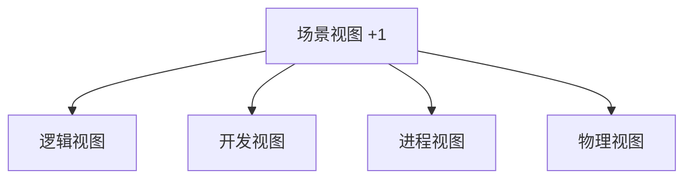

---

## 5.2 逻辑视图

### 5.2.1 逻辑分层

SIM 子系统逻辑上可划分为六层：

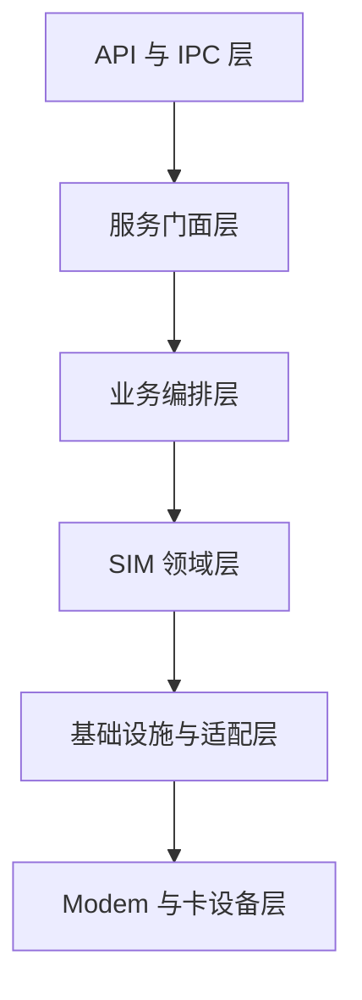

| 层次 | 主要组件 | 职责 |
|---|---|---|
| API 与 IPC 层 | JS/ANI API、CoreService Proxy/Stub、eSIM IDL | 跨进程接口、参数序列化 |
| 服务门面层 | `CoreService`、`CoreServiceSim` | 权限校验、异步调度、统一服务入口 |
| 业务编排层 | `SimManager`、`EsimManager` | 路由 SIM/eSIM 业务 |
| SIM 领域层 | 状态、文件、多卡、电话簿、短信、STK、运营商配置 | 实现核心业务规则 |
| 基础设施与适配层 | `TelRilManager`、DataShare、State Registry、Common Event、Extension Wrapper | 外部服务和硬件适配 |
| 设备层 | RIL Adapter、Modem、UICC/eUICC | 实际卡设备操作 |

### 5.2.2 核心逻辑组件

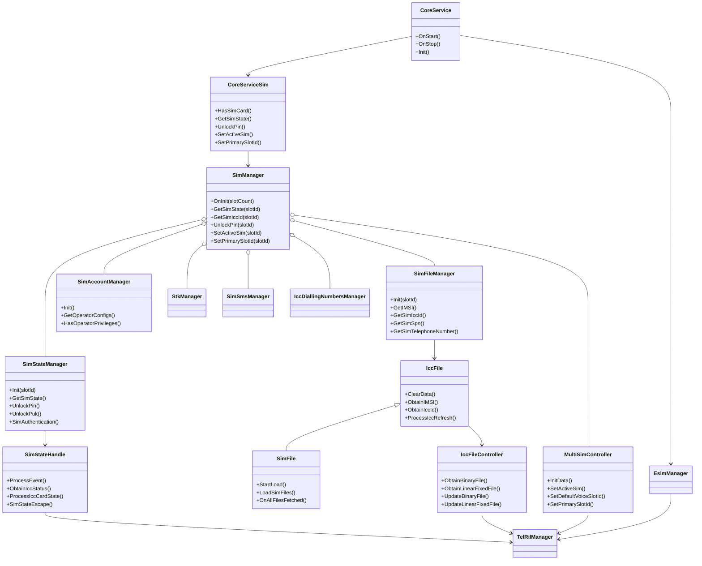

### 5.2.3 每卡槽聚合

每个卡槽构成一个逻辑 Slot Context：

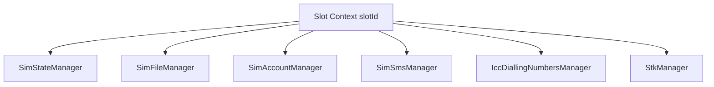

当前源码中没有显式 `SlotContext` 类，而是由 `SimManager` 中多个相同下标的 vector 隐式表达：

```text
simStateManager_[slotId]
simFileManager_[slotId]
simAccountManager_[slotId]
simSmsManager_[slotId]
iccDiallingNumbersManager_[slotId]
stkManager_[slotId]
```

这种设计实现了卡槽隔离，但存在数组下标一致性依赖。后续可引入显式 `SimSlotContext`，将同一卡槽的管理对象聚合到单个结构中。

### 5.2.4 全局协调对象

以下对象跨卡槽工作：

- `MultiSimController`
- `MultiSimMonitor`
- `RadioProtocolController`
- `SimRdbHelper`
- `OperatorConfigHisysevent`

它们负责：

- 卡槽间账户一致性；
- 默认卡唯一性；
- 主卡和 Modem 映射；
- 多卡初始化次序；
- SIM 账户数据库；
- 运营商配置匹配诊断。

### 5.2.5 领域边界

| 领域 | 主要职责 | 核心对象 |
|---|---|---|
| SIM 状态领域 | 卡状态、卡类型、锁原因 | `SimStateManager`、`SimStateHandle` |
| UICC 文件领域 | 文件加载、缓存、解析 | `SimFileManager`、`IccFile`、`IccFileController` |
| 安全领域 | PIN、PUK、锁、鉴权 | `SimStateManager`、`SimStateHandle` |
| 账户领域 | SIM ID、slot、默认卡、主卡 | `MultiSimController`、`SimRdbHelper` |
| 运营商配置领域 | opkey 和运营商配置 | `SimAccountManager`、`OperatorConfigLoader` |
| 电话簿领域 | ADN、FDN、SDN、PBR | `IccDiallingNumbersManager` |
| SIM 短信领域 | ICC 短信读写 | `SimSmsManager` |
| STK 领域 | Proactive Command 和 Refresh | `StkController` |
| eSIM 领域 | eUICC Profile 和 APDU | `EsimManager`、`EsimFile` |

---

## 5.3 开发视图

### 5.3.1 源码目录组织

```text
telephony_core_service/
├── BUILD.gn
├── bundle.json
├── telephony_core_service.gni
├── sa_profile/
├── interfaces/
│   ├── innerkits/
│   └── kits/
├── frameworks/
│   ├── native/
│   ├── js/
│   │   ├── sim/
│   │   └── esim/
│   └── ets/ani/
│       ├── sim/
│       └── esim/
├── services/
│   ├── core/
│   ├── sim/
│   │   ├── include/
│   │   ├── src/
│   │   └── test/
│   └── tel_ril/
├── utils/
└── test/
    ├── unittest/
    ├── fuzztest/
    ├── mock/
    └── guard/
```

### 5.3.2 开发模块关系

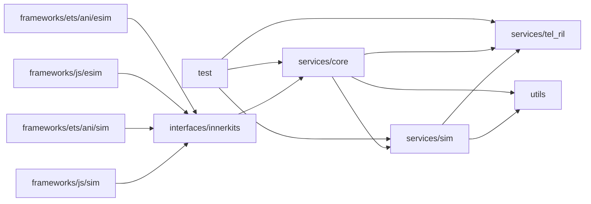

### 5.3.3 关键源文件

| 主题 | 文件 |
|---|---|
| SA 启动 | `services/core/src/core_service.cpp` |
| SIM 服务门面 | `services/core/src/core_service_sim.cpp` |
| IPC Stub | `services/core/src/core_service_stub.cpp` |
| SIM 总入口 | `services/sim/src/sim_manager.cpp` |
| SIM 状态同步接口 | `services/sim/src/sim_state_manager.cpp` |
| SIM 状态事件处理 | `services/sim/src/sim_state_handle.cpp` |
| SIM 文件管理 | `services/sim/src/sim_file_manager.cpp` |
| SIM 文件加载 | `services/sim/src/sim_file.cpp` |
| ICC 文件基类 | `services/sim/src/icc_file.cpp` |
| ICC 文件控制 | `services/sim/src/icc_file_controller.cpp` |
| 多卡控制 | `services/sim/src/multi_sim_controller.cpp` |
| 多卡监听 | `services/sim/src/multi_sim_monitor.cpp` |
| SIM 数据库 | `services/sim/src/sim_rdb_helper.cpp` |
| 运营商配置加载 | `services/sim/src/operator_config_loader.cpp` |
| 运营商配置缓存 | `services/sim/src/operator_config_cache.cpp` |
| 电话簿 | `services/sim/src/icc_dialling_numbers_manager.cpp` |
| USIM 电话簿 | `services/sim/src/usim_dialling_numbers_service.cpp` |
| SIM 短信 | `services/sim/src/sim_sms_controller.cpp` |
| STK | `services/sim/src/stk_controller.cpp` |
| eSIM | `services/sim/src/esim_manager.cpp`、`esim_file.cpp` |
| Native SIM 接口 | `interfaces/innerkits/include/i_sim_manager.h` |
| eSIM IDL | `interfaces/innerkits/IEsimService.idl` |
| 状态类型 | `interfaces/innerkits/include/sim_state_type.h` |

### 5.3.4 构建单元

主要构建目标：

| 构建目标 | 说明 |
|---|---|
| `tel_core_service` | Telephony Core Service 主服务 |
| `interfaces/innerkits:tel_core_service_api` | Native 内部 API |
| `frameworks/js/sim:sim` | JS SIM 模块 |
| `frameworks/js/esim:esim` | JS eSIM 模块 |
| `frameworks/ets/ani/sim:sim_ani_group` | ArkTS SIM ANI |
| `frameworks/ets/ani/esim:esim_ani_group` | ArkTS eSIM ANI |
| `sa_profile:core_service_sa_profile` | SA 配置 |
| `test:unittest` | 单元测试 |
| `test/fuzztest:fuzztest` | 模糊测试 |

### 5.3.5 编译期变体

`telephony_core_service.gni` 定义：

| 编译开关 | 作用 |
|---|---|
| `core_service_support_esim` | 编译 eSIM |
| `core_service_satellite` | 编译卫星交互 |
| `core_service_low_power_class_2` | 低功耗变体 |
| `telephony_telephony_enhanced` | 增强 Telephony 和 VSim |
| `is_double_framework` | 双 Framework 变体 |
| `build_public_version` | 公共版本接口控制 |

eSIM 默认关闭。启用后定义：

```text
CORE_SERVICE_SUPPORT_ESIM
```

并加入 eSIM Manager、文件、控制器、IDL、JS/ANI 和 ASN.1/APDU 工具。

### 5.3.6 开发依赖原则

推荐遵循：

1. Framework 只能依赖 InnerKit，不直接依赖 `services/sim`；
2. `services/core` 作为 IPC 和权限边界；
3. `services/sim` 不应依赖上层 JS/ANI；
4. SIM 领域通过 `ITelRilManager` 访问 RIL；
5. 卡账户持久化应通过 Repository/Helper 抽象；
6. 产品扩展只能通过明确扩展接口进入，不应直接修改核心状态。

---

## 5.4 进程视图

### 5.4.1 进程内执行单元

SIM 子系统主要运行于 `telephony` 进程，但内部存在多种执行上下文：

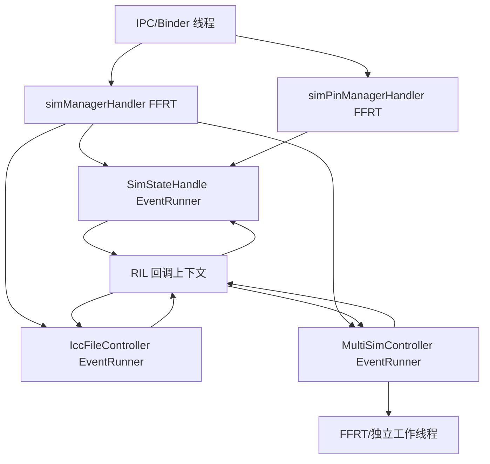

### 5.4.2 主要线程与队列

| 执行上下文 | 主要任务 |
|---|---|
| Binder/IPC 线程 | 接收请求、反序列化、权限校验 |
| `simManagerHandler` | 普通 SIM 异步操作 |
| `simPinManagerHandler` | PIN/PUK 等安全操作 |
| `SimStateHandle` | RIL 状态和安全命令响应 |
| `IccFileController` | SIM_IO 响应和 EF 文件读写 |
| `MultiSimController` | 主卡、激活、重试和超时 |
| FFRT Worker | 异步状态刷新、缓存更新 |
| 独立线程 | 部分主卡切换和电话簿缓存刷新 |

### 5.4.3 同步与异步边界

#### 对外异步

部分 IPC 请求通过 `IRawParcelCallback` 异步返回：

```text
IPC Request
  -> CoreServiceSim::AsyncSimGeneralExecute()
  -> SimManager
  -> callback->Transfer()
```

这样可以避免 Binder 线程直接执行较慢的 SIM 操作。

#### 内部异步

所有 RIL 请求本质上是异步的：

```text
创建 InnerEvent
  -> TelRilManager 请求
  -> RIL Adapter
  -> Modem
  -> RIL 回调
  -> InnerEvent 投递
  -> ProcessEvent
```

#### 同步封装

PIN、PUK、SIM 鉴权和部分 SIM_IO 使用条件变量，将异步 RIL 请求包装为同步领域接口。

### 5.4.4 同步等待模型

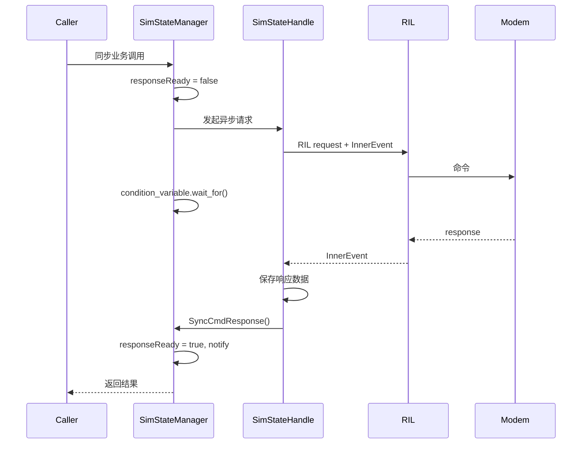

### 5.4.5 并发控制

主要锁包括：

| 锁类型 | 保护对象 |
|---|---|
| `ffrt::shared_mutex` | 管理器数组、SIM 账户缓存、SIM 文件缓存 |
| `ffrt::mutex` | 激活流程、主卡流程、数据库写入 |
| `std::mutex` | 状态管理器、Handler 初始化、同步响应 |
| `condition_variable` | RIL 命令同步等待 |
| 原子或状态标志 | 操作是否进行中、是否初始化完成 |

### 5.4.6 进程视图风险

1. 多个请求共享响应字段，可能发生并发覆盖；
2. detached thread 无法随服务停止统一取消；
3. 多锁嵌套缺少统一锁顺序说明；
4. 持锁执行数据库或扩展回调可能扩大临界区；
5. 主卡切换和激活操作之间存在相互等待；
6. RIL 回调过迟到达时，可能对应已超时的调用。

### 5.4.7 建议的进程模型改进

为每个 RIL 操作建立独立上下文：

```cpp
struct SimOperationContext {
    uint64_t requestId;
    int32_t slotId;
    SimOperationType type;
    std::promise<SimOperationResult> promise;
    std::chrono::steady_clock::time_point deadline;
    std::atomic_bool completed;
};
```

通过 `requestId` 匹配响应，并在超时后拒绝迟到响应。

---

## 5.5 物理视图

### 5.5.1 部署拓扑

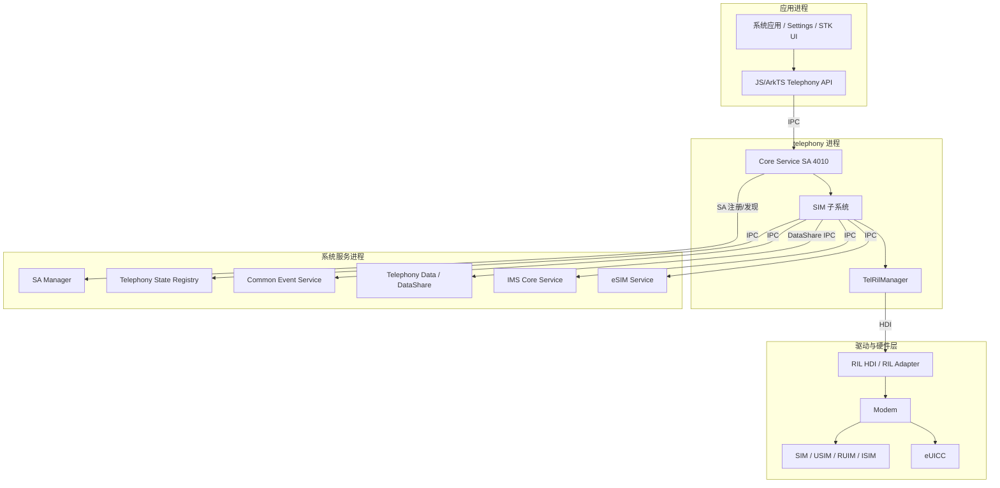

### 5.5.2 部署单元

| 部署单元 | 位置 | 说明 |
|---|---|---|
| `libtel_core_service.z.so` | `telephony` 进程 | 包含 Core、SIM、RIL 管理逻辑 |
| SA 4010 | `telephony` 进程 | Core Service 系统能力 |
| SIM JS/ANI 模块 | 应用 Framework | 供系统应用调用 |
| eSIM JS/ANI 模块 | 应用 Framework | 编译开关控制 |
| RIL Adapter/HDI | 驱动服务 | 芯片和 Modem 适配 |
| UICC/eUICC | 物理设备 | 卡文件和安全应用载体 |

### 5.5.3 SA 配置

`sa_profile/4010.json`：

```json
{
  "process": "telephony",
  "systemability": [
    {
      "name": 4010,
      "libpath": "libtel_core_service.z.so",
      "run-on-create": true,
      "distributed": false,
      "dump_level": 1,
      "min_hdi_proxy_version": [
        "libril_proxy_1.1.z.so"
      ]
    }
  ]
}
```

### 5.5.4 物理卡槽模型

逻辑 slot 不一定一一对应物理卡座：

- 物理 pSIM 卡槽；
- eSIM eUICC；
- eSIM MEP Port；
- VSim；
- 卫星卡；
- 保留业务卡槽；
- Modem 逻辑槽位。

因此代码同时维护：

- slot ID；
- SIM ID；
- Modem ID；
- SIM Label；
- eSIM Profile ID；
- ICCID；
- Radio Protocol 映射。

### 5.5.5 物理视图约束

1. RIL HDI 至少满足 `libril_proxy_1.1.z.so`；
2. 无 Modem 或 SIM 硬件时部分 API只能返回无卡；
3. eSIM 依赖编译开关、eUICC 和外部 eSIM Service；
4. 多卡能力由设备配置和 `MultiSimsCapabilityMgr` 决定；
5. 主卡切换能力取决于 RIL/Modem；
6. 物理槽位与逻辑 slot 映射期间，SIM 状态可能暂时不可靠。

---

## 5.6 场景视图（+1）

场景视图使用关键业务流程验证前述四个架构视图是否相互一致。

### 5.6.1 场景一：服务启动和 SIM 初始化

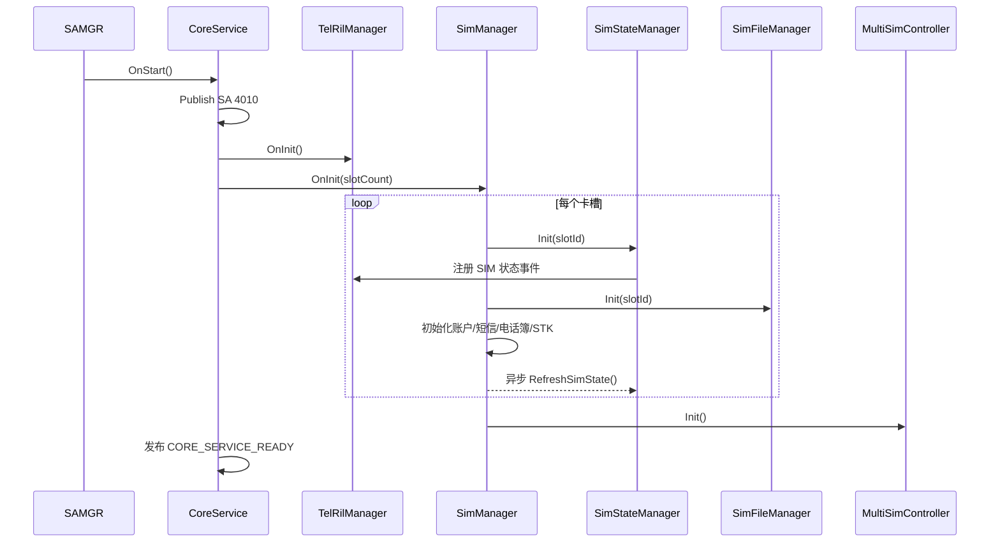

对应视图：

- 逻辑视图：Core、SimManager、Slot Context；
- 开发视图：`core_service.cpp`、`sim_manager.cpp`；
- 进程视图：SA 启动线程、FFRT 异步刷新；
- 物理视图：`telephony` 进程、SA Manager、RIL HDI。

### 5.6.2 场景二：插入 SIM 并完成文件加载

```mermaid
sequenceDiagram
    participant Modem
    participant RIL
    participant State as SimStateHandle
    participant File as SimFile
    participant FC as IccFileController
    participant Registry
    participant Event as Common Event
    participant Multi as MultiSimController

    Modem-->>RIL: SIM state changed
    RIL-->>State: RADIO_SIM_STATE_CHANGE
    State->>RIL: GetSimStatus()
    RIL-->>State: ICC_CONTENT_READY + card type + ICCID
    State->>State: 转换为 SIM_STATE_READY
    State->>Registry: UpdateSimState(READY)
    State->>Event: SIM_STATE_CHANGED
    State-->>File: RADIO_SIM_STATE_READY

    File->>File: LoadSimFiles()
    loop SIM EF
        File->>FC: 读取文件
        FC->>RIL: GetSimIO()
        RIL->>Modem: SIM_IO
        Modem-->>RIL: 文件数据
        RIL-->>FC: 回调
        FC-->>File: 文件结果
    end

    File->>File: OnAllFilesFetched()
    File->>Registry: UpdateSimState(LOADED)
    File->>Event: ICC_STATE_LOADED
    File-->>Multi: SIM records loaded
    Multi->>Multi: 初始化 SIM 账户
```

### 5.6.3 场景三：拔出 SIM

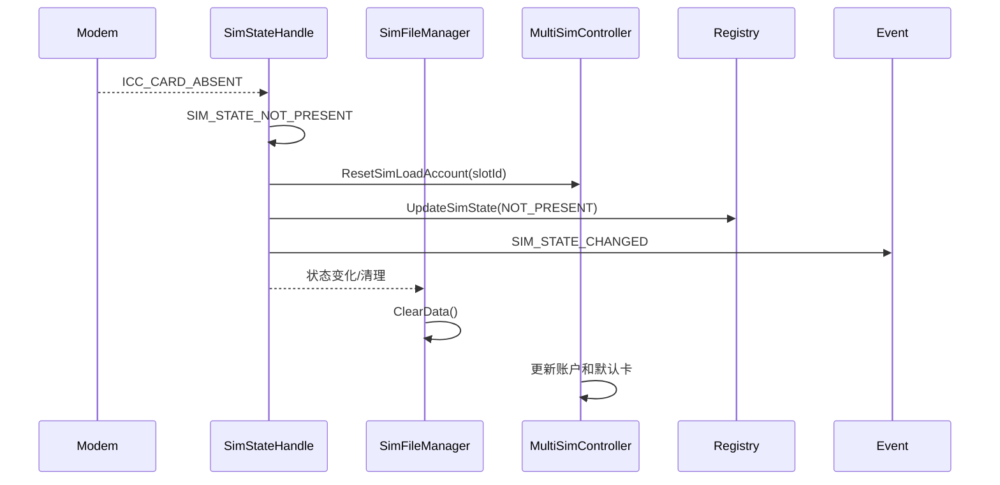

### 5.6.4 场景四：PIN 解锁

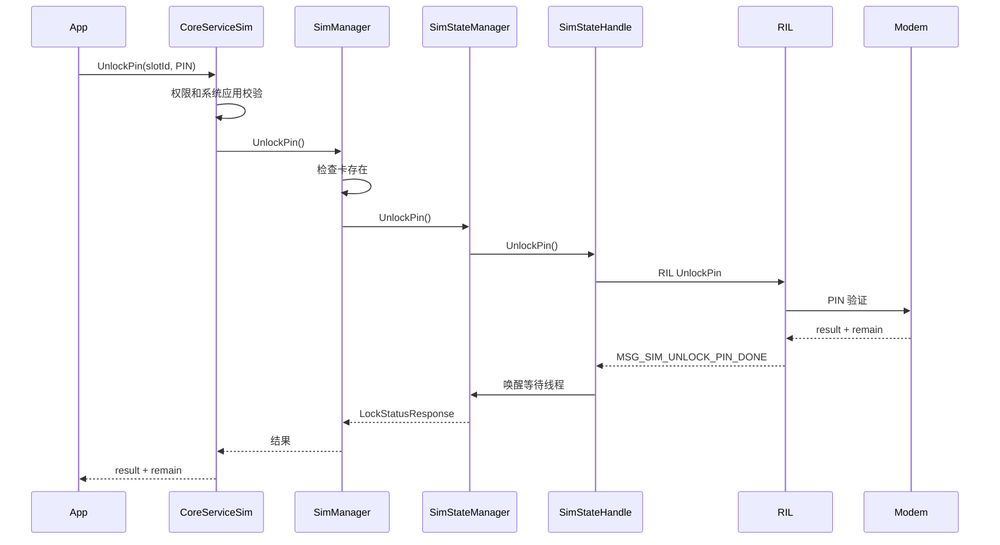

### 5.6.5 场景五：主卡切换

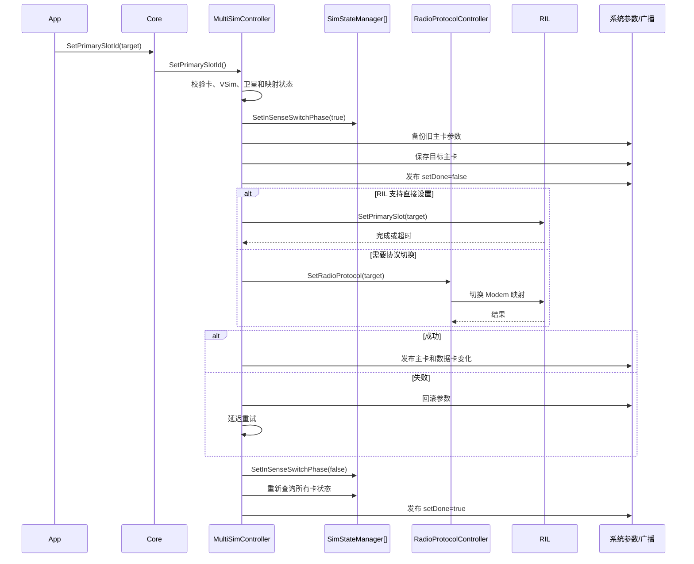

### 5.6.6 场景六：运营商配置加载

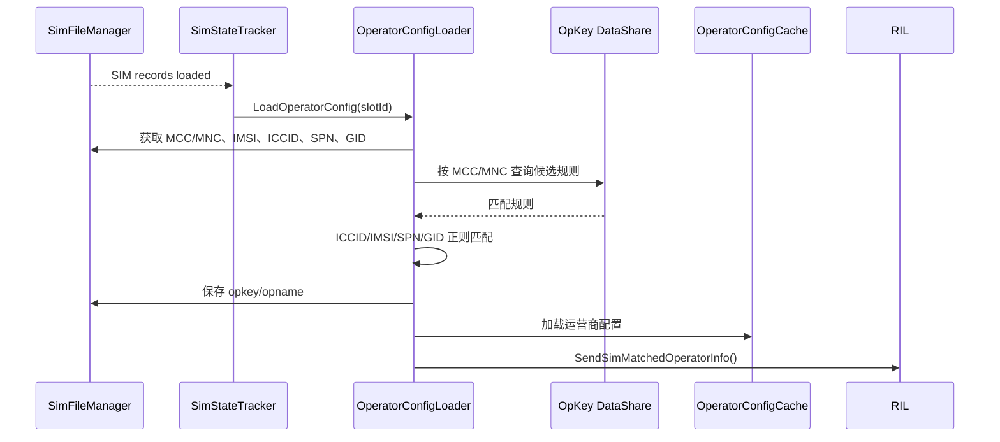

### 5.6.7 场景七：eSIM Profile 下载

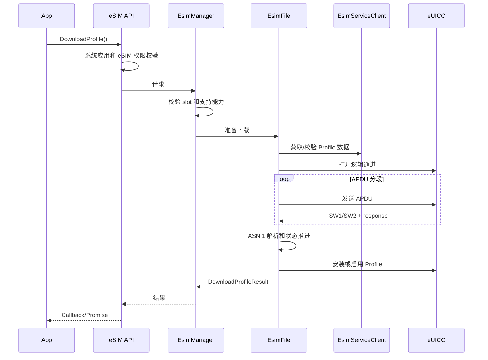

### 5.6.8 场景八：进程或外部服务异常恢复

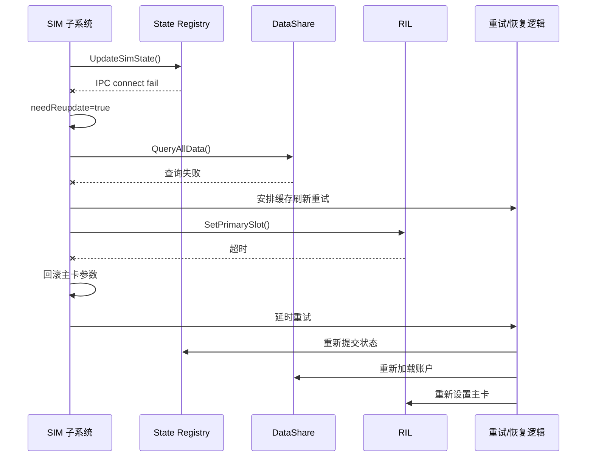

---

## 5.7 4+1 视图间映射

| 业务能力 | 逻辑组件 | 源码模块 | 执行上下文 | 部署依赖 |
|---|---|---|---|---|
| SIM 状态 | `SimStateManager`、`SimStateHandle` | `services/sim/src/sim_state_*` | EventRunner、RIL 回调 | RIL HDI、State Registry |
| SIM 文件 | `SimFileManager`、`IccFileController` | `services/sim/src/*file*` | 文件 EventRunner | Modem/UICC |
| PIN/PUK | `SimStateManager` | `sim_state_manager.cpp` | PIN Handler、条件变量 | RIL/Modem |
| 多卡账户 | `MultiSimController` | `multi_sim_controller.cpp` | MultiSim EventRunner | DataShare |
| 主卡切换 | `MultiSimController`、`RadioProtocolController` | 多卡和协议控制源码 | 工作线程、超时事件 | RIL/Modem |
| 运营商配置 | `SimAccountManager`、`OperatorConfigLoader` | `operator_config_*` | FFRT/EventHandler | DataShare、Config Policy |
| STK | `StkController` | `stk_controller.cpp` | EventRunner | RIL、Common Event |
| eSIM | `EsimManager`、`EsimFile` | `esim_*` | eSIM 回调和 APDU 状态机 | eSIM Service、eUICC |

---

# 6. System Ability 与服务初始化

## 6.1 System Ability

Core Service 注册为 SA 4010：

| 属性 | 值 |
|---|---|
| 进程 | `telephony` |
| 动态库 | `libtel_core_service.z.so` |
| 启动方式 | `run-on-create` |
| 分布式 | 否 |
| 最低 RIL HDI | `libril_proxy_1.1.z.so` |

## 6.2 启动顺序

1. `CoreService::OnStart()`；
2. 发布 SA；
3. 设置 FFRT Worker 数量；
4. 初始化 `TelRilManager`；
5. 可选初始化 `EsimManager`；
6. 初始化 `SimManager`；
7. 创建每卡槽对象；
8. 创建 `MultiSimController` 和 `MultiSimMonitor`；
9. 初始化 Network Search；
10. 发布 `CORE_SERVICE_READY`。

## 6.3 每卡槽对象初始化

`SimManager::InitBaseManager(slotId)` 创建：

- `SimStateManager`
- `SimFileManager`
- `SimAccountManager`

随后创建：

- `SimSmsManager`
- `IccDiallingNumbersManager`
- `StkManager`

并异步调用：

```text
SimStateManager::RefreshSimState(slotId)
```

---

# 7. SIM 状态管理设计

## 7.1 公共状态

```text
SIM_STATE_UNKNOWN
SIM_STATE_NOT_PRESENT
SIM_STATE_LOCKED
SIM_STATE_NOT_READY
SIM_STATE_READY
SIM_STATE_LOADED
```

## 7.2 底层状态

主要底层状态：

```text
ICC_CARD_ABSENT
ICC_CONTENT_READY
ICC_CONTENT_PIN
ICC_CONTENT_PUK
ICC_CONTENT_PIN2
ICC_CONTENT_PUK2
ICC_CONTENT_PH_NET_PIN
ICC_CONTENT_PH_NET_PUK
ICC_CONTENT_PH_NET_SUB_PIN
ICC_CONTENT_PH_NET_SUB_PUK
ICC_CONTENT_PH_SP_PIN
ICC_CONTENT_PH_SP_PUK
ICC_CONTENT_UNKNOWN
```

## 7.3 状态转换

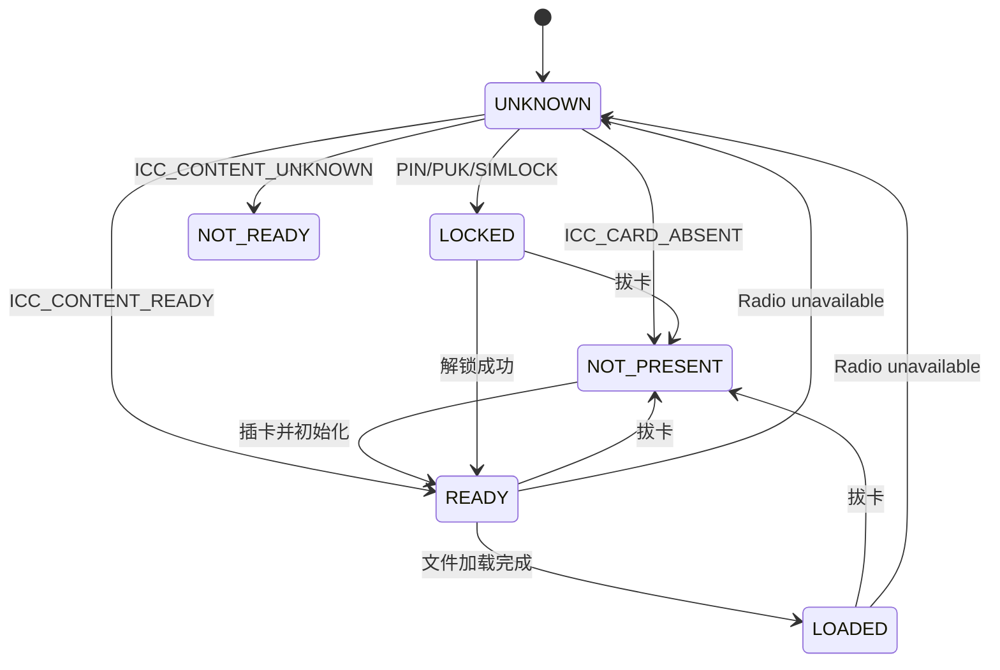

## 7.4 状态发布

状态发布到：

1. `ObserverHandler`；
2. Telephony State Registry；
3. Common Event；
4. HiSysEvent；
5. Telephony Extension。

State Registry IPC 失败时，`needReupdate_` 会记录需要重新提交。

---

# 8. PIN、PUK 与锁管理

## 8.1 支持能力

- PIN/PIN2；
- PUK/PUK2；
- 修改 PIN/PIN2；
- PIN Lock；
- FDN Lock；
- 网络个性化锁；
- 查询锁状态；
- 剩余尝试次数。

## 8.2 RIL 事件

| 操作 | 响应事件 |
|---|---|
| PIN | `MSG_SIM_UNLOCK_PIN_DONE` |
| PUK | `MSG_SIM_UNLOCK_PUK_DONE` |
| 修改 PIN | `MSG_SIM_CHANGE_PIN_DONE` |
| PIN2 | `MSG_SIM_UNLOCK_PIN2_DONE` |
| PUK2 | `MSG_SIM_UNLOCK_PUK2_DONE` |
| 修改 PIN2 | `MSG_SIM_CHANGE_PIN2_DONE` |
| 设置锁 | `MSG_SIM_ENABLE_PIN_DONE` |
| 查询锁 | `MSG_SIM_CHECK_PIN_DONE` |
| SIM Lock | `MSG_SIM_UNLOCK_SIMLOCK_DONE` |

## 8.3 超时

- 普通同步等待约 3 秒；
- 长操作约 20 秒；
- 超时返回 SIM 更新失败或 RIL 命令失败。

## 8.4 安全注意事项

- PIN/PUK 不得写入日志；
- PIN 缓存仅通过产品安全扩展实现；
- 迟到的 RIL 响应应通过 request ID 丢弃；
- 同一卡槽的安全操作应串行化。

---

# 9. SIM 文件子系统

## 9.1 主要对象

| 对象 | 职责 |
|---|---|
| `SimFileManager` | 文件对象创建和缓存查询 |
| `IccFile` | 公共 SIM 文件状态和数据模型 |
| `SimFile` | SIM/USIM 文件加载与解析 |
| `RuimFile` | RUIM/CSIM 文件 |
| `IsimFile` | ISIM 文件 |
| `IccFileController` | SIM_IO 命令 |
| 卡型 FileController | 文件路径适配 |

## 9.2 文件结构

支持路径：

| 路径 | 含义 |
|---|---|
| `3F00` | MF |
| `7F10` | DF TELECOM |
| `7F20` | DF GSM |
| `5F50` | DF GRAPHICS |
| `5F3A` | DF PHONEBOOK |
| `5FC0` | DF 5GS |
| `7FFF` | ADF |

## 9.3 文件操作

透明 EF：

- GET RESPONSE；
- READ BINARY；
- UPDATE BINARY。

线性定长 EF：

- GET RESPONSE；
- READ RECORD；
- READ ALL RECORDS；
- UPDATE RECORD；
- SEEK 无效记录。

## 9.4 主要加载内容

- ICCID；
- IMSI；
- AD/MNC 长度；
- SPN；
- GID1/GID2；
- MSISDN；
- MBDN；
- MWIS；
- CFIS/CFF；
- LI/PL；
- PNN/OPL；
- EHPLMN；
- SPDI；
- CSP；
- 短信参数；
- USIM 电话簿 PBR。

## 9.5 文件完成状态

`fileToGet_` 用作未完成请求计数。

完成条件主要为：

```text
SIM state >= READY
fileToGet_ == 0
fileQueried_ == true
```

完成后：

- 更新语言；
- 设置 `loaded_`；
- 发布 `RADIO_SIM_RECORDS_LOADED`；
- 更新状态为 `SIM_STATE_LOADED`；
- 发布 Common Event；
- 加载语音信箱；
- 调用扩展。

## 9.6 SIM Refresh

刷新策略：

- 已知单个文件：增量读取；
- 影响范围不明确：清除缓存并完整重载；
- 运营商关键文件变化：删除运营商缓存；
- slot mapping 期间：避免使用不可靠文件数据。

---

# 10. 多卡账户设计

## 10.1 账户数据

| 字段 | 说明 |
|---|---|
| `simId` | 持久化账户 ID |
| `slotIndex` | 当前逻辑卡槽 |
| `iccId` | ICCID |
| `cardId` | 当前通常等于 ICCID |
| `isActive` | 激活状态 |
| `isEsim` | eSIM 标志 |
| `simLabelIndex` | SIM 标签 |
| `showName` | 显示名称 |
| `phoneNumber` | 显示号码 |
| `operatorName` | 运营商名称 |
| `isMainCard` | 主卡 |
| `isVoiceCard` | 默认语音卡 |
| `isMessageCard` | 默认短信卡 |
| `isCellularDataCard` | 默认数据卡 |
| `imsSwitch` | IMS 开关 |

## 10.2 缓存

- `localCacheInfo_`：按当前 slot 排列；
- `allLocalCacheInfo_`：全部账户和历史 eSIM Profile。

## 10.3 新卡和历史卡

按 ICCID 查询数据库：

- 已存在：更新 slot、标签、激活状态；
- 不存在：新增 SIM 账户；
- ICCID 暂不可用：使用临时 `emptyiccid{slotId}`；
- eSIM Profile 可在不激活时保留历史账户。

## 10.4 默认卡

支持：

- 默认语音卡；
- 默认短信卡；
- 默认数据卡；
- 主卡。

设置后同步：

- 数据库；
- 本地缓存；
- 系统参数；
- Common Event；
- SIM Account Callback。

## 10.5 ICCID 保护

主卡系统参数保存：

```text
SHA256(ICCID)
```

而不是明文 ICCID。

---

# 11. 主卡与激活流程

## 11.1 SIM 激活

步骤：

1. 检查卡或 eSIM Profile；
2. 获取 SIM ID；
3. 标记操作进行中；
4. 等待主卡切换完成；
5. 向 RIL 设置激活状态；
6. 更新缓存；
7. 更新数据库；
8. 调用扩展；
9. 重新评估主卡；
10. 发布账户变化。

## 11.2 主卡切换模式

### 模式一：协议切换

使用：

```text
RadioProtocolController::SetRadioProtocol()
```

适用于需要调整 Modem 协议和卡槽映射的设备。

### 模式二：RIL 直接设置

当参数：

```text
const.vendor.ril.set_primary_slot_support=true
```

使用：

```text
TelRilManager::SetPrimarySlot()
```

最长等待约 45 秒。

## 11.3 可靠性机制

- 切换前备份旧参数；
- 失败回滚；
- 最多 5 次重试；
- 切换期间设置 `inSenseSwitchPhase`；
- 切换完成后重新获取所有 SIM 状态；
- 等待所有 Modem 和卡准备完成。

---

# 12. 运营商配置

## 12.1 匹配输入

- MCC/MNC；
- ICCID；
- IMSI；
- SPN；
- GID1；
- GID2。

## 12.2 处理流程

1. SIM Records Loaded；
2. 查询 MCC/MNC 候选规则；
3. 进行 ICCID、IMSI、SPN、GID 匹配；
4. 生成 opkey、opname、opkeyExt；
5. 保存到 `SimFileManager` 和系统参数；
6. 加载运营商配置；
7. 更新缓存；
8. 把匹配结果传递给 RIL；
9. 上报 HiSysEvent。

## 12.3 外部数据源

```text
datashare:///com.ohos.opkeyability
datashare:///com.ohos.opkeyability/opkey/opkey_info
datashare:///com.ohos.simability/sim/sim_info
```

## 12.4 配置扩展

支持：

- 漫游代理 MCC/MNC；
- 配置版本检查；
- opkey 数据库更新；
- 目标 opkey 定制；
- 语音信箱定制；
- 海外运营商识别。

---

# 13. SIM 鉴权与原始 IO

## 13.1 鉴权类型

- EAP-SIM；
- EAP-AKA。

## 13.2 AID 选择

| 卡类型 | AID |
|---|---|
| RUIM | `CDMA_FAKE_AID` |
| SIM 和部分双模卡 | `GSM_FAKE_AID` |
| USIM/默认 | `USIM_AID` |

## 13.3 返回值

- `SW1`
- `SW2`
- `response`

## 13.4 原始 SIM IO

`GetSimIO()` 从输入数据中解析：

- P1；
- P2；
- P3；
- Command；
- File ID；
- Data；
- Path。

原始 SIM IO 应限制为系统接口，并严格校验长度、命令和文件范围。

---

# 14. SIM 电话簿、短信和语音信箱

## 14.1 电话簿

支持：

- ADN；
- FDN；
- SDN；
- MSISDN；
- MBDN；
- USIM PBR；
- EMAIL；
- ANR；
- EXT。

操作：

- 查询；
- 新增；
- 删除；
- 更新。

## 14.2 SIM 短信

支持：

- 添加短信；
- 更新短信；
- 删除短信；
- 获取全部短信；
- 标记已读；
- 处理 SIM 新短信通知。

## 14.3 语音信箱

语音信箱数据来源：

1. EF MBDN；
2. CPHS Mailbox；
3. 运营商配置；
4. Telephony Extension。

支持：

- 号码；
- 标签；
- 未读数量；
- 固定号码标志；
- 更新 SIM 文件。

---

# 15. STK 设计

## 15.1 主要能力

- Envelope；
- Terminal Response；
- Call Setup Result；
- Proactive Command；
- Session End；
- SIM Refresh；
- STK Extension Ability；
- BIP 扩展。

## 15.2 可靠性

- STK 命令等待约 2 秒；
- Bundle 未就绪时延迟重试；
- SIM Refresh 驱动文件重载；
- eSIM 场景支持延迟关闭相关会话；
- 部分命令允许厂商扩展拦截。

---

# 16. eSIM 设计

## 16.1 构建控制

eSIM 默认关闭：

```text
core_service_support_esim = false
```

启用后定义：

```text
CORE_SERVICE_SUPPORT_ESIM
```

## 16.2 主要组件

| 组件 | 职责 |
|---|---|
| `EsimManager` | eSIM 业务门面 |
| `EsimFile` | eUICC/APDU/Profile 操作 |
| `EsimController` | eSIM 状态协调 |
| `IEsimService.idl` | 专用 IPC |
| `EsimServiceClient` | 外部 eSIM Service |
| ASN.1/APDU 工具 | eSIM 协议编码 |

## 16.3 功能

- EID；
- eUICC Info；
- Profile List；
- Profile 查询；
- 下载；
- 切换；
- 启用/停用；
- 删除；
- Nickname；
- SM-DP+/SM-DS 地址；
- Challenge；
- Rules Authorization Table；
- Cancel Session；
- Reset Memory；
- APDU；
- OSU。

## 16.4 MEP

支持：

- 多 Profile；
- eSIM Label；
- Port Index；
- 最近停用 Profile；
- pSIM/eSIM 电路映射；
- MEP 能力参数。

---

# 17. 扩展机制

## 17.1 编译期扩展

通过 GN Feature 控制 eSIM、卫星、VSim 和产品变体。

## 17.2 运行时扩展

`TELEPHONY_EXT_WRAPPER` 提供：

- slot/SIM ID 映射；
- VSim；
- 热插拔；
- PIN 资产；
- 主卡切换；
- 运营商配置；
- 漫游代理；
- 语音信箱；
- STK/BIP；
- eSIM 切换通知；
- 卡标签；
- 实际卡槽数。

## 17.3 观察者扩展

内部模块可订阅：

- SIM 状态变化；
- SIM READY；
- SIM LOCKED；
- SIMLOCK；
- ICCID；
- IMSI；
- Records Loaded；
- Account Loaded；
- eSIM 切换事件。

## 17.4 卡型扩展

新增卡型需要：

1. 增加 `CardType`；
2. 增加 RIL 类型映射；
3. 新增文件对象和控制器；
4. 注册到 `SimFileManager` 工厂；
5. 增加 EF 路径；
6. 补充测试。

## 17.5 扩展改进建议

将函数指针 Wrapper 重构为版本化接口：

```text
ISimSecurityExtension
IMultiSimExtension
IOperatorConfigExtension
IStkExtension
IEsimExtension
IVsimExtension
```

---

# 18. IPC 与 API

## 18.1 接口层次

```text
JS/ArkTS API
    -> Native Core Service Client
        -> CoreService Proxy
            -> CoreService Stub
                -> CoreService/CoreServiceSim
                    -> SimManager/EsimManager
```

## 18.2 API 分类

| 分类 | 示例 |
|---|---|
| 状态 | `getSimState`、`hasSimCard`、`getCardType` |
| 标识 | ICCID、IMSI、GID、SPN、MCC/MNC |
| 账户 | 默认卡、激活、名称、号码、标签 |
| 安全 | PIN、PUK、Lock、Authentication |
| 文件业务 | 电话簿、语音信箱、SIM IO |
| STK | Envelope、Terminal Response |
| eSIM | EID、Profile、APDU、下载和切换 |

## 18.3 接口演进原则

- Parcel 字段尾部追加；
- 结构体增加版本号；
- 新能力提供 Capability 查询；
- eSIM 与普通 SIM 保持接口隔离；
- 建立稳定业务错误码；
- 敏感数据接口必须明确权限。

---

# 19. 事件模型

## 19.1 内部事件

- `RADIO_SIM_STATE_CHANGE`
- `RADIO_SIM_STATE_READY`
- `RADIO_SIM_STATE_LOCKED`
- `RADIO_SIM_STATE_SIMLOCK`
- `RADIO_SIM_ICCID_LOADED`
- `RADIO_IMSI_LOADED_READY`
- `RADIO_SIM_RECORDS_LOADED`
- `RADIO_SIM_ACCOUNT_LOADED`
- `RADIO_CARD_TYPE_CHANGE`
- `RADIO_ESIM_SWITCH_*`

## 19.2 公共事件

- SIM 状态变化；
- 默认语音 SIM 变化；
- 默认短信 SIM 变化；
- 默认数据 SIM 变化；
- 主卡设置状态；
- Core Service Ready。

## 19.3 事件一致性

同一状态可能同时发布到：

- Observer；
- State Registry；
- Common Event；
- Callback；
- HiSysEvent。

建议建立统一事件对象：

```cpp
struct SimDomainEvent {
    uint64_t sequence;
    int32_t slotId;
    SimEventType type;
    SimState oldState;
    SimState newState;
    LockReason reason;
    std::chrono::system_clock::time_point timestamp;
};
```

以保证事件顺序和可追踪性。

---

# 20. 持久化与系统参数

## 20.1 主要系统参数

| 参数 | 用途 |
|---|---|
| `persist.telephony.MainCard.Iccid` | 主卡 ICCID 摘要 |
| `persist.telephony.MainSlotId` | 主卡 slot |
| `persist.telephony.MainCellularDataSlotId` | 默认数据卡 |
| `persist.telephony.userPreferPrimarySlot` | 用户选择主卡 |
| `persist.ril.sim_switch` | pSIM/eSIM 电路状态 |
| `persist.telephony.is_simslots_mapping` | slot mapping 状态 |
| `const.vendor.ril.set_primary_slot_support` | RIL 主卡能力 |
| `const.ril.esim_type` | eSIM 设备类型 |
| `const.ril.sim.esim_support_mep` | MEP 能力 |
| `persist.telephony.last_deactive_profile_slot0/1` | 最近停用 Profile |
| `persist.telephony.voicemail.simimsi` | 语音信箱关联 IMSI |

## 20.2 数据一致性

SIM 账户同时存在于：

- Modem；
- DataShare/RDB；
- 本地缓存；
- 系统参数；
- State Registry。

当前使用更新、重试和回滚保持最终一致，但缺少统一事务。

建议引入：

```text
PENDING
MODEM_APPLIED
DB_COMMITTED
EVENT_PUBLISHED
COMPLETED
ROLLBACK_REQUIRED
```

---

# 21. 安全设计

## 21.1 权限边界

安全校验主要位于 `CoreService` 和 `CoreServiceSim`：

- 系统应用校验；
- Telephony 权限校验；
- slot 能力校验；
- 敏感字段脱敏；
- 参数合法性校验。

## 21.2 敏感数据

包括：

- IMSI；
- ICCID；
- 电话号码；
- PIN/PUK；
- 鉴权数据；
- EID；
- eSIM Profile；
- APDU；
- UICC 运营商特权规则。

## 21.3 已有措施

- Access Token 权限；
- 系统应用限制；
- 无权限时清空 ICCID 和号码；
- ICCID SHA-256；
- PIN 安全扩展；
- 部分日志隐私标签；
- eSIM 独立权限。

## 21.4 风险与建议

部分代码使用 `%{public}s` 输出 SIM 文件原始数据。

建议：

1. EF 原始数据默认 private；
2. ICCID、IMSI、号码只输出摘要；
3. APDU 只输出长度和 SW1/SW2；
4. PIN/PUK 永不输出；
5. 生产版本关闭原始 SIM 数据日志；
6. DataShare 使用最小权限；
7. 对敏感缓存进行及时清除。

---

# 22. 可靠性设计

## 22.1 已有机制

| 机制 | 场景 |
|---|---|
| 条件变量超时 | PIN、PUK、鉴权、SIM IO |
| RIL 超时 | 主卡切换 |
| 有限重试 | 主卡和缓存刷新 |
| 参数回滚 | 主卡切换失败 |
| 状态重查 | 主卡切换完成 |
| State Registry 重提交 | IPC 失败 |
| 文件错误回传 | SIM_IO 失败 |
| 弱指针 | 生命周期管理 |
| HiSysEvent | 故障诊断 |

## 22.2 异常场景

### Radio unavailable

- 设置 Modem 未初始化；
- 卡状态转为 UNKNOWN；
- Radio 恢复后重新获取状态。

### SIM 移除

- 清除卡数据；
- 重置账户；
- 更新状态；
- 发布事件；
- 清理 eSIM 验证状态；
- 调用热插拔扩展。

### DataShare 异常

- 设置错误标记；
- 延迟刷新缓存；
- 恢复后重新查询账户。

### 主卡设置失败

- 回滚系统参数；
- 清除切换状态；
- 延迟重试；
- 发布完成状态。

---

# 23. 构建和部署

## 23.1 组件声明

`bundle.json` 声明：

```text
SystemCapability.Telephony.CoreService
SystemCapability.Telephony.CoreService.Esim
```

Feature：

```text
core_service_support_esim
core_service_low_power_class_2
core_service_satellite
```

## 23.2 主要依赖

- `drivers_interface_ril`
- `eventhandler`
- `ffrt`
- `ipc`
- `samgr`
- `safwk`
- `common_event_service`
- `data_share`
- `telephony_data`
- `config_policy`
- `access_token`
- `hisysevent`
- `openssl`
- `huks`

## 23.3 资源声明

组件声明：

- ROM：约 2 MB；
- RAM：约 5 MB。

实际使用量取决于：

- 卡槽数量；
- 电话簿规模；
- eSIM；
- 运营商配置；
- 日志等级；
- 缓存数量。

---

# 24. 测试设计

## 24.1 测试目录

| 测试类型 | 目录 |
|---|---|
| SIM 功能测试 | `services/sim/test/` |
| SIM 单元测试 | `test/unittest/sim_gtest/` |
| 状态处理测试 | `test/unittest/sim_state_handle_gtest/` |
| ICC 文件测试 | `test/unittest/icc_file_gtest/` |
| 电话簿测试 | `test/unittest/icc_dialling_numbers_handler_gtest/` |
| eSIM 测试 | `test/unittest/esim_gtest/` |
| eSIM Parcel 测试 | `test/unittest/esim_parcel_gtest/` |
| Core Service 测试 | `test/unittest/core_service_gtest/` |
| RIL 测试 | `test/unittest/tel_ril_gtest/` |
| Fuzz | `test/fuzztest/` |

## 24.2 SIM Fuzz 覆盖

包括：

- SIM 状态；
- PIN 解锁；
- SIM 鉴权；
- SIM Manager；
- 默认卡；
- 显示名称和号码；
- 电话簿；
- SIM 短信；
- EONS；
- 语音信箱；
- STK；
- 运营商配置；
- 编解码和反序列化。

## 24.3 建议补充测试

1. 同 slot 并发 PIN 请求；
2. 迟到 RIL 响应；
3. RIL 成功但数据库失败；
4. 主卡切换过程中拔卡；
5. 主卡切换过程中 Radio unavailable；
6. State Registry 重启；
7. SIM 文件部分加载超时；
8. eSIM 下载中进程死亡；
9. MEP 并行 Profile 切换；
10. 扩展回调阻塞或失败；
11. 敏感日志检查；
12. Thread Sanitizer 并发测试；
13. DataShare 晚启动；
14. System Ability 重启；
15. 超长 TLV、EF、号码和 APDU。

---

# 25. 已实现、可选与外部职责

## 25.1 本仓库已实现

- SIM 状态机；
- PIN/PUK；
- SIM Lock；
- SIM_IO；
- SIM/USIM/RUIM/CSIM/ISIM；
- 多卡账户；
- 默认卡和主卡；
- 电话簿；
- SIM 短信；
- STK；
- 运营商配置；
- 运营商特权；
- eSIM 主要框架；
- API、IPC、权限和测试。

## 25.2 可选实现

- eSIM；
- 卫星；
- VSim；
- 产品私有 PIN 资产；
- 产品私有主卡和标签逻辑。

## 25.3 外部组件职责

| 能力 | 组件 |
|---|---|
| 卡硬件通信 | Modem、RIL Adapter |
| 系统状态注册 | State Registry |
| SIM 账户 Provider | Telephony Data |
| IMS 电话号码 | IMS Core Service |
| eSIM 后台服务 | eSIM Service |
| 产品定制 | Telephony Extension |
| UI | Settings、SystemUI、STK 应用 |

---

# 26. 设计优点

1. 每卡槽实例隔离；
2. 统一 `SimManager` 门面；
3. 状态、文件、账户领域相对独立；
4. 完整的事件发布机制；
5. 支持多种卡型；
6. SIM_IO 抽象完整；
7. 多卡持久化能力丰富；
8. eSIM 可按产品裁剪；
9. 支持编译期和运行时扩展；
10. 已有超时、重试和回滚；
11. 单元测试和 Fuzz 类型丰富；
12. 4+1 视图中的逻辑、开发、执行和部署结构能够通过关键业务场景相互验证。

---

# 27. 风险与技术债

## 27.1 `SimManager` 职责过重

同时承担对象创建、校验、路由和扩展处理。

## 27.2 隐式 Slot Context

多个 vector 依靠相同下标关联，容易出现初始化不一致。

## 27.3 共享响应状态

条件变量和共享结果对象不适合并发请求。

## 27.4 多源状态一致性

Modem、数据库、缓存、参数和 State Registry 之间缺少统一事务。

## 27.5 Extension Wrapper 分散

大量可空函数指针不利于类型安全和版本演进。

## 27.6 Detached Thread

部分线程无法统一取消和等待。

## 27.7 敏感日志

部分 SIM 原始数据可能以 public 级别输出。

## 27.8 错误码不统一

混用：

```text
TELEPHONY_ERROR
INVALID_VALUE
TELEPHONY_ERR_*
CORE_ERR_*
RIL ErrType
```

## 27.9 特殊 slot 硬编码

`SIM_SLOT_2`、`SIM_SLOT_3` 存在特殊业务语义。

## 27.10 运营商规则硬编码

部分 PLMN 和 ICCID 前缀应配置化。

## 27.11 可疑空指针判断

`SimManager::GetOverseasCarrierBySimInfo()` 中的判断逻辑需要重点复核：

```cpp
if (simAccountManager_[0] != nullptr) {
    TELEPHONY_LOGE("simAccountManager_[0] is null!");
    return "";
}
return simAccountManager_[0]->GetOverseasCarrierBySimInfo(simCardInfo);
```

该判断可能与预期相反。

---

# 28. 改进建议

## 28.1 P0：正确性和安全

1. 修复可疑空指针判断；
2. 清理敏感 public 日志；
3. 为 RIL 请求加入 request ID；
4. 串行化同 slot 安全操作；
5. 拒绝迟到响应；
6. 对 Modem 成功、数据库失败增加补偿；
7. eSIM/APDU 全面脱敏。

## 28.2 P1：架构改进

引入：

```text
SimSlotContext
SimSecurityService
SimFileService
SimAccountService
SimToolkitService
SimOperationManager
SubscriptionRepository
SimDomainEventBus
VersionedExtensionRegistry
```

## 28.3 P1：并发改进

- detached thread 改为 FFRT TaskScope；
- 建立锁顺序规范；
- 外部回调不得在持锁状态下执行；
- 每请求独立 Future/Promise；
- 支持任务取消和超时。

## 28.4 P1：一致性改进

- 账户缓存增加 generation；
- 主卡切换持久化状态机；
- State Registry 主动重连；
- SIM 文件加载总超时；
- 数据库变更事件携带版本。

## 28.5 P2：可维护性

- 运营商规则配置化；
- 统一错误码；
- 统一系统参数访问器；
- 自动生成权限矩阵；
- 拆分大型源文件；
- 增加架构测试和故障注入。

---

# 29. 建议目标架构

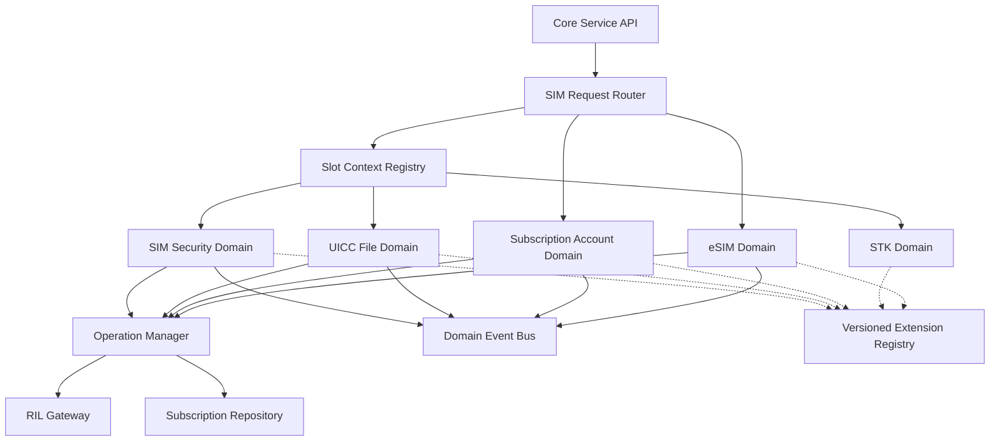

目标架构原则：

1. 显式 `SimSlotContext`；
2. 每个操作唯一 request ID；
3. Modem 和数据库操作受事务协调；
4. 统一领域事件；
5. 版本化扩展接口；
6. Repository 隔离 DataShare；
7. 统一任务生命周期；
8. 统一敏感数据策略；
9. 统一错误码和可观测性。

---

# 30. 架构决策摘要

| 决策 | 当前实现 | 评价 |
|---|---|---|
| SIM 运行在 Core Service SA 中 | 单进程部署 | 降低 IPC，但故障域较大 |
| 每卡槽创建独立管理器 | vector 按 slot 管理 | 隔离良好，但应显式聚合 |
| RIL 使用事件异步返回 | `InnerEvent` | 适合硬件异步操作 |
| 部分 API 同步等待 | 条件变量 | 简单，但并发扩展性有限 |
| 多卡账户使用 DataShare | RDB Helper + Cache | 支持持久化，但需事务补偿 |
| 厂商功能使用 Wrapper | 可空函数指针 | 灵活但类型和版本安全不足 |
| eSIM 使用编译开关 | 可裁剪 | 符合产品差异需求 |
| 状态发布多通道 | Observer/Registry/Event | 覆盖广，但应统一序列号 |
| 主卡 ICCID 保存摘要 | SHA-256 | 避免参数明文泄漏 |

---

# 31. 关键源码索引

| 主题 | 路径 |
|---|---|
| SA 启动 | `services/core/src/core_service.cpp` |
| SIM 服务门面 | `services/core/src/core_service_sim.cpp` |
| SIM 总管理 | `services/sim/src/sim_manager.cpp` |
| SIM 状态接口 | `services/sim/src/sim_state_manager.cpp` |
| SIM 状态机 | `services/sim/src/sim_state_handle.cpp` |
| SIM 文件管理 | `services/sim/src/sim_file_manager.cpp` |
| SIM 文件加载 | `services/sim/src/sim_file.cpp` |
| ICC 文件基类 | `services/sim/src/icc_file.cpp` |
| ICC 文件控制 | `services/sim/src/icc_file_controller.cpp` |
| 多卡控制 | `services/sim/src/multi_sim_controller.cpp` |
| 多卡监听 | `services/sim/src/multi_sim_monitor.cpp` |
| SIM 数据库 | `services/sim/src/sim_rdb_helper.cpp` |
| 运营商配置 | `services/sim/src/operator_config_loader.cpp` |
| 电话簿 | `services/sim/src/icc_dialling_numbers_manager.cpp` |
| 短信 | `services/sim/src/sim_sms_controller.cpp` |
| STK | `services/sim/src/stk_controller.cpp` |
| eSIM | `services/sim/src/esim_manager.cpp` |
| eSIM 文件 | `services/sim/src/esim_file.cpp` |
| Native SIM 接口 | `interfaces/innerkits/include/i_sim_manager.h` |
| eSIM 接口 | `interfaces/innerkits/IEsimService.idl` |
| 状态数据类型 | `interfaces/innerkits/include/sim_state_type.h` |
| 编译开关 | `telephony_core_service.gni` |
| 主构建 | `BUILD.gn` |
| SA Profile | `sa_profile/4010.json` |
| 组件声明 | `bundle.json` |

---

# 32. 分析边界

本文以仓库静态源码为依据。

限制包括：

1. RIL Adapter、Telephony Data、State Registry 和 IMS Service 不在本仓库完整实现；
2. 产品私有 Extension 不可见；
3. eSIM 代码只有启用 Feature 后才参与构建；
4. 部分运行行为依赖设备系统参数和 Modem 能力；
5. 无法通过静态分析验证真实硬件时序；
6. 架构流程图表示主要路径，省略部分错误分支和产品扩展回调。

---

# 33. 总结

`telephony_core_service` 的 SIM 子系统是一个覆盖状态、文件、安全、多卡账户、运营商配置、STK 和 eSIM 的综合 Telephony 领域系统。

通过 4+1 视图可以得到以下结论：

- **逻辑视图：** 采用服务门面、业务编排、卡槽领域组件和基础设施适配的分层结构；
- **开发视图：** SIM 业务集中在 `services/sim`，通过 InnerKit 向 Framework 暴露，并由 GN Feature 控制产品变体；
- **进程视图：** 运行于 `telephony` 进程，以 FFRT、EventHandler、RIL 回调和条件变量实现异步硬件操作；
- **物理视图：** 通过 SA 4010 对外服务，经 RIL HDI 连接 Modem、UICC 和 eUICC，并依赖多个系统服务；
- **场景视图：** 插拔卡、文件加载、PIN 解锁、主卡切换、运营商配置和 eSIM 下载等场景能够覆盖并验证其他四个视图。

现有设计功能完整、扩展能力强，但后续应重点解决：

1. `SimManager` 和 `MultiSimController` 体量过大；
2. 隐式 Slot Context；
3. 共享同步响应；
4. 多源状态一致性；
5. 扩展接口版本化；
6. detached thread 生命周期；
7. 敏感日志治理；
8. Modem 与数据库事务补偿。

通过引入显式卡槽上下文、请求级操作对象、统一领域事件、版本化扩展接口和账户 Repository，可以在保持现有 API 兼容的同时，提高子系统的安全性、可靠性和长期可维护性。

## 33.1 Subscription 投影实施状态

当前源码已在 `services/sim` 私有实现中增加首个只读 Subscription 投影切片：

- `SubscriptionId`、`LogicalSlotId`、`EuiccId`、`PortId`、`ProfileId`、`ModemId`、`OperationId` 和 `TopologyRevision` 等强类型 ID 已建立，尚未替换 RIL、IPC 或数据库边界的整数参数；
- `LegacySubscriptionRepository` 从 `localCacheInfo_` 构建 `Subscription` 与唯一 `SubscriptionSource`；pSIM 映射为 `UICC_APPLICATION`，eSIM 账户映射为 `ESIM_PROFILE`；
- 既有 `MultiSimController::GetSimAccountInfo(slotId, ...)` 保持签名、错误码和敏感字段脱敏语义，并通过 `LogicalSlotId` 查询该投影；
- 一个 Logical Slot 出现多个有效旧账户时查询返回参数错误，禁止静默选择任一账户；
- `SimRdbInfo`、DataShare 表结构、默认角色、Modem 分配、Profile/Port 绑定、拓扑版本和异步事务均未迁移。

该切片的事实来源仍是现有缓存，不创建第二份可写状态，也不改变独立 eSIM System Ability 的部署边界。
