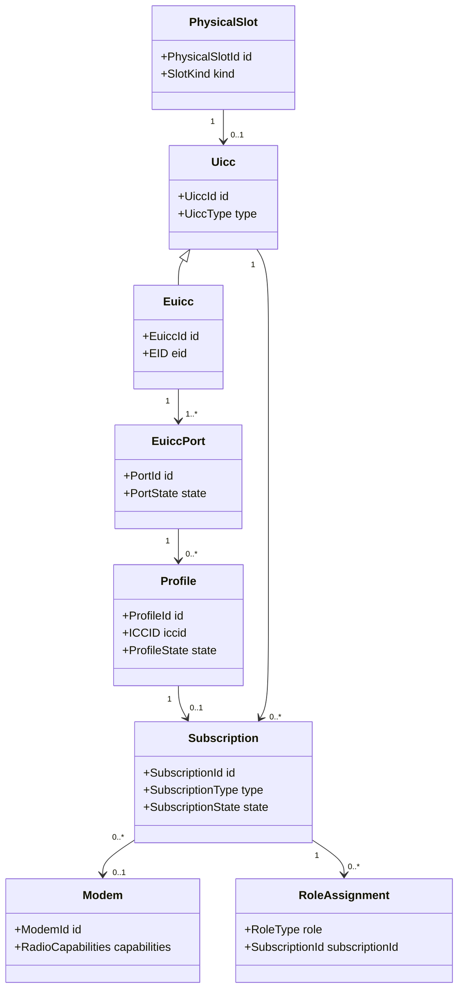
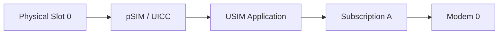
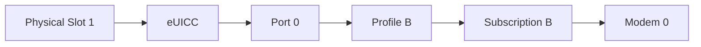
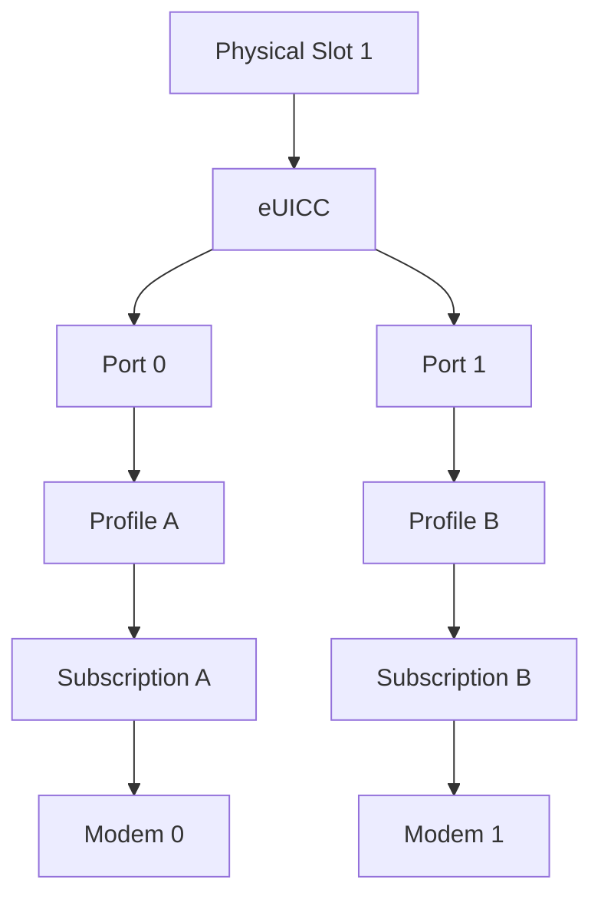
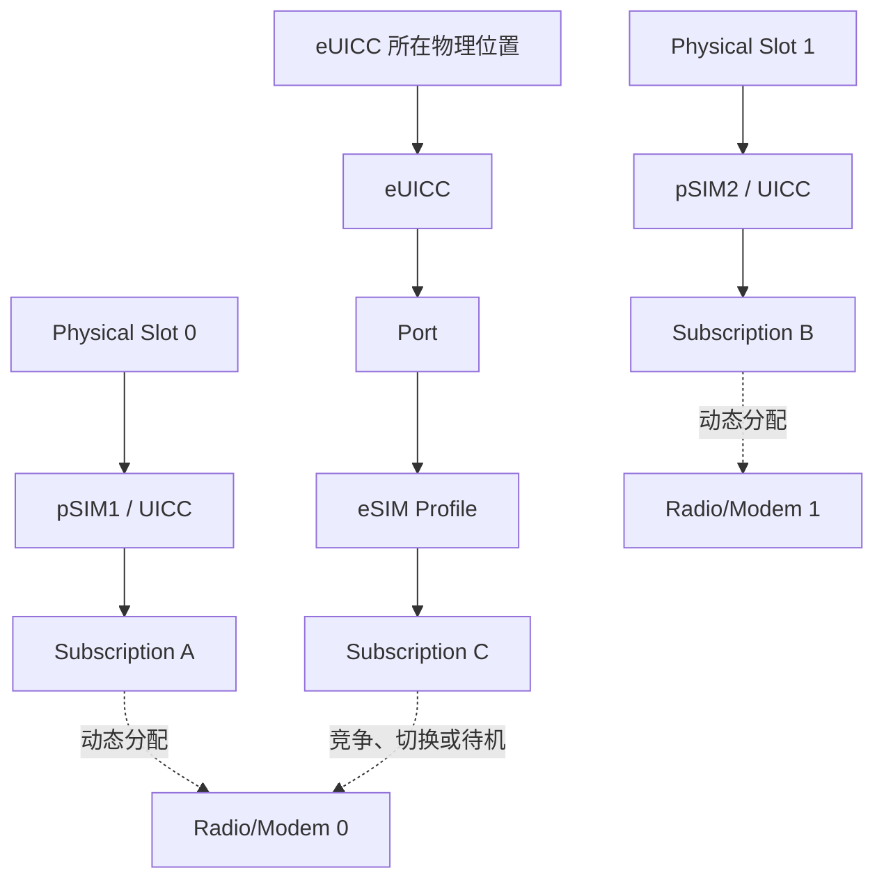

# OpenHarmony Telephony Core Service 多 SIM 及 pSIM/eSIM 混合场景扩展性专项分析

> **文档版本：** v2.1  
> **仓库：** `openharmony/telephony_core_service`  
> **默认分支：** `master`  
> **分析对象：** SIM、多 SIM、pSIM/eSIM、eSIM MEP、Radio Protocol、Subscription 账户与相关合入记录  
> **初始源码分析基线：** `cd3bca9ca9b1b0c163ba05a3cef5bba5ae2ac038`  
> **合入历史复核范围：** 截至 2026-08-28 的 `master` 分支代表性提交  
> **文档日期：** 2026-08-28  
> **文档性质：** 架构专项分析、历史证据汇总与重构诉求  
> **许可证：** Apache License 2.0

---

## 1. 文档目的

本文针对 `openharmony/telephony_core_service` 中多 SIM 及 pSIM/eSIM 混合场景的扩展能力进行专项分析，并结合仓库合入记录识别架构问题的历史证据。

本文重点回答：

1. 当前系统已经支持哪些多卡和 eSIM 能力；
2. `Subscription`、`UICC`、`eUICC`、`Profile`、`Port`、`Slot`、`SIM ID` 和 `Modem` 分别表示什么；
3. 当前代码中的上述概念如何映射；
4. 当前“三卡”能力是否表示两张 pSIM 和一个 eSIM；
5. 当前“扩展能力强”具体体现在哪些维度；
6. 为什么现有 Extension Hook 不能根本解决多 SIM 扩展问题；
7. 当前架构在哪些方面仍以传统单卡、双卡模型为中心；
8. 合入历史如何证明当前系统长期采用增量适配方式演进；
9. 为什么 eSIM MEP、多 eUICC、多 Modem 和三卡以上场景难以自然扩展；
10. 下一阶段应如何重构数据、拓扑、资源和事务模型；
11. 应对开发、测试和架构团队提出哪些具体诉求；
12. 如何通过合入治理阻止新的架构债务继续进入核心代码；
13. 如何在保持现有 API 与产品行为兼容的情况下渐进迁移。

---

## 2. 版本变更记录

| 版本 | 日期 | 主要变更 |
|---|---|---|
| v1.0 | 2026-08-28 | 完成多 SIM、pSIM/eSIM、MEP 和多 Modem 扩展能力专项分析 |
| v2.0 | 2026-08-28 | 新增仓库合入历史分析、架构证据链、合入模式、开发诉求和治理要求 |
| v2.1 | 2026-08-28 | 新增多 SIM/eSIM 核心概念模型，统一定义 Subscription、UICC、eUICC、Port、Profile、Slot、SIM ID、Modem 等概念；澄清当前三卡场景的准确含义 |
| v2.2 | 2026-09-09 | 记录首个只读 Subscription 投影切片的当前实现状态 |

---

# 3. 执行摘要

## 3.1 核心结论

当前 SIM 子系统已经具备较完整的功能覆盖，并拥有较多编译期 Feature、运行时参数和厂商扩展入口。但这些能力主要解决：

- 产品功能裁剪；
- 厂商差异适配；
- 运营商定制；
- 特殊硬件命令；
- 局部业务行为替换；
- 特定产品形态下的兼容性需求。

这些能力不等同于多 SIM 拓扑扩展能力。

从核心模型看，当前系统仍明显以以下假设为基础：

```text
一个 slot
≈ 一张卡
≈ 一个有效账户
≈ 一个活动 Subscription
≈ 一个主要 Radio 映射对象
```

该近似关系在传统单 pSIM、双 pSIM 场景中通常成立，但在 eSIM MEP、多 eUICC、VSim、卫星或远程 Modem 场景中不再成立。

## 3.2 当前“三卡”的准确含义

从当前公开代码看，“三卡”或 TSTS 主要面向以下产品形态：

```text
2 张物理 pSIM
+ 1 个 eSIM Profile/Subscription
```

但不能简单理解为：

```text
SIM_SLOT_0 = pSIM1
SIM_SLOT_1 = pSIM2
SIM_SLOT_2 = eSIM
```

原因包括：

1. `SIM_SLOT_2` 在代码中属于特殊扩展 Slot，部分注释表明其保留给特定虚拟业务；
2. eSIM 可以映射到 Slot 0 或 Slot 1 所在的电路；
3. pSIM/eSIM 映射还受到 ATR、系统参数、MEP 和产品 Extension 的影响；
4. Radio Protocol 当前仍主要限制在两个主要 Radio 资源；
5. “三卡”更准确地表示三个可识别或可管理的逻辑 Subscription，不一定表示三个独立物理卡槽或三个 Subscription 同时全活跃。

因此，推荐表述为：

> 当前系统中的三卡能力主要面向“两张物理 SIM 卡加一个 eSIM Subscription”的产品形态。三卡表示三个逻辑卡身份或 Subscription，而不是三个固定物理卡槽；其同时驻网和业务并发能力仍受 Modem 数量、Radio Protocol、RIL 和产品配置限制。

## 3.3 合入历史给出的结论

仓库合入记录表明，当前系统长期采用以下方式适配新产品：

```text
扩大 Slot 数量
+ 增加特殊 Slot
+ 扩充扁平账户字段
+ 增加组合状态
+ 增加系统参数
+ 增加重试和恢复事件
+ 增加 Extension Hook
```

这说明当前多卡能力并非建立在稳定、通用的 Subscription 拓扑模型上，而是在传统 Slot 模型上持续进行增量扩充。

## 3.4 总体建议

下一阶段应优先建立四个基础模型：

1. **数据模型**  
   分离 Physical Slot、UICC/eUICC、Port、Profile、Subscription 和 Modem。

2. **拓扑模型**  
   通过运行时能力发现建立实体及其绑定关系。

3. **资源模型**  
   支持 N 个 Subscription 在 M 个 Modem 上动态分配。

4. **事务模型**  
   协调 Profile、Port、Modem、数据库、默认角色和事件的一致性。

---

# 4. 多 SIM 与 eSIM 核心概念模型

## 4.1 为什么需要统一概念

当前代码和接口中同时存在：

- SIM；
- pSIM；
- UICC；
- eUICC；
- eSIM；
- Profile；
- Port；
- Slot；
- SIM ID；
- Subscription；
- Modem；
- Primary Slot。

这些概念在简单双卡设备中经常可以相互近似，但它们本质上代表不同对象。

如果继续混用，将导致：

- 把物理位置误认为业务账户；
- 把 eUICC 芯片误认为 eSIM Profile；
- 把 Slot 状态误认为 Subscription 状态；
- 把 Profile 激活误认为 Modem 已注册；
- 把默认数据 Subscription 误认为 Primary Slot；
- 无法表达一个 eUICC 的多个 Port；
- 无法表达多个 Subscription 竞争有限 Modem。

因此，架构重构前必须先统一术语和身份模型。

---

## 4.2 概念总览

| 概念 | 类型 | 主要职责 | 是否具有独立生命周期 |
|---|---|---|---|
| Physical Slot | 物理位置 | 承载可插拔 UICC 或 eUICC 硬件 | 是 |
| UICC | 卡硬件/安全载体 | 承载 SIM、USIM、ISIM 等应用 | 是 |
| pSIM | UICC 形态 | 可插拔的物理 UICC | 是 |
| eUICC | 嵌入式安全硬件 | 保存和管理多个 eSIM Profile | 是 |
| eSIM Profile | 运营商配置 | 提供运营商凭据和订阅数据 | 是 |
| Port | eUICC 逻辑端口 | 在 MEP 中承载一个活动 Profile | 是 |
| Subscription | 逻辑业务账户 | 为语音、短信、数据提供通信身份 | 是 |
| ICCID | 标识符 | 标识 UICC 应用或 eSIM Profile | 随卡/Profile |
| EID | 标识符 | 标识 eUICC 硬件 | 随 eUICC |
| SIM ID | 当前软件账户 ID | 当前系统内部标识 SIM 账户 | 是 |
| Logical Slot | 软件映射位置 | RIL/Telephony 对卡应用的逻辑访问位置 | 是 |
| Modem | Radio 资源 | 提供蜂窝或其他无线接入能力 | 是 |
| Radio Capability | 资源能力 | 表示 Modem 可提供的网络能力 | 可动态分配 |
| Default Role | 业务角色 | 默认语音、短信或数据的归属 | 可动态变更 |
| Primary Slot | 兼容概念 | 当前主卡/主 Radio 对应的 Slot | 可动态变更 |

---

## 4.3 SIM

### 定义

SIM 原本是 Subscriber Identity Module，严格意义上是一种用于 GSM 网络的应用和数据集合。

在工程语境中，“SIM”经常被泛化为：

- 物理卡；
- UICC；
- USIM 应用；
- eSIM Profile；
- Subscription；
- SIM 账户。

### 文档约定

本文仅在泛指时使用“SIM 卡”或“SIM 子系统”。

需要描述具体对象时，应使用：

- pSIM；
- UICC；
- eUICC；
- Profile；
- Subscription；
- Physical Slot。

---

## 4.4 UICC

### 定义

UICC 是 Universal Integrated Circuit Card，是一个安全硬件载体。

UICC 上可以运行多个卡应用，例如：

- SIM；
- USIM；
- ISIM；
- CSIM；
- RUIM 相关应用。

### 关键特征

- UICC 是硬件或安全载体；
- ICCID 通常用于标识其中的卡应用或卡身份；
- UICC 不等同于 Subscription；
- 一个 UICC 可以承载多个应用；
- 一个应用可以向系统形成一个通信 Subscription。

### 当前代码对应

当前代码中的以下对象主要承担 UICC 文件访问：

```text
IccFile
SimFile
RuimFile
IsimFile
IccFileController
UsimFileController
RuimFileController
CsimFileController
IsimFileController
```

---

## 4.5 pSIM

### 定义

pSIM 是 Physical SIM，即物理可插拔 SIM 卡。

更准确地说，它通常是一张可插拔 UICC，其中包含 SIM、USIM 或其他卡应用。

### 典型关系

```text
Physical Slot
    └── pSIM/UICC
          └── USIM Application
                └── Subscription
```

### 当前代码中的识别

当前卡文件检测逻辑主要将：

```text
phyCard == 0
phyCard == 1
```

视为两张物理 SIM：

```text
pSIM1
pSIM2
```

其他 `phyCard` 值在相关逻辑中可能被归类为 eSIM。

### 注意

`pSIM1`、`pSIM2` 是产品标签，不应直接等同于固定的逻辑 Slot。

在发生 Slot Mapping 或电路切换后：

```text
pSIM1 的物理位置
逻辑 Slot
Modem
```

可能不是固定一一对应关系。

---

## 4.6 eUICC

### 定义

eUICC 是 Embedded Universal Integrated Circuit Card，是嵌入设备内部、支持远程 Profile 管理的安全硬件。

### eUICC 的主要职责

- 保存多个 eSIM Profile；
- 安装和删除 Profile；
- 启用和停用 Profile；
- 维护 Profile 元数据；
- 提供 APDU 访问；
- 提供 EID；
- 在支持 MEP 时提供多个逻辑 Port。

### eUICC 不等于 eSIM Profile

必须区分：

```text
eUICC = 硬件容器
eSIM Profile = 安装在 eUICC 中的运营商订阅配置
```

一个 eUICC 可以包含：

```text
Profile A
Profile B
Profile C
...
```

### 标识

eUICC 应由独立的：

```text
EuiccId
EID
```

标识。

不应仅使用 `slotId` 或 ICCID 标识 eUICC。

### 当前代码限制

当前代码主要通过：

- `slotId`
- ATR；
- eSIM 支持参数；
- `EsimServiceClient::IsSupported(slotId)`；

识别 eSIM 能力，尚未形成完整的独立 `Euicc` 实体模型。

---

## 4.7 eSIM

### 定义

eSIM 是基于 eUICC 实现的嵌入式 SIM 方案。

工程上应避免将 eSIM 同时用于表示：

- eUICC 芯片；
- Profile；
- Subscription；
- 逻辑 Slot。

### 本文约定

本文中：

- `eUICC` 表示硬件安全载体；
- `eSIM Profile` 表示安装在 eUICC 中的运营商 Profile；
- `eSIM Subscription` 表示由已启用 Profile 形成的逻辑业务订阅。

### 典型关系

```text
eUICC
  └── Port
       └── Enabled Profile
            └── eSIM Subscription
```

---

## 4.8 Profile

### 定义

Profile 是安装在 eUICC 中的运营商配置和安全数据集合。

Profile 通常包含：

- 运营商身份；
- 认证凭据；
- ICCID；
- 网络访问参数；
- Profile 元数据；
- 策略和权限规则。

### 生命周期

典型状态包括：

```text
Not Installed
Downloading
Installed
Disabled
Enabled
Deleting
Error
```

### Profile 与 Subscription

Profile 与 Subscription 通常接近一一对应，但不应直接视为同一个对象。

原因是：

- Profile 可以已安装但未启用；
- 未启用 Profile 不一定形成活动 Subscription；
- Subscription 还具有默认角色、Modem 分配和网络注册状态；
- Profile 生命周期属于 eUICC 管理；
- Subscription 生命周期属于 Telephony 业务管理。

### 建议关系

```text
Profile
  └── 启用后形成或激活 Subscription
```

---

## 4.9 Port

### 定义

Port 是 eUICC 在 MEP 场景下提供的逻辑端口。

每个 Port 可以独立承载一个已启用 Profile。

### 非 MEP 场景

```text
一个 eUICC
  └── 一个活动 Profile
```

此时 Port 可能被隐式处理。

### MEP 场景

```text
一个 eUICC
  ├── Port 0
  │    └── Profile A
  │         └── Subscription A
  └── Port 1
       └── Profile B
            └── Subscription B
```

### 为什么 Port 很重要

如果不独立建模 Port，则无法准确表达：

- 同一个 eUICC 多个活动 Profile；
- 两个 Profile 分别使用不同 Modem；
- 某个 Port 局部故障；
- 某个 Port 的 Profile 切换；
- 同一个 Physical Slot 下多个 Subscription。

### 当前代码现状

部分 eSIM API 已携带 `portIndex`，例如：

- `GetProfile`
- `DisableProfile`
- `SwitchToProfile`
- `GetEuiccInfo2`
- `LoadBoundProfilePackage`
- `GetRulesAuthTable`

但 SIM 账户、状态和事件模型尚未完整以 Port 为索引。

---

## 4.10 Subscription

### 定义

Subscription 是向系统上层提供通信能力的逻辑订阅账户。

它是用户、应用和 Telephony 业务真正使用的对象。

Subscription 可以来源于：

- pSIM 中的 USIM/SIM 应用；
- eUICC 中已启用的 Profile；
- VSim；
- 卫星订阅；
- 远程或分布式 Modem 提供的订阅。

### Subscription 典型属性

```text
SubscriptionId
SubscriptionType
DisplayName
PhoneNumber
Operator
ActiveState
RegistrationState
DefaultRoles
AssignedModem
PhysicalLocation
ProfileReference
```

### Subscription 与 Slot 的区别

```text
Slot = 位置或访问通道
Subscription = 业务账户
```

一个 Slot 可能：

- 当前没有 Subscription；
- 承载一个 pSIM Subscription；
- 对应一个 eUICC；
- 在 MEP 下关联多个 Subscription；
- 在 Slot Mapping 后关联不同 Subscription。

因此不能假设：

```text
slotId == subscriptionId
```

### Subscription 与 Profile 的区别

```text
Profile = eUICC 中的数据和安全配置
Subscription = 系统可使用的通信账户
```

Profile 启用后，系统可以创建或激活对应 Subscription。

### 为什么目标架构应以 Subscription 为中心

上层业务关心的是：

- 默认语音使用哪个账户；
- 默认短信使用哪个账户；
- 数据使用哪个账户；
- 哪个账户已注册网络；
- 哪个账户正在通话；
- 哪个账户使用哪个 Modem。

这些问题的正确主键是 `SubscriptionId`，而不是 `slotId`。

---

## 4.11 SIM ID

### 定义

SIM ID 是当前 OpenHarmony Telephony 实现中用于标识 SIM 账户的内部 ID。

它主要存在于：

- `IccAccountInfo`
- `SimRdbInfo`
- SIM Account API
- 默认卡广播

### 与 Subscription ID 的关系

当前 `simId` 在功能上接近 Subscription ID，但其语义仍受到 Slot-Centric 数据模型影响。

问题包括：

- 当前活动账户与历史 eSIM Profile 混合管理；
- Slot 与 `simId` 的映射具有动态性；
- 一个 Slot 多 Subscription 时，`GetSimId(slotId)` 不再唯一；
- SIM ID 是否跨 Profile 删除、重装保持稳定尚需明确。

### 目标建议

可以：

1. 将现有 `simId` 明确升级为稳定 `SubscriptionId`；或
2. 新增 `SubscriptionId`，保留 `simId` 作为兼容字段。

无论采用哪种方式，都需要定义：

- 创建规则；
- 持久化规则；
- 删除规则；
- Profile 重装规则；
- 跨 Slot 迁移规则；
- 多用户可见性；
- IPC 兼容性。

---

## 4.12 Physical Slot

### 定义

Physical Slot 表示设备中的物理位置，例如：

- 可插拔 pSIM 卡座；
- eUICC 芯片所在位置；
- 特殊安全模块所在位置。

### Physical Slot 不等于 Logical Slot

物理位置可能经过：

- Slot Mapping；
- Modem Mapping；
- 电路切换；
- VSim 替换；
- eSIM Profile 切换；

映射到不同逻辑访问通道。

### 建议属性

```cpp
struct PhysicalSlotInfo {
    PhysicalSlotId id;
    SlotKind kind;
    PresenceState presence;
    SlotCapabilities capabilities;
};
```

---

## 4.13 Logical Slot

### 定义

Logical Slot 是 Telephony/RIL 用于访问某个卡应用或订阅的逻辑位置。

它通常由 `slotId` 表示。

### 当前代码中的 `slotId`

当前 `slotId` 被用于：

- 访问 RIL；
- 访问 SIM 状态；
- 访问 SIM 文件；
- 查询账户；
- 设置默认卡；
- 设置 Primary Slot；
- 访问 eSIM；
- 注册事件。

因此它混合了承载位置、访问通道和业务账户等多种语义。

### 目标建议

将 `slotId` 明确限制为 Logical Slot ID，并通过拓扑模型建立：

```text
Logical Slot
↔ Physical Slot
↔ UICC/eUICC Port
↔ Subscription
↔ Modem
```

之间的关系。

---

## 4.14 ICCID

### 定义

ICCID 是 Integrated Circuit Card Identifier。

在 pSIM 中，通常用于标识卡或 UICC 应用身份；在 eSIM 中，通常用于标识某个 Profile。

### ICCID 不能标识

ICCID 不应被用于唯一标识：

- Physical Slot；
- eUICC；
- Port；
- Modem；
- 当前网络注册；
- 默认业务角色。

### 当前代码中的用途

当前 ICCID 被广泛用于：

- 查询 SIM 账户；
- 判断是否为历史卡；
- 更新数据库；
- 保存主卡摘要；
- 标识 eSIM Profile；
- 设置 SIM Label。

这使 ICCID 在当前架构中承担了过多关联职责。

### 目标建议

ICCID 应保留为 Profile/UICC 应用的业务属性，并通过 `SubscriptionId`、`ProfileId` 建立稳定关联。

---

## 4.15 EID

### 定义

EID 是 eUICC Identifier，用于标识 eUICC 硬件。

### 与 ICCID 的区别

| 标识 | 标识对象 |
|---|---|
| EID | eUICC 硬件 |
| ICCID | pSIM 卡应用或 eSIM Profile |
| Profile ID | 软件内部 Profile |
| Subscription ID | Telephony 业务订阅 |

一个 eUICC 只有一个 EID，但可以包含多个拥有不同 ICCID 的 Profile。

### 安全要求

EID 属于敏感设备标识，应：

- 受权限保护；
- 避免 public 日志；
- 持久化时考虑摘要或加密；
- 避免作为公开数据库主键直接暴露。

---

## 4.16 Modem

### 定义

Modem 是提供蜂窝或其他无线接入能力的硬件或逻辑资源。

Modem 负责：

- 网络注册；
- Radio 接入；
- 语音和数据承载；
- 与 UICC/eUICC 交互；
- Radio Capability。

### Modem 与 Subscription 的关系

Subscription 只有被分配到可用 Modem 后，才能进行网络注册和业务通信。

典型关系：

```text
Subscription A → Modem 0
Subscription B → Modem 1
Subscription C → 暂未分配或低优先级待机
```

### Modem 与 Slot 的区别

```text
Slot = 卡或订阅的访问位置
Modem = 无线通信资源
```

一个 Modem 可以在不同时间服务不同 Subscription。

一个 Subscription 也可能在策略变化后迁移到另一个 Modem。

---

## 4.17 Radio Capability

### 定义

Radio Capability 表示 Modem 能够提供的无线能力，例如：

- GSM/WCDMA/LTE/NR；
- 语音；
- 数据；
- IMS；
- 高能力 NR；
- 卫星能力；
- 并发注册能力。

### 当前问题

当前架构主要通过：

```text
Primary Slot
Radio Protocol
Modem 0
```

间接表达能力分配。

复杂设备中，默认数据 Subscription、默认语音 Subscription 和高能力 Radio Subscription 可能不是同一个对象。

### 目标建议

独立保存：

```text
Default Voice Subscription
Default SMS Subscription
Default Data Subscription
Preferred High-Capability Subscription
Subscription-Modem Assignment
```

---

## 4.18 Default Role

### 定义

Default Role 表示系统对特定业务选择的默认 Subscription。

主要角色包括：

- Default Voice；
- Default SMS；
- Default Data；
- Preferred High-Capability Radio；
- User Preferred Subscription。

### 当前模型

当前接口主要使用：

```text
SetDefaultVoiceSlotId
SetDefaultSmsSlotId
SetDefaultCellularDataSlotId
```

即默认角色绑定 Slot。

### 目标模型

应使用：

```text
SetDefaultVoiceSubscription
SetDefaultSmsSubscription
SetDefaultDataSubscription
```

因为同一 Slot 在 MEP 下可能对应多个 Subscription。

---

## 4.19 Primary Slot

### 定义

Primary Slot 是当前系统中的兼容性概念，可能表示：

- 主 Modem 对应 Slot；
- 默认数据卡；
- 高能力 Radio 对应卡；
- 用户首选卡；
- 历史主卡。

### 概念问题

这些含义在传统双卡中常常一致，但在复杂场景中可能不同。

例如：

```text
默认语音：pSIM Subscription A
默认数据：eSIM Subscription B
高能力 NR：Subscription B
卫星紧急通信：Subscription C
```

此时单一 Primary Slot 无法表达完整状态。

### 目标建议

将 Primary Slot 降级为兼容派生值：

```text
Subscription Role
+ Modem Assignment
+ User Preference
→ Primary Slot
```

---

## 4.20 DSDS、DSDA 与 TSTS

### DSDS

Dual SIM Dual Standby：

- 两个 Subscription 可待机；
- 通常共享有限 Radio 资源；
- 一个 Subscription 使用 Radio 时，另一个可能受限。

### DSDA

Dual SIM Dual Active：

- 两个 Subscription 可以同时保持活动；
- 通常需要两个独立或足够并发的 Modem/Radio 资源。

### TSTS

Triple SIM Triple Standby：

- 三个逻辑卡身份或 Subscription 可被系统管理或进入待机模型；
- 不必然表示三个 Subscription 同时拥有完全独立 Radio；
- 实际并发能力取决于 Modem 数量和产品方案。

### 当前代码中的 TSTS

当前 TSTS 相关代码主要表现为：

- `persist.telephony.tsts_mode`；
- 两张 pSIM 的重启检测；
- 特殊 Slot；
- Slot 数量扩展；
- Radio Protocol 仍主要限制为两个 Slot。

因此当前实现更接近：

```text
3 个 Subscription
+ 2 个主要 Radio Protocol 资源
```

而不是严格的：

```text
3 个物理卡槽
+ 3 个独立 Modem
+ 3 个 Subscription 同时全活跃
```

---

## 4.21 VSim

### 定义

VSim 是通过软件、远程凭据或产品私有实现提供的虚拟 Subscription。

### 与 eSIM 的区别

| eSIM | VSim |
|---|---|
| 基于标准 eUICC/Profile | 通常基于产品私有实现 |
| 有 EID/Profile/Port | 未必有标准 eUICC |
| 由 eSIM Service 管理 | 常由私有 Extension 管理 |
| Profile 存储在 eUICC | 凭据可能来自安全环境或远端 |

### 当前架构影响

VSim 使用特殊 Slot 和 Extension Hook 时，会进一步增加 `slotId` 的语义负担。

目标架构应将 VSim 视为一种：

```text
SubscriptionType::VSIM
```

而不是一个具有特殊数字含义的 Slot。

---

## 4.22 概念关系总图



---

## 4.23 典型物理 SIM 场景



---

## 4.24 典型 eSIM 单 Profile 场景



---

## 4.25 典型 eSIM MEP 场景



---

## 4.26 当前三卡场景概念图



### 说明

这里的三卡主要是：

```text
Subscription A
Subscription B
Subscription C
```

而不是三个固定逻辑 Slot。

实际产品可能通过电路切换在以下组合间变化：

```text
pSIM1 + pSIM2
pSIM1 + eSIM
pSIM2 + eSIM
```

TSTS 模式可能进一步管理三个逻辑 Subscription，但其 Radio 并发能力不应仅由 Subscription 数量推断。

---

# 5. 当前概念与代码对象的映射

| 目标概念 | 当前代码中的近似对象 | 当前不足 |
|---|---|---|
| Physical Slot | `slotId`、`phyCard` | 二者关系不明确 |
| Logical Slot | `slotId` | 与 Physical Slot、Subscription 混用 |
| UICC | `IccFile`、`SimFile`、卡状态 | 缺少独立 UICC 实体 ID |
| eUICC | `EsimManager`、`EsimFile` | 主要仍按 Slot 管理 |
| Port | `portIndex` | 未进入核心账户和事件索引 |
| Profile | ICCID、eSIM Profile Parcel | 缺少统一内部 Profile ID |
| Subscription | `IccAccountInfo`、`simId` | 仍与 Slot 强绑定 |
| Modem | `modemId`、`RadioProtocol` | 主要按双卡资源组织 |
| Default Role | `isVoiceCard` 等字段 | 存在每账户重复布尔标志 |
| Primary Role | `primarySlotId` | 混合多个业务含义 |
| Topology | 多个常量、参数和缓存 | 缺少统一快照 |
| Operation | 多个事件和条件变量 | 缺少统一 Operation ID |

---

# 6. 概念使用规范

## 6.1 应使用的表达

推荐：

```text
Physical Slot 0 中插入 pSIM A
pSIM A 形成 Subscription 1001
eUICC 0 的 Port 1 启用了 Profile B
Profile B 形成 Subscription 1002
Subscription 1002 被分配到 Modem 1
Subscription 1002 是默认数据 Subscription
```

## 6.2 应避免的表达

避免：

```text
Slot 1 就是 eSIM
SIM_SLOT_2 就是第三张卡
eUICC 就是 eSIM 账户
ICCID 就是 Subscription ID
Primary Slot 就是默认数据卡
三卡就表示三个 Modem
```

## 6.3 文档统一规则

后续文档和设计应遵循：

1. 使用 Physical Slot 表示物理位置；
2. 使用 Logical Slot 表示 RIL 访问位置；
3. 使用 eUICC 表示硬件；
4. 使用 Profile 表示 eSIM 运营商配置；
5. 使用 Port 表示 MEP 逻辑端口；
6. 使用 Subscription 表示业务账户；
7. 使用 Modem 表示 Radio 资源；
8. 使用 Default Role 表示业务默认选择；
9. `Primary Slot` 仅用于兼容现有接口；
10. 不再用“卡”同时指代上述所有对象。

---

# 7. 当前多卡支持的准确边界

## 7.1 能够较好支持

- 单 pSIM；
- 双 pSIM；
- 单 eSIM Profile；
- 简单 pSIM + eSIM；
- 预定义 pSIM/eSIM 电路切换；
- 两个主要 Radio Protocol Slot；
- 三个逻辑卡身份或账户的部分管理；
- 历史 eSIM Profile 账户。

## 7.2 支持不完整或模型不足

- 同一 eUICC 多活动 Port；
- 一个 Slot 返回多个活动 Subscription；
- 双 eUICC；
- 三个 Subscription 同时拥有独立 Radio；
- N Subscription/M Modem 动态分配；
- Profile 与 Subscription 分离生命周期；
- Port 级状态和事件；
- Subscription 级默认角色；
- 拓扑版本和迟到事件过滤；
- Profile 切换跨模块事务。

## 7.3 三卡能力的推荐定义

```text
三卡能力
= 系统可识别、保存或管理三个逻辑 Subscription
≠ 三个固定 Physical Slot
≠ 三个固定 Logical Slot
≠ 三个独立 Modem
≠ 三个 Subscription 必然同时全活跃
```

---

# 8. 扩展能力评价矩阵

| 扩展维度 | 当前水平 | 说明 |
|---|---:|---|
| 编译期功能裁剪 | 较强 | 支持 eSIM、卫星、VSim 等 Feature |
| 厂商行为定制 | 较强 | Extension Wrapper 覆盖面广 |
| 运营商配置扩展 | 较强 | 支持数据驱动的 opkey 和配置加载 |
| SIM 卡型适配 | 中等 | 支持 SIM、USIM、RUIM、CSIM、ISIM |
| API 功能增加 | 中等 | 可继续增加 IPC 和 Manager 接口 |
| 多 SIM 数量扩展 | 较弱 | 深层逻辑仍存在固定上限和特殊 Slot |
| pSIM/eSIM 混合拓扑 | 较弱 | 主要依靠 Slot、布尔值和标签表达 |
| eSIM MEP | 初步支持 | API 有 Port，账户和状态未完整 Port 化 |
| 多 eUICC | 较弱 | 缺少 eUICC 独立实体和统一标识 |
| 多 Modem 资源调度 | 较弱 | Radio Protocol 仍偏向双卡主从 |
| 动态拓扑发现 | 较弱 | 主要依赖常量、参数和预定义规则 |
| 跨模块事务 | 较弱 | Profile、Modem、数据库和角色分别更新 |
| 事件版本管理 | 较弱 | 缺少统一 Topology Revision |
| 多拓扑自动化验证 | 不足 | 测试主要按接口而非拓扑组织 |

---

# 9. 核心模型问题摘要

## 9.1 Slot、Subscription 和 Modem 被过度绑定

当前常见关系近似为：

```text
slotId
→ SIM Account
→ Default Role
→ Primary Role
→ Modem
```

目标关系应为：

```text
Physical Slot
→ UICC/eUICC Port
→ Profile
→ Subscription
→ Modem Assignment
```

## 9.2 eUICC、Port 和 Profile 没有完整实体化

虽然 eSIM API 支持 `portIndex`，但核心账户主要只有：

```text
slotIndex
isEsim
simLabelIndex
iccId
```

无法表达：

```text
一个 eUICC
→ 多个 Port
→ 多个活动 Profile
→ 多个 Subscription
```

## 9.3 SIM ID 语义需要重新定义

现有 `simId` 可以作为 Subscription ID 的迁移基础，但必须明确：

- 稳定性；
- 唯一性；
- Profile 重新安装后的行为；
- 跨 Slot 迁移行为；
- 历史 Profile 行为；
- 删除和重建规则。

---

# 10. 目标架构概念约束

## 10.1 核心不变量

目标架构应保证：

```text
一个 Physical Slot 可以没有 UICC，也可以承载一个 UICC/eUICC
一个 eUICC 可以有多个 Port
一个 Port 同一时刻最多承载一个 Enabled Profile
一个 Profile 最多映射一个 Subscription
一个 Subscription 可以动态分配到一个 Modem
一个 Modem 可以根据能力承载一个或多个 Subscription
Default Role 必须指向 Subscription
```

## 10.2 不应再成立的假设

```text
slotId == Physical Slot
slotId == Subscription
slotId == Modem
一个 Slot 只有一个账户
eSIM == eUICC
eSIM == Profile
ICCID == Subscription ID
Primary Slot == Default Data Subscription
```

---

# 11. 对数据模型的补充诉求

建议 Subscription 记录至少包含：

```cpp
struct SubscriptionRecord {
    SubscriptionId subscriptionId;
    SubscriptionType type;
    SubscriptionState state;

    std::optional<PhysicalSlotId> physicalSlotId;
    std::optional<LogicalSlotId> logicalSlotId;

    std::optional<EuiccId> euiccId;
    std::optional<PortId> portId;
    std::optional<ProfileId> profileId;

    std::optional<ModemId> assignedModemId;

    std::string iccid;
    std::string operatorName;
};
```

建议 eUICC 独立记录：

```cpp
struct EuiccRecord {
    EuiccId euiccId;
    PhysicalSlotId physicalSlotId;
    std::string eidHash;
    int32_t maxPorts;
    EuiccState state;
};
```

建议 Port 独立记录：

```cpp
struct EuiccPortRecord {
    EuiccId euiccId;
    PortId portId;
    PortState state;
    std::optional<ProfileId> enabledProfileId;
};
```

---

# 12. 对接口模型的补充诉求

## 12.1 Subscription 查询

```cpp
int32_t GetSubscriptionInfo(
    SubscriptionId subscriptionId,
    SubscriptionInfo &info);

int32_t GetSubscriptionsByPhysicalSlot(
    PhysicalSlotId slotId,
    std::vector<SubscriptionInfo> &result);

int32_t GetSubscriptionByEuiccPort(
    EuiccId euiccId,
    PortId portId,
    SubscriptionInfo &result);
```

## 12.2 eUICC 查询

```cpp
int32_t GetEuiccList(
    std::vector<EuiccInfo> &euiccs);

int32_t GetEuiccPorts(
    EuiccId euiccId,
    std::vector<EuiccPortInfo> &ports);
```

## 12.3 默认角色

```cpp
int32_t SetDefaultVoiceSubscription(
    SubscriptionId subscriptionId);

int32_t SetDefaultSmsSubscription(
    SubscriptionId subscriptionId);

int32_t SetDefaultDataSubscription(
    SubscriptionId subscriptionId);
```

## 12.4 Radio 分配

```cpp
int32_t AssignSubscriptionToModem(
    SubscriptionId subscriptionId,
    ModemId modemId,
    const RadioCapabilityRequest &request);
```

---

# 13. 对事件模型的补充诉求

事件应至少携带：

```cpp
struct SubscriptionEvent {
    uint64_t operationId;
    uint64_t topologyRevision;

    SubscriptionEventType type;

    std::optional<PhysicalSlotId> physicalSlotId;
    std::optional<LogicalSlotId> logicalSlotId;
    std::optional<EuiccId> euiccId;
    std::optional<PortId> portId;
    std::optional<ProfileId> profileId;
    std::optional<SubscriptionId> subscriptionId;
    std::optional<ModemId> modemId;

    SubscriptionState oldState;
    SubscriptionState newState;
};
```

这样才能区分：

- Slot 插拔；
- eUICC 状态变化；
- Port 切换；
- Profile 启停；
- Subscription 激活；
- Modem 分配；
- 默认角色变化。

---

# 14. 对测试模型的补充诉求

测试名称和输入不应只使用：

```text
slot0
slot1
slot2
```

应显式构造拓扑：

```text
PhysicalSlot0:
  pSIM A
  Subscription A

PhysicalSlot1:
  eUICC 0
  Port 0:
    Profile B
    Subscription B
  Port 1:
    Profile C
    Subscription C

Modem0:
  LTE/NR

Modem1:
  LTE
```

然后验证：

- Subscription 与 Modem 分配；
- Profile 与 Port 绑定；
- 默认角色；
- Slot Mapping；
- Profile 切换；
- 事务恢复；
- 迟到事件。

---

# 15. 对现有文档结论的最终修订

推荐将架构结论统一为：

> 当前系统中的多卡支持应按 Physical Slot、UICC/eUICC、Port、Profile、Subscription 和 Modem 六个层次理解。当前“三卡”主要面向两张 pSIM 加一个 eSIM Subscription 的产品形态，表示三个逻辑 Subscription，而不表示三个固定物理 Slot、三个固定逻辑 Slot或三个独立 Modem。现有代码仍大量使用 `slotId` 近似表示上述多个对象，这正是多 SIM 和 pSIM/eSIM 混合场景扩展困难的核心原因。

进一步的重构目标是：

```text
Physical Slot 负责描述位置
UICC/eUICC 负责描述安全载体
Port 负责描述 eUICC 逻辑通道
Profile 负责描述 eSIM 运营商配置
Subscription 负责描述业务账户
Modem 负责描述 Radio 资源
Role Assignment 负责描述默认业务选择
```

只有将这些概念独立建模，系统才能从：

```text
基于 Slot 的双卡扩展实现
```

演进为：

```text
基于 Subscription 的通用多订阅平台
```

---

# 附录 A：核心概念速查表

| 常见问题 | 正确答案 |
|---|---|
| eUICC 是 eSIM Profile 吗？ | 不是。eUICC 是硬件容器，Profile 是其中的数据 |
| Profile 是 Subscription 吗？ | 不完全是。启用 Profile 后可形成 Subscription |
| Slot 是 Subscription 吗？ | 不是。Slot 是位置或访问通道 |
| ICCID 是 Subscription ID 吗？ | 不是。ICCID 标识卡应用或 Profile |
| EID 标识什么？ | 标识 eUICC 硬件 |
| 一个 Slot 能有多个 Subscription 吗？ | MEP 等场景下可以 |
| 一个 eUICC 能有多个 Profile 吗？ | 可以 |
| 一个 eUICC 能同时启用多个 Profile 吗？ | 支持 MEP 时可以 |
| 三卡是否表示三个物理 Slot？ | 不一定，当前主要是两个 pSIM 加一个 eSIM Subscription |
| 三卡是否表示三个 Modem？ | 不是 |
| Primary Slot 是默认数据 Subscription 吗？ | 当前常有关联，但概念上不等价 |
| 默认语音、短信和数据应绑定什么？ | 应绑定 Subscription |
| Modem 应绑定 Slot 还是 Subscription？ | 目标架构应绑定 Subscription |

---

# 附录 C：首个渐进式实现切片

当前源码的 `LegacySubscriptionRepository` 只读适配 `localCacheInfo_`，以现有 `simId` 创建暂时的 `SubscriptionId` 投影，并用 `isEsim` 将来源区分为 `UICC_APPLICATION` 或 `ESIM_PROFILE`。既有 `GetSimAccountInfo(slotId, ...)` 已经通过 `LogicalSlotId` 查询此投影，保持原有 IPC/API DTO、错误码及拒绝访问时不返回 ICCID 和号码的行为。

该实现不改变以下当前事实：

- `localCacheInfo_` 仍是 Slot 排序的兼容缓存；
- `allLocalCacheInfo_` 仍保存历史账户；
- `simId` 尚未获得跨 Profile 删除或重装的稳定性承诺；
- eSIM Runtime 仍以 `slotId + portIndex + ICCID` 进行路由；
- 默认角色、Modem、Port/Profile Binding、TopologyRevision 和 OperationId 尚未接入运行时流程。

若同一 Logical Slot 在投影中出现多个有效账户，适配器明确返回参数错误。这是为未来 MEP 迁移建立的兼容约束，不改变当前一槽一账户正常路径。

---

# 附录 B：文档统一用词

| 不推荐 | 推荐 |
|---|---|
| 第三张卡就是 Slot 2 | 第三个逻辑 Subscription |
| Slot 1 是 eSIM | Slot 1 当前映射到某 eUICC Port/Profile |
| 切换 eSIM 卡 | 切换 eSIM Profile |
| eSIM 芯片 | eUICC |
| eSIM 账户 | eSIM Subscription |
| 主卡就是数据卡 | 当前主 Radio 与默认数据 Subscription 可能相关 |
| SIM 数量 | 应区分 Physical Slot、Profile 和 Subscription 数量 |
| 激活 SIM | 应明确是启用 Profile、激活 Subscription 还是分配 Modem |
