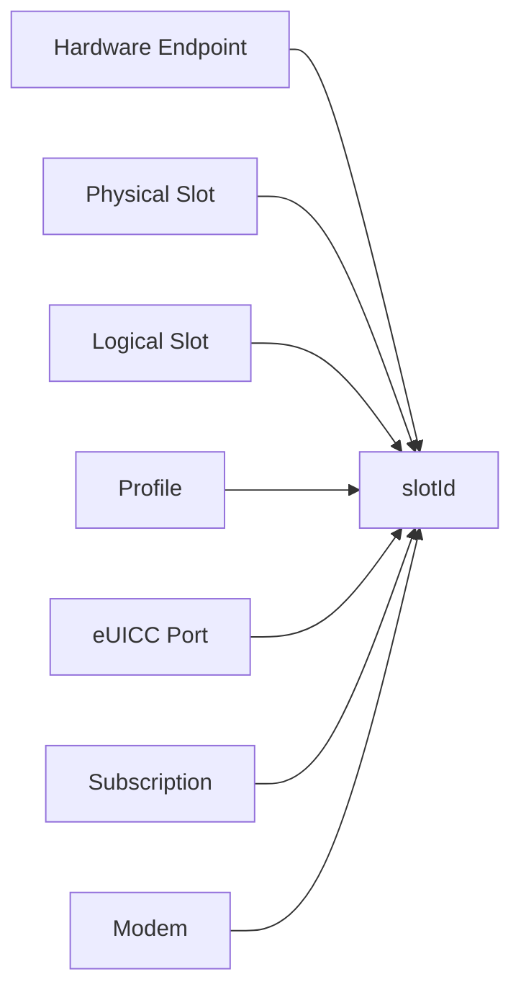
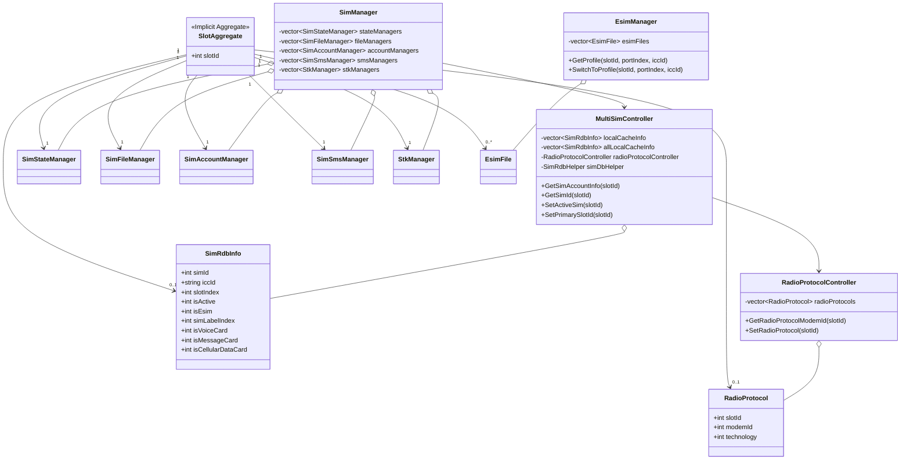
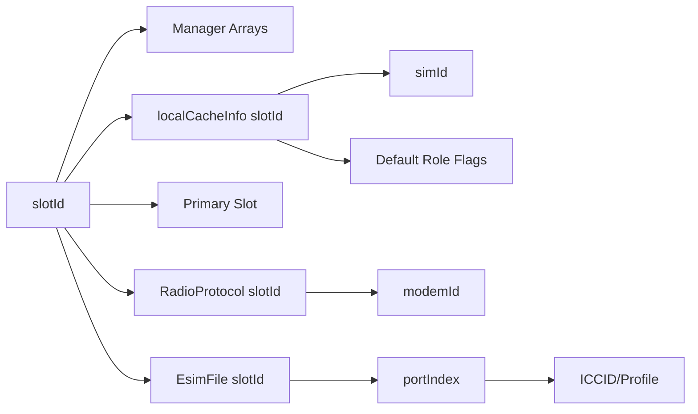
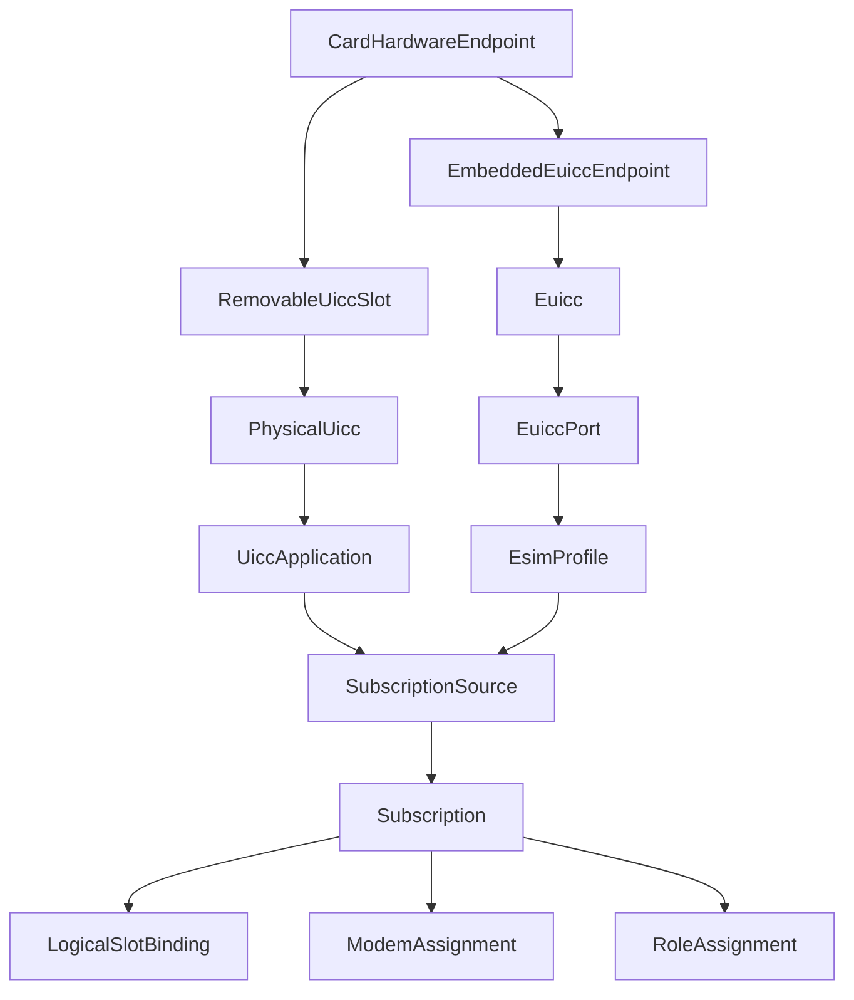
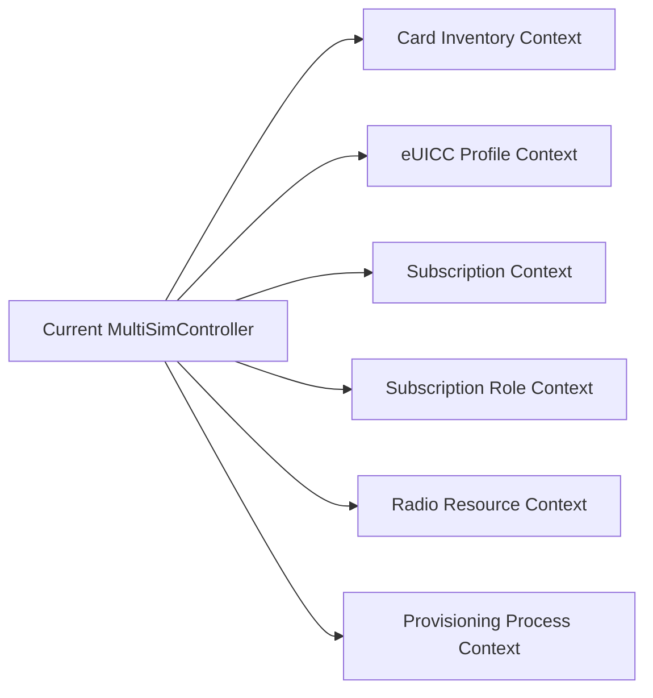
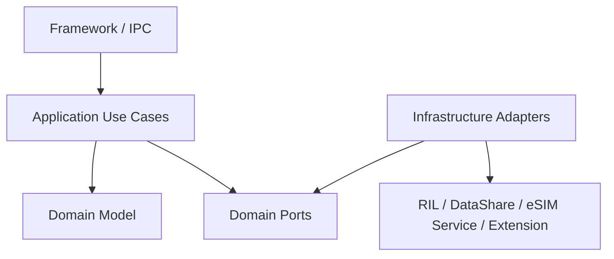
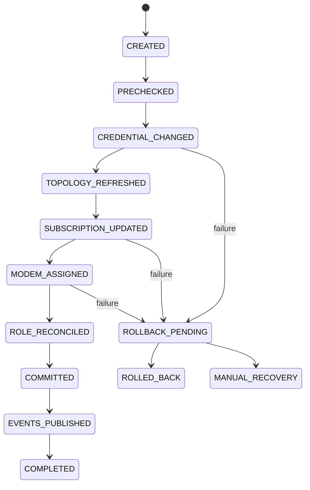
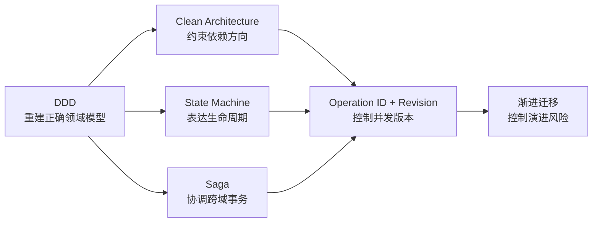

# OpenHarmony Telephony Core Service 多 SIM 领域模型失真与 DDD 重构分析

> **文档版本：** v2.0  
> **仓库：** `openharmony/telephony_core_service`  
> **默认分支：** `master`  
> **源码分析基线：** `90ad4f1f005191eae3843e441de18388703cb9a5`  
> **文档日期：** 2026-09-03  
> **分析范围：** 多 SIM、pSIM/eSIM、UICC/eUICC、MEP、Subscription、Logical Slot、Modem、默认角色与主卡切换  
> **文档性质：** 领域建模诊断、DDD 适用性论证及重构建议  
> **关联文档：**
>
> - `02_current_architecture_and_evolution.md`
> - `05_detailed_class_and_data_model.md`

---

# 1. 文档目的

本文通过 `telephony_core_service` 多 SIM 相关代码实例，论证以下结论：

> 如果问题仅是依赖混乱，可以通过分层重构缓解；如果问题仅是状态并发，可以增加状态机和请求上下文。但当身份、拓扑、事务和资源语义同时失真时，必须先重建领域模型——这是领域驱动设计 DDD 最适用的场景。

本文重点回答：

1. 当前多 SIM 问题是否只是类过大、依赖混乱或锁过多；
2. `slotId`、`simId`、ICCID、Profile、Port、Modem 等身份是否被正确区分；
3. 当前系统能否准确表达 pSIM/eSIM、MEP 和多 Modem 拓扑；
4. 多卡操作是否具有明确的领域不变量和事务边界；
5. Radio、默认角色和 Primary Slot 是否具有清晰资源语义；
6. 为什么单纯分层、增加状态机或继续增加 Extension Hook 不足以解决问题；
7. 为什么 DDD 是本次重构最匹配的主方法论；
8. Clean Architecture、状态机、版本控制和渐进迁移如何配合 DDD 落地；
9. pSIM 与 eSIM 应当在哪个架构层次分叉，又在哪个层次完成业务归一。

---

# 2. 版本变更记录

| 版本 | 日期 | 主要变更 |
|---|---|---|
| v1.0 | 2026-09-02 | 基于身份、拓扑、资源和事务失真论证 DDD 重构必要性 |
| v2.0 | 2026-09-03 | 刷新源码基线；重写第 19 章领域模型；引入 `CardHardwareEndpoint`，修正由 `PhysicalSlot` 直接统一 pSIM/eSIM 的不准确设计；补充当前 Slot-Centric 模型与目标 Subscription-Centric 模型对比 |
| v2.1 | 2026-09-09 | 记录首个 Subscription 拓扑投影切片的实际分层、兼容边界和验证限制 |

---

# 3. 执行摘要

## 3.1 核心判断

当前多 SIM 代码同时存在四类语义失真：

| 失真维度 | 当前表现 | 直接后果 |
|---|---|---|
| 身份失真 | `slotId` 同时表示位置、账户、Profile 入口和 Radio 对象 | 一槽多 Subscription 无法自然表达 |
| 拓扑失真 | 通过特殊 Slot、组合常量和系统参数推导拓扑 | 新硬件形态需要增加分支 |
| 事务失真 | RIL、缓存、数据库、参数和广播分步修改 | 失败后可能形成部分成功 |
| 资源失真 | Primary Slot 同时表示首选卡、数据卡、主 Modem 和高能力 Radio | N Subscription/M Modem 无法建模 |

这些问题说明：

```text
当前架构问题
≠ 单纯代码质量问题
≠ 单纯依赖方向问题
≠ 单纯并发控制问题

当前架构问题
= 领域概念、身份、关系、不变量和一致性边界失真
```

## 3.2 当前代码的组织核心

当前模型主要围绕以下对象隐式形成：

```text
slotId
SimRdbInfo
MultiSimController
```

其中 `slotId` 是最核心的运行时组织键：

```text
slotId
├── SimStateManager[slotId]
├── SimFileManager[slotId]
├── SimAccountManager[slotId]
├── SimSmsManager[slotId]
├── StkManager[slotId]
├── localCacheInfo[slotId]
├── RadioProtocol[slotId]
└── EsimFile[slotId]
```

因此当前模型本质上是：

```text
Slot-Centric
```

而不是：

```text
Subscription-Centric
```

## 3.3 pSIM 与 eSIM 的正确归一方式

pSIM 与 eSIM 不应由传统意义上的 `PhysicalSlot` 强行统一。

二者应在硬件层分叉：

```text
CardHardwareEndpoint
├── RemovableUiccSlot
│    └── PhysicalUicc
│         └── UiccApplication
│
└── EmbeddedEuiccEndpoint
     └── Euicc
          └── EuiccPort
               └── EsimProfile
```

然后在业务身份层统一：

```text
UiccApplication / EsimProfile
              ↓
      SubscriptionSource
              ↓
         Subscription
```

即：

> pSIM 与 eSIM 在硬件载体和凭据生命周期上保持差异，在 Subscription 层完成业务归一。

## 3.4 DDD 与其他方法的分工

| 方法 | 主要职责 |
|---|---|
| DDD | 重建领域模型、边界、身份和不变量 |
| Clean Architecture | 约束依赖方向，隔离领域与基础设施 |
| 状态机 | 实现 Profile、Subscription 和事务生命周期 |
| Operation ID/Topology Revision | 解决异步响应和拓扑版本问题 |
| Saga/Process Manager | 协调 eUICC、RIL、数据库、角色和事件 |
| 渐进迁移 | 保持旧 API 和现有产品行为兼容 |

---

# 4. 诊断框架：什么情况下必须重建领域模型

## 4.1 仅依赖混乱

典型表现：

- 上层直接依赖数据库；
- 业务类直接调用多个系统服务；
- 基础设施接口缺少抽象。

主要解决方法：

- 分层；
- 依赖倒置；
- Repository；
- Adapter；
- Clean Architecture。

## 4.2 仅状态并发

典型表现：

- 多请求共享响应状态；
- 回调乱序；
- 同类操作并发覆盖；
- 超时响应继续生效。

主要解决方法：

- 状态机；
-请求 ID；
- Future/Promise；
- Actor；
- 串行队列；
- 乐观锁和版本号。

## 4.3 领域模型失真

以下问题同时出现时，仅做分层或状态机不足：

- 一个 ID 表示多个不同对象；
- 真实对象没有独立身份；
- 真实拓扑只能通过特殊值推导；
- 一个布尔字段混合多个生命周期状态；
- 同一业务事实存在多个事实来源；
- 跨模块操作没有统一业务事务；
- 资源角色与位置概念混用；
- 新业务总要增加特殊分支。

当前多 SIM 模块符合上述特征。

---

# 5. 当前多 SIM 领域的统一语言缺失

## 5.1 真实业务概念

完整的多订阅领域至少包含：

```text
Card Hardware Endpoint
Physical UICC Slot
Embedded eUICC Endpoint
Physical UICC
UICC Application
eUICC
eUICC Port
eSIM Profile
Subscription
Logical Slot
Modem
Radio Capability
Default Role
Subscription Operation
```

## 5.2 当前代码主要使用的概念

```text
slotId
simId
iccId
isEsim
simLabelIndex
primarySlotId
isActive
```

这些字段不足以表达完整领域。

## 5.3 概念压缩



多个具有不同身份和生命周期的概念被压缩到 `slotId`。

---

# 6. 当前模型以 `slotId` 为核心的代码证据

## 6.1 运行时对象按 Slot 创建

`SimManager` 为不同业务分别维护平行 vector：

```cpp
std::vector<std::shared_ptr<SimStateManager>> simStateManager_;
std::vector<std::shared_ptr<SimFileManager>> simFileManager_;
std::vector<std::shared_ptr<SimSmsManager>> simSmsManager_;
std::vector<std::shared_ptr<SimAccountManager>> simAccountManager_;
std::vector<std::shared_ptr<IccDiallingNumbersManager>>
    iccDiallingNumbersManager_;
std::vector<std::shared_ptr<StkManager>> stkManager_;
```

初始化时通过相同 `slotId` 创建整套对象：

```cpp
for (int32_t slotId = 0; slotId < slotCount_; slotId++) {
    InitBaseManager(slotId);

    simSmsManager_[slotId] =
        std::make_shared<SimSmsManager>(
            telRilManager_,
            simFileManager_[slotId],
            simStateManager_[slotId]);

    stkManager_[slotId] =
        std::make_shared<StkManager>(
            telRilManager_,
            simStateManager_[slotId]);
}
```

该结构隐含：

```text
同一数组下标
= 同一张卡
= 同一个账户
= 同一个业务订阅上下文
```

## 6.2 账户通过 Slot 唯一索引

```cpp
info.simId = localCacheInfo_[slotId].simId;
info.isActive = localCacheInfo_[slotId].isActive;
info.isEsim = localCacheInfo_[slotId].isEsim;
info.simLabelIndex = localCacheInfo_[slotId].simLabelIndex;
```

当前模型是：

```text
slotId
→ localCacheInfo_[slotId]
→ 唯一账户
```

## 6.3 SIM ID 由 Slot 解析

```cpp
int32_t MultiSimController::GetSimId(int32_t slotId)
{
    IccAccountInfo info;
    if (GetSimAccountInfo(slotId, true, info) ==
        TELEPHONY_ERR_SUCCESS) {
        return info.simId;
    }
    return INVALID_VALUE;
}
```

这说明：

```text
slotId 是一级定位身份
simId 是通过 Slot 查询得到的二级身份
```

## 6.4 默认角色以 Slot 为命令目标

```cpp
SetDefaultVoiceSlotId(slotId);
SetDefaultSmsSlotId(slotId);
SetDefaultCellularDataSlotId(slotId);
SetPrimarySlotId(slotId);
```

而不是：

```text
AssignDefaultVoiceRole(subscriptionId)
AssignDefaultDataRole(subscriptionId)
```

## 6.5 Radio 资源按 Slot 索引

```cpp
RadioProtocol protocol;
protocol.slotId = i;
protocol.modemId = 0;
radioProtocol_.emplace_back(protocol);
```

查询关系为：

```cpp
return radioProtocol_[slotId].modemId;
```

因此当前 Radio 模型是：

```text
Slot → Radio Protocol → Modem
```

## 6.6 eSIM 也附着在 Slot 下

```cpp
esimFiles_.resize(slotCount_);

esimFiles_[slotId] =
    std::make_shared<EsimFile>(telRilManager_, slotId);
```

Profile 的定位方式是：

```text
slotId + portIndex + ICCID
```

而不是：

```text
EuiccId + PortId + ProfileId
```

---

# 7. 身份语义失真

## 7.1 当前身份链

```text
slotId
→ localCacheInfo_[slotId]
→ simId
→ iccId
```

## 7.2 隐含的一对一假设

```text
一个 slotId
→ 一个 Sim Account
→ 一个 simId
→ 一个 Radio Protocol
→ 一个 modemId
```

在 MEP 中，真实关系可能是：

```text
一个 eUICC 硬件接入点
→ 一个 eUICC
→ 多个 Port
→ 多个 Enabled Profile
→ 多个 Subscription
```

因此一槽一账户并不是领域不变量，只是历史实现假设。

## 7.3 Extension 可覆盖身份映射

当前 Extension 可以覆盖：

```text
GetSlotId(simId)
GetSimId(slotId)
```

这说明 Subscription 身份和位置映射没有唯一事实来源。

DDD 目标应由：

```text
SubscriptionRegistry
LogicalSlotBinding
SubscriptionSource
```

统一管理身份与位置。

---

# 8. 扁平数据模型造成领域混合

`SimRdbInfo` 同时保存：

```text
simId
iccId
cardId
slotIndex
cardType
imsSwitch
showName
phoneNumber
countryCode
language
imsi
isMainCard
isVoiceCard
isMessageCard
isCellularDataCard
isActive
isEsim
simLabelIndex
operatorName
phyCard
lsi
mncLen
efust
gid1
gid2
spn
ehplmn
```

## 8.1 字段所属领域

| 字段 | 所属领域 |
|---|---|
| `simId` | Subscription Account |
| `slotIndex`、`phyCard`、`lsi` | Hardware/Slot Topology |
| `iccId`、`isEsim` | Credential/Profile Source |
| 默认角色布尔字段 | Subscription Role |
| `isActive` | Subscription Lifecycle |
| `imsSwitch` | IMS Policy |
| `efust`、`gid1`、`spn` | UICC Application Data |
| `operatorName` | Profile/Operator Metadata |

`SimRdbInfo` 不是清晰聚合，而是多个限界上下文的数据拼接。

## 8.2 直接后果

- Profile、Subscription 和 Slot 生命周期无法独立变化；
- 默认角色唯一性依赖批量字段更新；
- 数据库记录成为事实模型；
- 新需求主要通过加字段完成；
- 领域不变量散布在过程代码中。

---

# 9. 拓扑语义失真

## 9.1 组合状态表达拓扑

```text
PSIM1_PSIM2
PSIM1_ESIM
PSIM2_ESIM
```

这些常量把多个对象及其关系压缩为一个整数。

加入以下能力后会发生组合膨胀：

- 更多 eSIM Profile；
- 多 Port；
- 多 eUICC；
- VSim；
- Satellite Subscription；
- Remote Subscription。

## 9.2 系统参数推导拓扑

当前代码通过：

```text
slotId
+ persist.ril.sim_switch
+ ATR
+ isEsim
+ simLabelIndex
```

推断某个 Slot 当前属于 pSIM 还是 eSIM。

这说明拓扑没有成为一等领域对象。

## 9.3 特殊 Slot 携带类型语义

```text
SIM_SLOT_2：特定保留业务
SIM_SLOT_3：特殊卡交换路径
```

正确模型应使用：

```text
EndpointType
SlotKind
SlotCapabilities
SubscriptionType
```

而不是通过 Slot 数字编码产品能力。

---

# 10. eSIM API 与账户模型冲突

## 10.1 eSIM API 已承认 Port

```text
DisableProfile(slotId, portIndex, iccId)
GetProfile(slotId, portIndex, iccId)
SwitchToProfile(slotId, portIndex, iccId)
GetEuiccInfo2(slotId, portIndex)
```

## 10.2 账户仍是 Slot 唯一

```text
GetSimAccountInfo(slotId)
GetSimId(slotId)
localCacheInfo_[slotId]
```

因此存在两个冲突模型：

```text
eSIM Context：
Slot → 多 Port/Profile

Subscription Context：
Slot → 唯一账户
```

这属于对象关系定义错误，不是增加状态机能够解决的问题。

---

# 11. 资源语义失真

## 11.1 当前模型

```text
slotId
→ RadioProtocol
→ modemId
```

## 11.2 真实业务关系

```text
Subscription
→ ModemAssignment
→ Modem
```

## 11.3 Primary Slot 混合角色

当前设置 Primary Slot 会联动：

- Main Card；
- Default Data；
- Primary Modem；
- 高能力 Radio；
- 用户首选。

复杂设备上这些角色可能属于不同 Subscription。

目标应分离：

```text
DefaultVoiceSubscription
DefaultSmsSubscription
DefaultDataSubscription
PreferredHighCapabilitySubscription
ModemAssignment
```

---

# 12. 事务语义失真

## 12.1 SIM 激活跨越多个状态源

一次 `SetActiveSim()` 可能更新：

1. 操作进行中状态；
2. RIL/Modem；
3. 当前账户缓存；
4. 全量账户缓存；
5. DataShare；
6. Extension；
7. Primary Slot；
8. Common Event。

## 12.2 部分成功风险

```text
RIL 成功
→ 缓存成功
→ 数据库失败
```

此时可能出现：

```text
Modem = Active
Cache = Active
Database = Inactive
```

## 12.3 主卡切换是典型长事务

主卡切换涉及：

- 系统参数；
- ICCID 摘要；
- RIL；
- Radio Protocol；
- 默认数据角色；
- Extension；
- 广播；
- 重试；
- 回滚。

它应被建模为：

```text
SubscriptionOperation / Process Manager / Saga
```

而不是普通 Manager 方法。

---

# 13. 状态机只能解决部分问题

状态机可以解决：

- 生命周期转换；
- 重复执行；
- 超时；
- 回调乱序；
- 迟到响应；
- 恢复步骤。

但状态机不能回答：

- `slotId` 是 Physical Slot 还是 Logical Slot；
- eUICC 与 Slot 是什么关系；
- Profile 和 Subscription 是什么关系；
- 默认数据角色属于谁；
- Subscription 应分配给哪个 Modem；
- 谁拥有默认角色唯一性。

正确顺序应是：

```text
先重建领域对象和关系
→ 再为聚合和长事务设计状态机
```

---

# 14. 限界上下文缺失

当前 `MultiSimController` 同时处理：

- 卡存在和 Slot Mapping；
- eSIM 账户；
- Subscription 激活；
- 默认角色；
- Primary Slot；
- Radio Protocol；
- 数据库；
- 参数；
- 广播；
- 重试；
- 回滚。

建议拆分为：

```text
Card Inventory Context
eUICC Profile Context
Subscription Context
Subscription Role Context
Radio Resource Context
Provisioning Process Context
```

---

# 15. 全局依赖隐藏领域边界

当前路径依赖：

- `CoreManagerInner`
- `TelephonyExtWrapper`
- `EsimController`
- `TelephonyDataHelper`
- `EsimServiceClient`
- `ImsCoreServiceClient`

例如 eSIM Profile 停用后，代码通过：

```text
CoreManagerInner::GetInstance().GetSimId(slotId)
```

解析账户身份。

该方式同时暴露两个问题：

1. 全局 Service Locator 隐藏跨上下文依赖；
2. 继续假设 Slot 唯一对应 Subscription。

仅做依赖分层，无法修复第二个问题。

---

# 16. 为什么 Clean Architecture 不是主方法论

Clean Architecture 能够解决：

- Domain 不依赖 DataShare；
- Domain 不依赖 RIL；
- Domain 不依赖 System Parameter；
- Extension 通过接口注入；
- Use Case 通过 Port 调用 Adapter。

但它不能自动确定：

- `Subscription` 是否是聚合根；
- eUICC、Port、Profile 的关系；
- pSIM 和 eSIM 应在哪里统一；
- 默认角色属于哪个对象；
- Primary Slot 是否应拆分；
- Profile 切换的一致性边界。

因此：

> DDD 负责定义正确的业务模型，Clean Architecture 负责保护该模型不受基础设施污染。

---

# 17. 为什么 DDD 是最匹配的主方法论

| 当前问题 | DDD 机制 |
|---|---|
| Slot、SIM、Profile 概念混用 | Ubiquitous Language |
| 身份不稳定 | Entity + Strongly Typed ID |
| 扁平 `SimRdbInfo` | Aggregate + Value Object |
| 领域边界混合 | Bounded Context |
| 默认角色唯一性分散 | Domain Invariant |
| Profile 切换跨模块 | Domain Service + Saga |
| DataShare/RIL 侵入业务 | Repository + ACL |
| 全局整数事件 | Domain Event |
| 厂商 Hook 修改核心状态 | Policy Port |
| 新旧模型并存 | Anti-Corruption Layer |

DDD 的重点不是增加类数量，而是明确：

1. 谁拥有稳定身份；
2. 谁是聚合根；
3. 哪些关系是实体；
4. 哪些关系只是动态 Binding；
5. 哪些状态必须原子一致；
6. 哪些操作允许最终一致；
7. 哪些外部系统需要反腐层。

---

# 18. 建议的统一语言

| 术语 | 定义 |
|---|---|
| Card Hardware Endpoint | 设备中提供卡身份能力的硬件接入点 |
| Removable UICC Slot | 可插拔 pSIM 卡槽 |
| Embedded eUICC Endpoint | 固定或集成 eUICC 的硬件位置 |
| Physical UICC | 可插拔 UICC 安全载体 |
| UICC Application | SIM、USIM、ISIM 等卡应用 |
| eUICC | 保存和管理 eSIM Profile 的安全硬件 |
| Port | eUICC MEP 逻辑端口 |
| Profile | eUICC 内的运营商凭据与配置 |
| Subscription | 上层业务使用的逻辑通信订阅 |
| Logical Slot | Telephony/RIL 的逻辑访问位置 |
| Modem Assignment | Subscription 与 Modem 的资源绑定 |
| Role Assignment | 默认语音、短信、数据等业务角色 |
| Subscription Operation | 跨聚合长事务 |

---

# 19. 当前领域模型与建议领域模型对比

## 19.1 对比目的

当前多 SIM 代码并非没有领域模型，而是其领域模型主要围绕：

```text
slotId
SimRdbInfo
MultiSimController
```

隐式形成。

当前模型可概括为：

```text
Slot
→ SIM Manager
→ SIM Account Record
→ Primary Slot
→ Radio Protocol
```

建议模型不能简单表示为：

```text
Physical Slot
→ UICC/eUICC Port
→ Profile/Application
→ Subscription
```

因为 pSIM 和 eSIM 的物理结构不同：

- pSIM 插入可插拔 UICC Slot；
- eUICC 通常固定或集成在设备内部；
- eUICC 下还存在 Port 和 Profile。

因此建议模型应采用**硬件分叉、业务归一**：

```text
CardHardwareEndpoint
├── RemovableUiccSlot
│    └── PhysicalUicc
│         └── UiccApplication
│
└── EmbeddedEuiccEndpoint
     └── Euicc
          └── EuiccPort
               └── EsimProfile

UiccApplication / EsimProfile
              ↓
      SubscriptionSource
              ↓
         Subscription
├── LogicalSlotBinding
├── ModemAssignment
└── RoleAssignment
```

二者根本区别是：

- 当前模型以 Slot 为隐式聚合核心；
- 建议模型以 Subscription 为业务核心；
- 当前模型把硬件、凭据、账户和资源压缩到 Slot；
- 建议模型在硬件层分叉，在业务身份层统一；
- 当前模型通过字段和条件分支表达关系；
- 建议模型通过实体、值对象和关联实体表达关系；
- 当前模型通过过程代码维护一致性；
- 建议模型通过聚合不变量和领域事务维护一致性。

---

## 19.2 当前领域模型概述

### 当前核心对象

| 当前对象 | 代码载体 | 实际职责 |
|---|---|---|
| Slot | `slotId` | 卡访问、账户、eSIM 和 Radio 的共同索引 |
| SIM 状态 | `SimStateManager`、`SimStateHandle` | 卡状态、类型、锁状态 |
| SIM 文件 | `SimFileManager`、`IccFile` | ICCID、IMSI、SPN、GID |
| SIM 账户 | `SimRdbInfo`、`IccAccountInfo` | 账户、Slot、角色、eSIM 标志 |
| 多卡控制 | `MultiSimController` | 激活、默认卡、Primary、Radio、数据库 |
| eSIM | `EsimManager`、`EsimFile` | Profile、Port 和 APDU |
| Radio | `RadioProtocolController` | Slot 到 Modem 的映射 |
| 产品差异 | `TelephonyExtWrapper` | Slot 映射、VSim、主卡和产品策略 |

### 当前隐式聚合根

`MultiSimController` 实际承担超大聚合根，直接管理：

```text
Slot
Subscription Account
Active State
Default Roles
Primary Slot
Radio Protocol
eSIM Label
Database
System Parameters
Events
Retries
Rollbacks
```

---

## 19.3 当前领域模型类图



`SlotAggregate` 并非源码中的显式类，而是从当前数据结构和调用方式中提炼出的隐式聚合。

---

## 19.4 当前领域模型的主要关系



当前核心链路是：

```text
Slot
→ Manager
→ Account Record
→ Primary Slot
→ Radio Protocol
```

---

## 19.5 当前模型存在的核心失真

### 身份失真

```text
slotId
≈ Physical Slot
≈ Logical Slot
≈ Subscription Location
≈ Radio Assignment Target
```

### 拓扑失真

```text
SIM_SLOT_2
SIM_SLOT_3
PSIM1_PSIM2
PSIM1_ESIM
PSIM2_ESIM
persist.ril.sim_switch
```

被用于表示真实拓扑。

### 账户失真

`SimRdbInfo` 同时保存：

- 身份；
- 位置；
-来源；
-角色；
-生命周期；
-卡文件快照；
-运营商属性。

### 资源失真

当前关系为：

```text
Slot → Radio Protocol → Modem
```

而真实业务关系应为：

```text
Subscription → Modem Assignment → Modem
```

### 事务失真

一次多卡操作可能同时修改：

- RIL；
- Modem；
-缓存；
-数据库；
-参数；
-Extension；
-广播。

但没有统一 Operation 聚合。

---

## 19.6 建议领域模型的分层结构

建议模型分为四个层次：

```text
1. 硬件接入点层
2. 安全载体层
3. 凭据/应用层
4. 业务 Subscription 层
```

### 硬件接入点层

统一抽象：

```text
CardHardwareEndpoint
```

子类型：

```text
RemovableUiccSlot
EmbeddedEuiccEndpoint
IntegratedEuiccEndpoint
```

### 安全载体层

```text
PhysicalUicc
Euicc
```

### 凭据和应用层

```text
UiccApplication
EsimProfile
```

### 业务层

```text
Subscription
LogicalSlotBinding
ModemAssignment
RoleAssignment
```

---

## 19.7 为什么引入 `CardHardwareEndpoint`

`PhysicalSlot` 如果只表示传统可插拔卡座，无法统一 eUICC，因为 eUICC 通常：

- 焊接在主板；
- 集成在芯片；
- 位于独立安全单元；
- 不存在插入或拔出的行为。

因此使用：

```text
CardHardwareEndpoint
```

统一描述“设备中提供卡身份能力的硬件接入点”。

它不要求所有 Endpoint 都具备传统 Slot 的插拔语义。

---

## 19.8 建议领域模型类图

```mermaid
classDiagram
direction LR

class CardHardwareEndpoint {
    <<abstract Aggregate Root>>
    +HardwareEndpointId id
    +EndpointType type
    +EndpointState state
    +EndpointCapabilities capabilities
}

class RemovableUiccSlot {
    +PhysicalSlotId physicalSlotId
    +PresenceState presence
}

class EmbeddedEuiccEndpoint {
    +EuiccHardwareLocationId locationId
}

class CardDevice {
    <<abstract>>
    +CardDeviceId id
    +CardDeviceType type
    +DeviceState state
}

class PhysicalUicc {
    +UiccId id
    +ATR atr
}

class Euicc {
    <<Aggregate Root>>
    +EuiccId id
    +EID eid
    +EuiccState state
    +int maxPortCount
}

class EndpointDeviceBinding {
    +BindingId id
    +HardwareEndpointId endpointId
    +CardDeviceId deviceId
    +BindingState state
    +TopologyRevision revision
    +Timestamp validFrom
    +Timestamp validTo
}

class UiccApplication {
    +ApplicationId id
    +ApplicationType type
    +AID aid
    +ICCID iccid
    +ApplicationState state
}

class EuiccPort {
    +PortId id
    +PortState state
}

class EsimProfile {
    +ProfileId id
    +ICCID iccid
    +ProfileState state
    +ProfileMetadata metadata
}

class PortProfileBinding {
    +BindingId id
    +EuiccId euiccId
    +PortId portId
    +ProfileId profileId
    +BindingState state
    +TopologyRevision revision
}

class Subscription {
    <<Aggregate Root>>
    +SubscriptionId id
    +SubscriptionType type
    +SubscriptionState state
    +RegistrationState registrationState
    +SubscriptionDisplayInfo displayInfo
    +Activate()
    +Deactivate()
}

class SubscriptionSource {
    +SourceType sourceType
    +SourceId sourceId
    +ICCID iccid
}

class LogicalSlot {
    +LogicalSlotId id
    +LogicalSlotState state
}

class LogicalSlotBinding {
    +BindingId id
    +LogicalSlotId logicalSlotId
    +SubscriptionId subscriptionId
    +BindingState state
    +TopologyRevision revision
}

class Modem {
    <<Aggregate Root>>
    +ModemId id
    +ModemState state
    +RadioCapabilitySet capabilities
    +int maxConcurrentSubscriptions
}

class ModemAssignment {
    +AssignmentId id
    +SubscriptionId subscriptionId
    +ModemId modemId
    +AssignmentState state
    +RadioCapabilitySet allocatedCapabilities
    +TopologyRevision revision
}

class SubscriptionRoleSet {
    <<Aggregate Root>>
    +UserId userId
    +AssignRole(roleType, subscriptionId)
    +RemoveRole(roleType)
}

class RoleAssignment {
    +RoleType roleType
    +SubscriptionId subscriptionId
    +AssignmentState state
}

class SubscriptionOperation {
    <<Process Aggregate>>
    +OperationId id
    +OperationType type
    +OperationState state
    +OperationStep currentStep
    +TopologyRevision baseRevision
    +ExecuteNext()
    +Rollback()
}

class SubscriptionTopology {
    +TopologyRevision revision
    +GetSubscriptionsByEndpoint()
    +GetSubscriptionByPort()
    +GetAssignmentsByModem()
}

CardHardwareEndpoint <|-- RemovableUiccSlot
CardHardwareEndpoint <|-- EmbeddedEuiccEndpoint

CardDevice <|-- PhysicalUicc
CardDevice <|-- Euicc

CardHardwareEndpoint "1" --> "0..*" EndpointDeviceBinding
CardDevice "1" --> "0..*" EndpointDeviceBinding

PhysicalUicc "1" *-- "1..*" UiccApplication

Euicc "1" *-- "1..*" EuiccPort
Euicc "1" *-- "0..*" EsimProfile

EuiccPort "1" --> "0..*" PortProfileBinding
EsimProfile "1" --> "0..*" PortProfileBinding

Subscription "1" *-- "1" SubscriptionSource
UiccApplication "1" --> "0..1" SubscriptionSource
EsimProfile "1" --> "0..1" SubscriptionSource

LogicalSlot "1" --> "0..*" LogicalSlotBinding
Subscription "1" --> "0..*" LogicalSlotBinding

Modem "1" --> "0..*" ModemAssignment
Subscription "1" --> "0..*" ModemAssignment

SubscriptionRoleSet "1" *-- "0..*" RoleAssignment
Subscription "1" --> "0..*" RoleAssignment

SubscriptionOperation "1" --> "1..*" Subscription
SubscriptionOperation "1" --> "0..*" PortProfileBinding
SubscriptionOperation "1" --> "0..*" LogicalSlotBinding
SubscriptionOperation "1" --> "0..*" ModemAssignment

SubscriptionTopology --> CardHardwareEndpoint
SubscriptionTopology --> Euicc
SubscriptionTopology --> Subscription
SubscriptionTopology --> LogicalSlot
SubscriptionTopology --> Modem
```



---

## 19.9 pSIM 和 eSIM 的分叉路径

### pSIM 路径

```text
CardHardwareEndpoint
└── RemovableUiccSlot
     └── EndpointDeviceBinding
          └── PhysicalUicc
               └── UiccApplication
                    └── SubscriptionSource
                         └── Subscription
```

### eSIM 路径

```text
CardHardwareEndpoint
└── EmbeddedEuiccEndpoint
     └── EndpointDeviceBinding
          └── Euicc
               └── EuiccPort
                    └── PortProfileBinding
                         └── EsimProfile
                              └── SubscriptionSource
                                   └── Subscription
```

---

## 19.10 pSIM 和 eSIM 的业务归一

形成 Subscription 后，两条路径使用相同业务模型：

```text
Subscription
├── LogicalSlotBinding
├── ModemAssignment
├── RoleAssignment
├── RegistrationState
└── SubscriptionAccount
```

上层业务无需通过 `isEsim` 分支决定：

- 默认语音；
- 默认短信；
- 默认数据；
- Modem 分配；
- 网络注册；
- 用户显示。

其业务主键统一为：

```text
SubscriptionId
```

---

## 19.11 建议模型的逻辑关系



---

## 19.12 建议模型的领域不变量

### Endpoint 与设备

```text
一个 RemovableUiccSlot 当前最多绑定一个 PhysicalUicc。

一个 EmbeddedEuiccEndpoint 通常固定绑定一个 Euicc。
```

### Subscription 来源

```text
一个 Subscription 必须且只能有一个来源：

UiccApplication
XOR
EsimProfile
XOR
VSimCredential
XOR
SatelliteCredential
XOR
RemoteCredential
```

### Port/Profile

```text
同一 Topology Revision 内：

一个 Port 最多启用一个 Profile；
一个 Enabled Profile 最多绑定一个 Port。
```

### Logical Slot

```text
一个 Logical Slot 当前最多映射一个 Subscription；
一个 Subscription 当前最多映射一个 Logical Slot。
```

### Modem Assignment

```text
一个 Subscription 当前最多有一个活动 Modem Assignment；

一个 Modem 的活动 Subscription 数量
不得超过其能力上限。
```

### 默认角色

```text
同一 UserId + RoleType
最多指向一个活动 Subscription。
```

### 版本

```text
所有 Binding、Assignment 和领域事件
必须携带 Topology Revision。

旧版本结果不得覆盖新版本状态。
```

---

## 19.13 当前模型与建议模型总对比

| 维度 | 当前模型 | 建议模型 |
|---|---|---|
| 核心业务身份 | `slotId` | `SubscriptionId` |
| 硬件统一入口 | `slotId` | `CardHardwareEndpoint` |
| pSIM 位置 | Slot 隐式表示 | `RemovableUiccSlot` |
| eUICC 位置 | Slot 隐式表示 | `EmbeddedEuiccEndpoint` |
| 安全载体 | 卡状态和文件对象间接表达 | `PhysicalUicc` / `Euicc` |
| UICC 应用 | `IccFile` 数据 | `UiccApplication` |
| eUICC Port | API 参数 | `EuiccPort` Entity |
| Profile | ICCID/Parcel | `EsimProfile` Entity |
| 业务账户 | `SimRdbInfo` | `Subscription` Aggregate |
| Subscription 来源 | `isEsim` 推断 | `SubscriptionSource` |
| Slot 映射 | Slot 本身 | `LogicalSlotBinding` |
| Modem 关系 | `radioProtocol_[slotId]` | `ModemAssignment` |
| 默认角色 | 账户布尔字段 | `RoleAssignment` |
| Primary Slot | 核心事实 | 兼容派生值 |
| 拓扑 | 常量、参数、分支 | `SubscriptionTopology` |
| 一致性 | 过程式更新 | 聚合不变量 |
| 长事务 | Manager + Retry | `SubscriptionOperation` |
| 产品扩展 | 全局 Hook | Versioned Policy Port |

---

## 19.14 当前与目标身份链对比

### 当前

```text
slotId
→ localCacheInfo_[slotId]
→ simId
→ ICCID
```

### 目标

```text
SubscriptionId
→ SubscriptionSource
→ UiccApplication 或 EsimProfile
```

位置关系独立存在：

```text
SubscriptionId
→ LogicalSlotBinding
→ LogicalSlotId
```

资源关系独立存在：

```text
SubscriptionId
→ ModemAssignment
→ ModemId
```

---

## 19.15 当前与目标拓扑对比

### 当前

```text
SIM_SLOT_COUNT
SIM_SLOT_2
SIM_SLOT_3
PSIM1_PSIM2
PSIM1_ESIM
PSIM2_ESIM
ATR
System Parameters
Extension Hooks
```

### 目标

```text
HardwareEndpoint E0
  type = REMOVABLE_UICC_SLOT
  binds PhysicalUicc U0

HardwareEndpoint E1
  type = EMBEDDED_EUICC
  binds Euicc EU0

Euicc EU0
  provides Port P0
  Port P0 enables Profile EP0

UiccApplication UA0
  forms Subscription S0

Profile EP0
  forms Subscription S1
```

---

## 19.16 当前与目标默认角色对比

### 当前

```text
SimRdbInfo A:
  isVoiceCard = true
  isMessageCard = true

SimRdbInfo B:
  isCellularDataCard = true
```

### 目标

```text
RoleAssignment:
  role = DEFAULT_VOICE
  subscriptionId = A

RoleAssignment:
  role = DEFAULT_SMS
  subscriptionId = A

RoleAssignment:
  role = DEFAULT_DATA
  subscriptionId = B
```

默认角色不再附着在 Slot 或每条账户记录上。

---

## 19.17 当前与目标 Radio 资源对比

### 当前

```text
slotId
→ RadioProtocol
→ modemId
```

### 目标

```text
SubscriptionId
→ ModemAssignment
→ ModemId
→ AllocatedRadioCapabilities
```

目标模型可表达：

```text
Subscription A → Modem 0
Subscription B → Modem 1
Subscription C → 暂未分配
```

而不要求每个 Subscription 都拥有独立 Slot 或 Modem。

---

## 19.18 当前与目标事务模型对比

### 当前

```text
RIL
→ Cache
→ Full Cache
→ Database
→ System Parameter
→ Extension
→ Broadcast
→ Retry/Rollback
```

状态由多个变量表达：

```text
isSetPrimarySlotIdInProgress_
isSettingPrimarySlotToRil_
responseReady_
retryCount
targetPrimarySlotId_
```

### 目标

```text
SubscriptionOperation
├── operationId
├── baseTopologyRevision
├── targetSubscriptionIds
├── targetEndpoint/Port/Profile
├── currentStep
├── completedSteps
├── compensationActions
├── deadline
└── result
```

---

## 19.19 限界上下文映射



| 当前职责 | 目标限界上下文 |
|---|---|
| Endpoint、卡存在、Slot Mapping | Card Inventory |
| eUICC、Port、Profile | eUICC Profile |
| Subscription 账户和生命周期 | Subscription |
| 默认语音、短信、数据 | Subscription Role |
| Modem、Radio Capability | Radio Resource |
| 激活、切换、补偿和恢复 | Provisioning Process |

---

## 19.20 当前类到建议领域对象的迁移

| 当前类/数据 | 建议目标 |
|---|---|
| `SimManager` | Legacy Facade/Application Service |
| 多个 Manager vector | `LogicalSlotRuntimeRegistry` |
| `MultiSimController` | 多个 Context Service |
| `MultiSimMonitor` | Domain Event Handler + Availability Adapter |
| `SimRdbInfo` | 多领域 Projection |
| `IccAccountInfo` | Legacy DTO |
| `RadioProtocolController` | Radio Resource Arbiter + Modem Adapter |
| `EsimManager` | eUICC Profile Application Service |
| `EsimFile` | eUICC Protocol Adapter |
| `SimRdbHelper` | Subscription Repository Adapter |
| `CoreManagerInner` | 显式 Application Port |
| `TelephonyExtWrapper` | Versioned Policy Ports |

---

## 19.21 兼容模型

目标模型需要 Anti-Corruption Layer：


示例：

```text
SetDefaultVoiceSlotId(slotId)
→ 查询 LogicalSlotBinding
→ 得到 SubscriptionId
→ AssignDefaultRole(DEFAULT_VOICE, subscriptionId)
```

在一 Slot 多 Subscription 时，兼容层必须：

- 明确主 Port 或主 Subscription；
- 无法唯一解析时返回明确错误；
- 禁止静默选择任意账户。

---

## 19.22 本章结论

当前领域模型本质上是：

```text
Slot
→ Manager
→ Account Record
→ Primary Slot
→ Radio Protocol
```

建议模型应采用：

```text
CardHardwareEndpoint
→ 安全载体分叉
→ 凭据分叉
→ Subscription 业务归一
→ Logical Slot / Modem / Role 动态关联
```

关键并非把 `PhysicalSlot` 扩大解释为可插拔卡槽和 eUICC 的共同容器，而是：

1. 在硬件层使用 `CardHardwareEndpoint` 统一接入点；
2. 在安全载体层区分 `PhysicalUicc` 与 `Euicc`；
3. 在凭据层区分 `UiccApplication` 与 `EsimProfile`；
4. 在业务层统一形成 `Subscription`；
5. 将位置、资源和默认角色建模为动态关联关系。

这能够既保留 pSIM/eSIM 的硬件差异，又实现面向 Subscription 的统一业务模型。

---

# 20. 建议的领域不变量汇总

## 20.1 身份不变量

```text
SubscriptionId 不得由当前 slotId 动态推导。
```

## 20.2 来源不变量

```text
每个 Subscription 只能有一个 SubscriptionSource。
```

## 20.3 Endpoint 不变量

```text
一个可插拔 UICC Slot 当前最多绑定一张 PhysicalUicc。
```

## 20.4 Port/Profile 不变量

```text
一个 Port 当前最多启用一个 Profile。
一个 Enabled Profile 当前最多绑定一个 Port。
```

## 20.5 Role 不变量

```text
同一用户的同一角色最多指向一个 Subscription。
```

## 20.6 Resource 不变量

```text
一个 Subscription 当前最多有一个活动 Modem Assignment。
```

## 20.7 Version 不变量

```text
旧 Topology Revision 的结果不得覆盖新状态。
```

---

# 21. 建议的聚合边界

| 聚合根 | 内部对象 | 主要不变量 |
|---|---|---|
| `CardHardwareEndpoint` | 当前 Device Binding | Endpoint 与设备绑定 |
| `Euicc` | Port、Profile、PortProfileBinding | Port/Profile 唯一性 |
| `Subscription` | Source、状态、显示信息 | 稳定身份与唯一来源 |
| `SubscriptionRoleSet` | Role Assignment | 每角色唯一性 |
| `Modem` | 当前 Assignment | 容量和 Radio Capability |
| `SubscriptionOperation` | Steps、Compensation | 长事务合法性 |

---

# 22. Clean Architecture 落地方式



Domain 层不得依赖：

- DataShare；
- RIL；
- System Parameter；
- `CoreManagerInner`；
- `TELEPHONY_EXT_WRAPPER`；
- Common Event。

---

# 23. 状态机的正确使用位置

## 23.1 Profile 状态机

```text
INSTALLED
→ ENABLING
→ ENABLED
→ DISABLING
→ DISABLED
→ DELETING
```

## 23.2 Subscription 状态机

```text
DISCOVERED
→ PROVISIONING
→ ACTIVE
→ ASSIGNED
→ REGISTERED
→ SUSPENDED
→ DEACTIVATED
```

## 23.3 Operation 状态机



---

# 24. Process Manager/Saga 设计

一次 Profile 切换可能修改：

- eUICC Port；
- Profile；
- Subscription；
- Logical Slot Binding；
- Modem Assignment；
- Default Role；
-持久化；
-外部状态。

建议引入：

```text
SwitchProfileProcess
```

维护：

- Operation ID；
- Topology Revision；
- EuiccId；
- PortId；
-旧 Profile；
-新 Profile；
-旧 Subscription；
-新 Subscription；
-当前步骤；
-补偿动作；
-Deadline。

---

# 25. 版本控制与并发模型

```cpp
struct OperationContext {
    OperationId operationId;
    TopologyRevision baseRevision;
    SubscriptionId subscriptionId;
    std::optional<EuiccId> euiccId;
    std::optional<PortId> portId;
    std::optional<ProfileId> profileId;
    Deadline deadline;
};
```

响应处理必须验证：

```text
response.operationId == current.operationId
response.topologyRevision >= allowedRevision
```

否则标记为：

```text
STALE_RESPONSE
```

---

# 26. 渐进迁移策略

## 阶段 0：统一语言与 Context Map

输出：

- Glossary；
- Context Map；
- 身份映射；
- 当前领域不变量；
- pSIM/eSIM 对象实例图。

## 阶段 1：引入强类型 ID

```text
HardwareEndpointId
PhysicalSlotId
LogicalSlotId
UiccId
EuiccId
PortId
ProfileId
SubscriptionId
ModemId
TopologyRevision
```

## 阶段 2：引入 Subscription Registry

建立：

```text
subscriptionsById
subscriptionsByEndpoint
subscriptionByEuiccPort
subscriptionsByLogicalSlot
subscriptionsByModem
```

## 阶段 3：迁移角色与账户

- 默认角色转为 `RoleAssignment`；
- `SimRdbInfo` 降级为兼容 Projection；
- 新 Repository 成为事实来源。

## 阶段 4：迁移 Profile 与 Modem 事务

- Profile 切换进入 Process Manager；
- Radio 进入 Resource Arbiter；
- Primary Slot 成为派生值。

## 阶段 5：删除旧模型

删除：

- 一槽一账户缓存；
- 特殊 Slot 业务判断；
- 组合拓扑状态；
- 无版本 Extension Hook；
- 由 Slot 推导 Subscription 的核心路径。

---

# 27. 各方法论的分工



---

# 28. 当前类的 DDD 重构映射

| 当前类 | 当前问题 | DDD 目标 |
|---|---|---|
| `SimManager` | 大型业务门面 | Legacy Facade/Application API |
| `MultiSimController` | 跨多个领域 | 拆为多个 Context Service |
| `MultiSimMonitor` | 事件、恢复和基础设施混合 | Event Handler + Availability Adapter |
| `SimRdbInfo` | 多领域扁平记录 | 多个 Aggregate/Projection |
| `RadioProtocolController` | Slot-Centric 资源控制 | Radio Resource Context |
| `EsimManager` | Slot-Centric eUICC 操作 | eUICC Profile Context |
| `CoreManagerInner` | 全局 Service Locator | 显式 Application Port |
| `TelephonyExtWrapper` | 无边界全局 Hook | Versioned Policy Port |
| `SimRdbHelper` | 数据结构即领域模型 | Repository Adapter |

---

# 29. 重构验收标准

重构后应能明确回答：

1. 设备有哪些 Card Hardware Endpoint；
2. 哪些 Endpoint 是可插拔 UICC Slot；
3. 哪些 Endpoint 固定承载 eUICC；
4. 一个 eUICC 有哪些 Port；
5. 每个 Port 当前启用哪个 Profile；
6. 每个 UICC Application/Profile 对应哪个 Subscription；
7. Subscription 的稳定身份是什么；
8. Subscription 当前映射哪个 Logical Slot；
9. Subscription 当前分配哪个 Modem；
10. 默认语音、短信、数据属于哪个 Subscription；
11. 一次切换属于哪个 Operation；
12. 当前状态属于哪个 Topology Revision；
13. 迟到响应为何不会覆盖新状态；
14. Extension 能改变哪些策略，不能改变哪些事实。

---

# 30. 最终结论

通过当前代码可以确认：

1. 运行时 Manager 通过 `vector[slotId]` 组织；
2. 账户通过 `localCacheInfo_[slotId]` 查询；
3. `simId` 主要由 `slotId` 解析；
4. 默认角色通过 Slot 设置；
5. Radio Protocol 按 Slot 索引；
6. eSIM 对象仍通过 `esimFiles_[slotId]` 管理；
7. 并发和重试状态按 Slot 保存；
8. 特殊产品能力由特殊 Slot 数字表达。

因此当前模型可以概括为：

```text
Slot-Centric Aggregate
```

但目标模型不能简单把 `PhysicalSlot` 扩大为 pSIM/eSIM 的统一对象。

正确的 DDD 模型应采用：

```text
CardHardwareEndpoint
→ PhysicalUicc / Euicc
→ UiccApplication / EsimProfile
→ SubscriptionSource
→ Subscription
→ LogicalSlotBinding / ModemAssignment / RoleAssignment
```

本次重构的核心矛盾仍然是：

> **领域模型失真，而不是局部代码质量问题。**

DDD 负责重建：

- 统一语言；
- 稳定身份；
- 硬件接入点；
- 安全载体；
- 凭据来源；
- Subscription；
-聚合不变量；
-限界上下文；
-一致性边界。

Clean Architecture、状态机、Process Manager、Operation ID、Topology Revision 和渐进迁移，则在正确领域模型的基础上，将其落实为可执行的软件架构。

最终演进目标是：

```text
从 Slot-Centric
转向 Subscription-Centric

从 PhysicalSlot 强行统一
转向 CardHardwareEndpoint 分层统一

从特殊分支拓扑
转向显式实体和 Binding

从 Primary Slot
转向 Role Assignment + Modem Assignment

从分步更新
转向可跟踪、可补偿的 Subscription Operation

从数据库记录驱动业务
转向领域模型驱动持久化
```

---

# 附录 A：关键源码索引

| 主题 | 路径 |
|---|---|
| SIM 总入口 | `services/sim/src/sim_manager.cpp` |
| SIM Manager 定义 | `services/sim/include/sim_manager.h` |
| 多卡控制 | `services/sim/src/multi_sim_controller.cpp` |
| 多卡控制定义 | `services/sim/include/multi_sim_controller.h` |
| 多卡辅助与组合状态 | `services/sim/src/multi_sim_helper.cpp` |
| SIM 账户记录 | `services/sim/include/sim_rdb_info.h` |
| SIM 状态同步 | `services/sim/src/sim_state_manager.cpp` |
| Radio Protocol | `services/sim/src/radio_protocol_controller.cpp` |
| Radio Protocol 定义 | `services/sim/include/radio_protocol_controller.h` |
| eSIM Manager | `services/sim/src/esim_manager.cpp` |
| eSIM 接口 | `services/sim/include/esim_manager.h` |
| 全局服务定位 | `interfaces/innerkits/include/core_manager_inner.h` |
| 产品扩展 | `services/telephony_ext_wrapper/include/telephony_ext_wrapper.h` |

---

# 附录 B：分析边界

1. 本文依据公开仓库静态源码；
2. 产品私有 Telephony Extension 不可见；
3. RIL Adapter、Modem 固件和外部 eSIM Service 不在本仓库完整实现；
4. 部分业务规则依赖产品配置和系统参数；
5. 本文重点分析领域表达能力，不评价单个开发人员；
6. DDD 目标模型需由 SIM、eSIM、RIL、Data 和产品团队联合验证；
7. 目标模型应以真实的 pSIM + eSIM MEP 场景作为首个验证用例。

---

# 31. 首个 Subscription 拓扑投影切片

## 31.1 实际目录与依赖方向

首个切片位于 `services/sim` 的现有私有 include/source 目录，不向 `interfaces/innerkits`、IDL 或 SA 暴露新接口：

```text
subscription.h                         Domain：强类型 ID、Subscription、SubscriptionSource
subscription_topology.h                Domain：LogicalSlot、LogicalSlotBinding、SubscriptionTopology
slot_registry.h                        Application：既有 Logical Slot 清单与 Capability 元数据
euicc_profile_topology.h               Domain：私有 Slot/Port/ProfileState Shadow Sidecar
subscription_repository.h              Port：ISubscriptionRepository
legacy_subscription_repository.h       Infrastructure ACL：LegacySubscriptionRepository
subscription_topology_manager.h        Application：SubscriptionTopologyManager
```

实际调用链为：

```text
CoreService/CoreServiceSim
  -> SimManager
  -> MultiSimController::GetSimAccountInfo(slotId, ...)
  -> SubscriptionTopologyManager
  -> LegacySubscriptionRepository
  -> localCacheInfo_ (只读)
  -> IccAccountInfo (旧 DTO)
```

Domain 只依赖标准 C++ 类型；它不依赖 DataShare、RIL、System Ability、系统参数、`CoreManagerInner` 或 `TelephonyExtWrapper`。`LegacySubscriptionRepository` 是唯一读取 `SimRdbInfo` 的反腐边界，`MultiSimController` 继续负责旧错误码、锁和 DTO 输出。

## 31.2 已实现语义

- `simId` 经显式 `SubscriptionId` 包装形成当前投影身份；其跨删除、重装和迁移稳定性尚未改变；
- `slotIndex` 经显式 `LogicalSlotId` 形成 `LogicalSlotBinding`；
- `isEsim` 仅在 Legacy Adapter 内转换为 `SubscriptionSourceType::UICC_APPLICATION` 或 `SubscriptionSourceType::ESIM_PROFILE`，不进入领域模型作为布尔分支；
- 一个请求期 `SubscriptionTopology` 中同一 Logical Slot 有多个有效 Binding 时，兼容查询返回明确参数错误，不会静默选择；
- `localCacheInfo_` 每次成功整体刷新并排序后递增 `TopologyRevision`；该版本被传给请求期拓扑并用于过滤不属于当前快照的 Binding。它尚未用于过滤异步 RIL/eSIM 回调。
- `SlotRegistry` 在 `MultiSimController::Init` 后从 `SimManager` 实际创建并传入的 `SimStateManager` 集合生成 Logical Slot 清单；额外 Runtime Manager 加入时，Registry 在自身锁内刷新清单。现有设备级 MEP 开关仅作为保守 Capability 元数据导入 Shadow Snapshot，它不改变 eSIM 或 Radio 的既有特殊 Slot 策略。
- `CoreService` 在 eSIM 初始化完成后，调用追加到 `ISimManager` 末尾且带默认空实现的 `SetEsimCapabilityMask(uint32_t)` 发布 per-Slot eSIM 支持位图。该位图仅表示 eSIM 服务启动时支持该 Slot，不表示卡存在、Profile 活动或 MEP；`SupportsMep()` 继续保持全局属性语义。
- `CoreService` 在同一启动阶段、拓扑锁外查询支持 Slot 的 Profile List；只有传输与 eSIM 结果均成功时才经 `UpdateEuiccProfileSnapshot` 发布。Sidecar 仅保留 Logical Slot、Port 和 ProfileState，不保留 ICCID、昵称或运营商元数据；失败会清空对应 Slot 的 Sidecar，不阻断服务启动。
- Shadow Snapshot 在整体缓存刷新后替换，并对 legacy 请求期投影进行一致性比较和无敏感标识摘要 Dump；为避免未迁移的局部缓存写路径产生双事实源，现有查询仍从 `localCacheInfo_` 构造投影。

## 31.3 共存和后续顺序

本切片选择“旧数据为事实来源，新模型为只读投影”。不双写、不发布领域事件、不修改数据库、默认角色、Modem 分配、Profile/Port 绑定或独立 eSIM SA。后续顺序为：

1. 将 Capability 扩展为每 Endpoint/Slot 的真实能力；
2. 扩展 `SubscriptionRegistry` 支持 Port 查询，并在 eSIM Runtime 提供显式 Profile/Port 投影；
3. 将默认角色迁移为 `SubscriptionRoleAssignment`；
4. 引入 `ModemAssignment` 和 Radio 资源仲裁，并将 TopologyRevision 接入异步 RIL/eSIM 回调过滤；
5. 最后将 Profile 切换接入带 OperationId 的事务协调。

`SetEsimCapabilityMask` 与 `UpdateEuiccProfileSnapshot` 是受控 InnerKit 演进：既有虚函数顺序不变，新增方法有默认实现；该接口仍改变 vtable，所有消费者与实现方必须随本次 ABI 破坏性接口版本协调重建。它不新增 IPC 事务。

## 31.4 无编译环境风险

本次仅完成源码、签名、include、构建源列表和调用路径静态核对。完整 GN 构建、eSIM 开关关闭构建、ABI 检查和 gtest 执行均待具备完整工程环境后验证。
