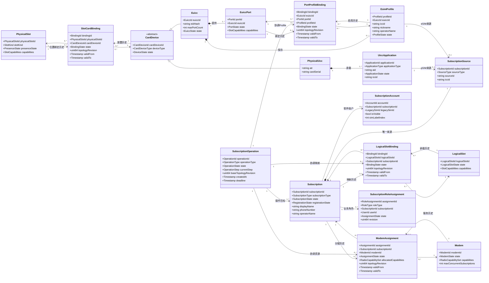
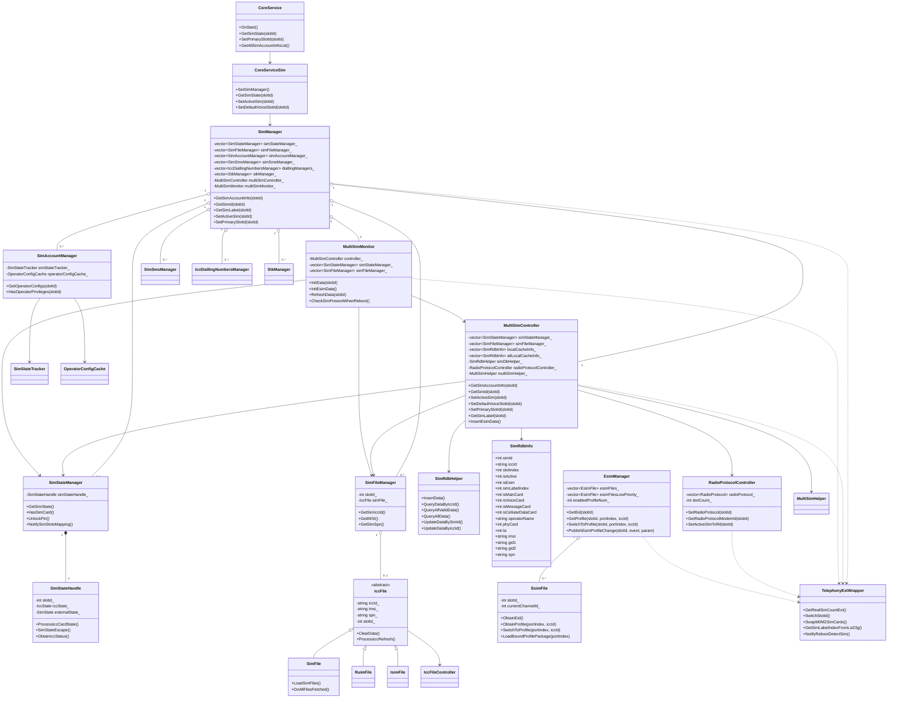
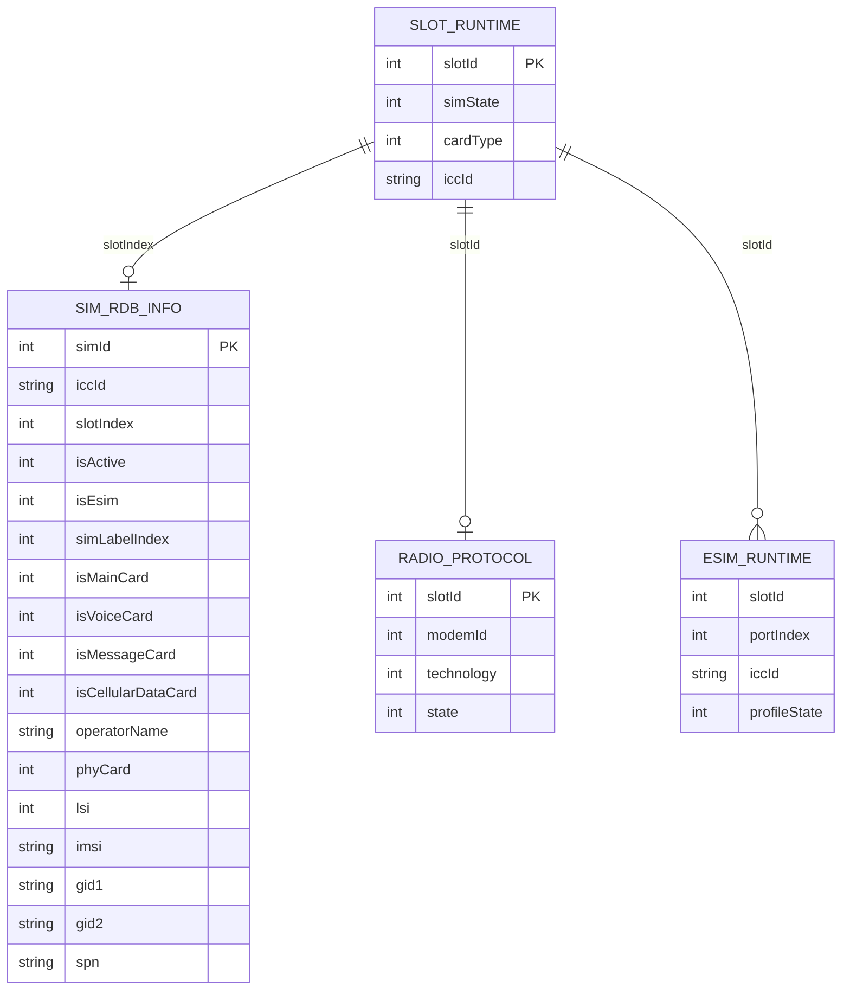
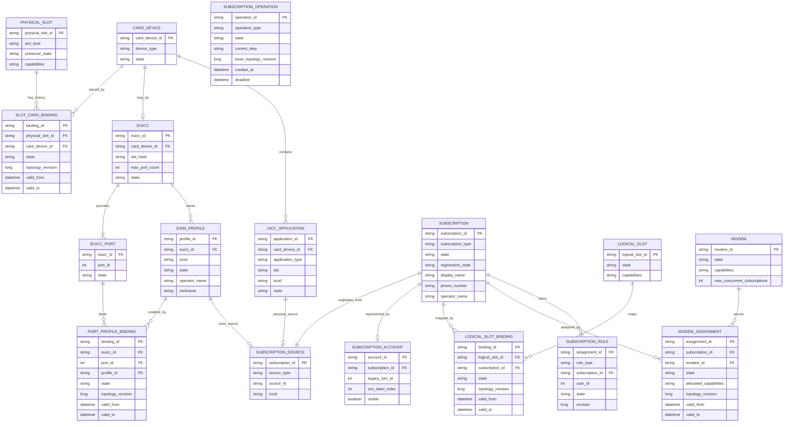
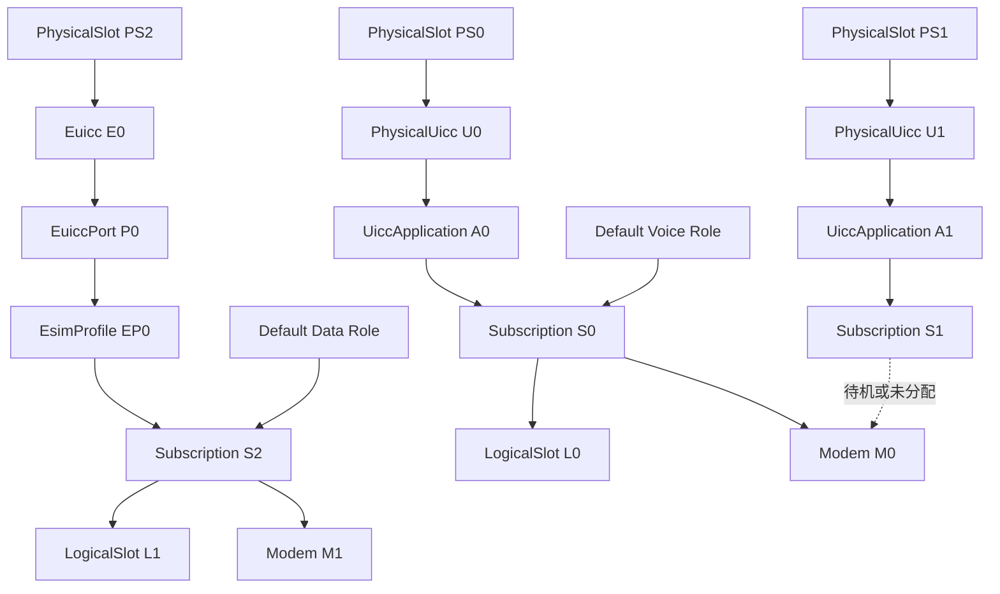

# OpenHarmony Telephony Core Service 卡管理逻辑关系与类模型对比设计

> **文档版本：** v1.1<br>
> **仓库：** `openharmony/telephony_core_service`  
> **默认分支：** `master`  
> **分析范围：** 多 SIM、pSIM/eSIM、eUICC、MEP、Subscription、Logical Slot 与 Modem  
> **文档日期：** 2026-09-09<br>
> **文档性质：** 领域模型及类图设计输入  
> **关联文档：** `02_current_architecture_and_evolution.md`

---

# 1. 文档目的

本文将卡管理涉及的核心概念映射到逻辑数据对象，并明确对象之间的：

- 一对一关系；
- 一对多关系；
- 多对一关系；
- 多对多关系；
- 当前有效关系；
- 历史绑定关系；
- 聚合和生命周期关系。

本文同时给出：

1. 当前代码中的主要类关系；
2. 当前逻辑数据模型；
3. 当前模型存在的问题；
4. 目标状态下的领域类图；
5. 当前模型与目标模型的映射；
6. 后续数据库、接口和类设计必须满足的约束。

本文不要求目标类名与最终实现完全一致，但其中的：

- 对象边界；
- 身份分离；
- 关系基数；
- 绑定实体；
- 一致性约束；

应作为后续详细设计的基础。

---

# 2. 建模原则

## 2.1 区分实体、值对象和关联实体

### 实体

具有独立身份和生命周期：

- `PhysicalSlot`
- `PhysicalUicc`
- `Euicc`
- `EuiccPort`
- `EsimProfile`
- `Subscription`
- `LogicalSlot`
- `Modem`
- `SubscriptionOperation`

### 值对象

没有独立身份，依附于实体存在：

- `ICCID`
- `EID`
- `SlotCapabilities`
- `RadioCapabilitySet`
- `OperatorIdentity`
- `TopologyRevision`
- `SubscriptionDisplayInfo`

### 关联实体

表达两个实体之间随时间变化的关系：

- `SlotCardBinding`
- `PortProfileBinding`
- `LogicalSlotBinding`
- `ModemAssignment`
- `SubscriptionRoleAssignment`

---

## 2.2 区分当前关系和历史关系

例如，某一时刻：

```text
一个 Port 最多启用一个 Profile
```

但从历史角度：

```text
一个 Port 可以先后启用多个 Profile
一个 Profile 也可能先后绑定不同 Port
```

因此：

- 当前快照是“一对零或一”；
- 历史关系是“多对多”；
- 必须使用 `PortProfileBinding` 保存历史关系。

同样的原则适用于：

- Physical Slot 与 Card Device；
- Logical Slot 与 Subscription；
- Modem 与 Subscription；
- Subscription 与默认业务角色。

---

## 2.3 核心身份必须分离

以下标识不能继续混用：

```text
PhysicalSlotId
LogicalSlotId
EuiccId
PortId
ProfileId
SubscriptionId
ModemId
ICCID
EID
```

其中：

| 标识 | 标识对象 |
|---|---|
| `PhysicalSlotId` | 物理卡位置 |
| `LogicalSlotId` | Telephony/RIL 逻辑访问位置 |
| `EuiccId` | eUICC 硬件 |
| `PortId` | eUICC MEP Port |
| `ProfileId` | eSIM Profile |
| `SubscriptionId` | 业务订阅 |
| `ModemId` | Radio 资源 |
| ICCID | UICC 应用或 eSIM Profile |
| EID | eUICC 硬件标识 |

---

# 3. 核心概念定义

| 概念 | 类型 | 定义 |
|---|---|---|
| Physical Slot | 物理实体 | pSIM 卡座或 eUICC 所在硬件位置 |
| Logical Slot | 软件实体 | Telephony/RIL 访问卡或订阅的逻辑位置 |
| UICC | 安全载体 | 承载 SIM、USIM、ISIM 等应用 |
| pSIM | UICC 形态 | 可插拔物理 UICC |
| eUICC | 安全硬件 | 可安装和管理多个 eSIM Profile |
| Port | eUICC 逻辑实体 | MEP 下独立承载活动 Profile |
| Profile | eSIM 配置 | 安装在 eUICC 中的运营商配置和凭据 |
| Subscription | 业务实体 | 为语音、短信、数据提供通信身份 |
| Subscription Account | 软件账户 | Subscription 在系统数据库和 API 中的账户表达 |
| Modem | 资源实体 | 为 Subscription 提供无线注册和通信能力 |
| Default Role | 业务角色 | 默认语音、短信、数据等角色 |
| Primary Slot | 兼容概念 | 当前主 Radio、主卡或首选卡对应的 Slot |
| Topology Revision | 版本值 | 当前订阅拓扑的版本号 |
| Operation ID | 事务标识 | 一次跨模块操作的唯一标识 |

---

# 4. 核心概念逻辑关系总图



---

# 5. 关系基数总表

| 对象 A | 对象 B | 当前快照关系 | 历史关系 | 说明 |
|---|---|---:|---:|---|
| Physical Slot | Card Device | 1 : 0..1 | 多 : 多 | 一个位置当前最多安装一个卡设备 |
| Physical UICC | UICC Application | 1 : 多 | 1 : 多 | 一张 UICC 可承载多个应用 |
| eUICC | Port | 1 : 多 | 1 : 多 | 一个 eUICC 提供一个或多个 Port |
| eUICC | Profile | 1 : 多 | 1 : 多 | 一个 eUICC 可安装多个 Profile |
| Port | Enabled Profile | 1 : 0..1 | 多 : 多 | 一个 Port 当前最多启用一个 Profile |
| Profile | Active Port | 1 : 0..1 | 多 : 多 | 一个 Profile 当前最多绑定一个 Port |
| UICC Application | Subscription | 1 : 0..1 | 1 : 0..1 | 有效卡应用可形成一个 Subscription |
| eSIM Profile | Subscription | 1 : 0..1 | 1 : 0..1 | Profile 可存在但不一定形成活动 Subscription |
| Subscription | Subscription Source | 1 : 1 | 1 : 1 | 每个 Subscription 只有一个来源 |
| Subscription | Software Account | 1 : 0..1 | 1 : 1 或多版本 | 软件账户可保留历史状态 |
| Logical Slot | Subscription | 1 : 0..1 | 多 : 多 | 当前一个 Logical Slot 最多承载一个 Subscription |
| Subscription | Logical Slot | 1 : 0..1 | 多 : 多 | 当前一个 Subscription 最多映射一个 Logical Slot |
| Modem | Subscription | 1 : 0..N | 多 : 多 | 一个 Modem 可服务多个 Subscription |
| Subscription | Modem | 1 : 0..1 | 多 : 多 | 当前一个 Subscription 通常分配到一个 Modem |
| Subscription | Role Assignment | 1 : 0..N | 1 : 多 | 一个 Subscription 可承担多个业务角色 |
| Role Type | Subscription | 1 : 0..1 | 多 : 多 | 同一用户作用域内，一个角色最多指向一个 Subscription |
| Operation | Subscription | 1 : 1..N | 多 : 多 | 一次操作可以影响多个 Subscription |
| Operation | Binding/Assignment | 1 : 0..N | 1 : 多 | 事务协调多个绑定变化 |

---

# 6. 当前代码类图

> 本节描述当前代码的主要职责和依赖关系，用于说明现有实现如何表达卡、账户、Slot 和 eSIM。  
> 图中省略了部分工具类、Parcel 类型和普通查询接口，不代表完整源码继承图。



---

# 7. 当前类模型的核心特征

## 7.1 每 Slot 多管理器

当前主要按相同数组下标关联：

```text
simStateManager_[slotId]
simFileManager_[slotId]
simAccountManager_[slotId]
simSmsManager_[slotId]
stkManager_[slotId]
```

逻辑上表示：

```text
slotId
→ State Manager
→ File Manager
→ Account Manager
→ SMS Manager
→ STK Manager
```

但没有显式的：

```text
SimSlotContext
```

因此所有 vector 必须保证：

- 长度一致；
- 下标一致；
- 初始化顺序一致；
- 特殊 Slot 跳过规则一致。

---

## 7.2 `MultiSimController` 成为多领域聚合点

当前 `MultiSimController` 同时负责：

- Subscription 账户；
- Slot 映射；
- SIM 激活；
- 默认语音、短信和数据；
- Primary Slot；
- 本地缓存；
- 历史账户缓存；
- eSIM 标签；
- 数据库；
- Radio Protocol；
- Modem 映射；
- 系统参数；
- Common Event；
- 重试与回滚。

这表明多个领域边界被集中到同一个类。

---

## 7.3 `SimRdbInfo` 是扁平聚合数据

当前 `SimRdbInfo` 同时表示：

- 账户；
- Physical Slot；
- Logical Slot；
- 卡类型；
- Subscription 状态；
- 默认业务角色；
- eSIM 标识；
- 显示属性；
- 运营商数据；
- SIM 文件快照。

该模型不能自然表达：

```text
一个 eUICC
→ 多个 Port
→ 多个 Profile
→ 多个 Subscription
```

---

## 7.4 eSIM 类与 SIM 账户模型分离不完整

`EsimManager` 和 `EsimFile` 已支持：

```text
slotId + portIndex + iccId
```

但是 `MultiSimController` 仍主要使用：

```text
localCacheInfo_[slotId]
```

因此：

- eSIM 操作层能识别 Port；
- 账户层不能完整保存 Port；
- 事件层仍主要使用 Slot；
- 默认角色仍主要绑定 Slot。

---

# 8. 当前逻辑数据关系图



## 8.1 当前数据关系的隐含假设

```text
一个 slotId
→ 一个当前 SIM_RDB_INFO
→ 一个当前 Radio Protocol
```

但 eSIM Runtime 已可能表示：

```text
一个 slotId
→ 多个 portIndex
→ 多个 Profile
```

这导致当前模型内部存在不对称：

```text
eSIM Runtime：一 Slot 多 Port
SIM Account：一 Slot 一个当前账户
Radio Protocol：一 Slot 一个 Radio 映射
```

---

# 9. 当前模型存在的主要问题

## 9.1 Slot 概念过载

当前 `slotId` 同时用于表示：

- Physical Slot；
- Logical Slot；
- SIM Account 位置；
- eSIM 所在位置；
- RIL 通道；
- Modem 映射；
- Primary Slot；
- 特殊产品 Slot。

---

## 9.2 一槽一账户假设

```text
localCacheInfo_[slotId]
```

表示一个 Slot 对应一个当前账户。

MEP 场景中：

```text
一个 Slot
→ 一个 eUICC
→ 多个活动 Port
→ 多个 Subscription
```

一槽一账户假设不再成立。

---

## 9.3 默认角色以布尔字段重复保存

当前每条账户记录保存：

```text
isVoiceCard
isMessageCard
isCellularDataCard
isMainCard
```

为了设置一个默认角色，需要：

1. 清除其他账户的字段；
2. 设置目标账户字段；
3. 更新缓存；
4. 更新数据库；
5. 发布事件。

这是一种分布式互斥状态，容易产生多个账户同时标记为默认或没有账户标记为默认。

---

## 9.4 活动缓存与全量缓存重复

当前同时存在：

```text
localCacheInfo_
allLocalCacheInfo_
activeIccAccountInfoList_
allIccAccountInfoList_
```

以下字段更新时需要同步多个副本：

- 激活状态；
- 显示号码；
- 显示名称；
- SIM Label；
- 运营商名称；
- 默认角色。

---

## 9.5 Profile、Port、Subscription 未独立建模

当前通常通过：

```text
slotIndex
isEsim
simLabelIndex
iccId
```

近似表达 eSIM Subscription。

缺少：

- `EuiccId`
- `PortId`
- `ProfileId`
- 稳定的 `SubscriptionId`
- `ModemAssignment`

---

## 9.6 Primary Slot 混合多个角色

当前 Primary Slot 可能同时表达：

- 用户首选卡；
- 默认数据卡；
- 主 Modem；
- 高能力 Radio；
- 历史主卡。

复杂场景中，这些角色不一定属于同一 Subscription。

---

# 10. 目标状态类图

```mermaid
classDiagram
direction TB

class SubscriptionFacade {
    +GetTopology()
    +GetSubscription(subscriptionId)
    +ActivateSubscription(subscriptionId)
    +SetDefaultRole(role, subscriptionId)
    +SwitchProfile(target)
}

class SubscriptionTopologyManager {
    -SubscriptionTopology currentTopology_
    +DiscoverTopology()
    +ApplyTopologyChange()
    +GetTopologySnapshot()
    +GetTopologyRevision()
}

class SubscriptionTopology {
    +uint64 revision
    +vector~PhysicalSlot~ physicalSlots
    +vector~Euicc~ euiccs
    +vector~Subscription~ subscriptions
    +vector~Modem~ modems
}

class PhysicalSlot {
    +PhysicalSlotId id
    +SlotKind kind
    +PresenceState presence
    +SlotCapabilities capabilities
}

class CardDevice {
    <<abstract>>
    +CardDeviceId id
    +DeviceState state
}

class PhysicalUicc
class Euicc {
    +EuiccId id
    +EID eid
    +EuiccState state
}

class UiccApplication {
    +ApplicationId id
    +ApplicationType type
    +AID aid
    +ICCID iccid
}

class EuiccPort {
    +PortId id
    +PortState state
}

class EsimProfile {
    +ProfileId id
    +ICCID iccid
    +ProfileState state
    +ProfileMetadata metadata
}

class Subscription {
    +SubscriptionId id
    +SubscriptionType type
    +SubscriptionState state
    +RegistrationState registrationState
    +SubscriptionDisplayInfo displayInfo
}

class SubscriptionSource {
    +SourceType sourceType
    +SourceId sourceId
}

class SubscriptionAccount {
    +AccountId id
    +LegacySimId legacySimId
    +int simLabelIndex
    +bool visible
}

class LogicalSlot {
    +LogicalSlotId id
    +LogicalSlotState state
}

class Modem {
    +ModemId id
    +ModemState state
    +RadioCapabilitySet capabilities
}

class SlotCardBinding {
    +BindingId id
    +PhysicalSlotId slotId
    +CardDeviceId cardId
    +BindingState state
    +uint64 revision
}

class PortProfileBinding {
    +BindingId id
    +EuiccId euiccId
    +PortId portId
    +ProfileId profileId
    +BindingState state
    +uint64 revision
}

class LogicalSlotBinding {
    +BindingId id
    +LogicalSlotId slotId
    +SubscriptionId subscriptionId
    +BindingState state
    +uint64 revision
}

class ModemAssignment {
    +AssignmentId id
    +SubscriptionId subscriptionId
    +ModemId modemId
    +RadioCapabilitySet capabilities
    +AssignmentState state
    +uint64 revision
}

class SubscriptionRoleAssignment {
    +RoleAssignmentId id
    +RoleType roleType
    +SubscriptionId subscriptionId
    +UserId userId
    +uint64 revision
}

class SubscriptionRegistry {
    -map~SubscriptionId,Subscription~ subscriptions_
    -multimap~PhysicalSlotId,SubscriptionId~ byPhysicalSlot_
    -map~EuiccPortKey,SubscriptionId~ byPort_
    -multimap~ModemId,SubscriptionId~ byModem_
    +GetById()
    +GetByPhysicalSlot()
    +GetByEuiccPort()
    +GetByModem()
}

class SubscriptionRepository {
    +LoadTopology()
    +SaveSubscription()
    +SaveBinding()
    +CommitTransaction()
    +CreateLegacyView()
}

class SubscriptionPolicyEngine {
    +SelectDefaultRole()
    +EvaluateModemAssignment()
    +ResolveSubscriptionConflict()
}

class RadioResourceArbiter {
    +AssignModem()
    +ReleaseModem()
    +AllocateCapabilities()
    +CheckResourceConflict()
}

class SubscriptionTransactionManager {
    +BeginOperation()
    +ExecuteStep()
    +Commit()
    +Rollback()
    +RecoverPendingOperations()
}

class SubscriptionOperation {
    +OperationId id
    +OperationType type
    +OperationState state
    +OperationStep currentStep
    +uint64 topologyRevision
}

class SubscriptionEventBus {
    +Publish(event)
    +Subscribe(eventType)
    +RejectStaleEvent()
}

class VersionedExtensionRegistry {
    +RegisterExtension()
    +GetCapability()
    +GetPolicyExtension()
}

SubscriptionFacade --> SubscriptionTopologyManager
SubscriptionFacade --> SubscriptionTransactionManager
SubscriptionFacade --> SubscriptionRegistry

SubscriptionTopologyManager *-- SubscriptionTopology
SubscriptionTopology *-- PhysicalSlot
SubscriptionTopology *-- Euicc
SubscriptionTopology *-- Subscription
SubscriptionTopology *-- Modem

CardDevice <|-- PhysicalUicc
CardDevice <|-- Euicc

PhysicalSlot --> SlotCardBinding
CardDevice --> SlotCardBinding

PhysicalUicc *-- UiccApplication
Euicc *-- EuiccPort
Euicc *-- EsimProfile

EuiccPort --> PortProfileBinding
EsimProfile --> PortProfileBinding

Subscription *-- SubscriptionSource
Subscription --> SubscriptionAccount
UiccApplication --> SubscriptionSource
EsimProfile --> SubscriptionSource

LogicalSlot --> LogicalSlotBinding
Subscription --> LogicalSlotBinding

Subscription --> ModemAssignment
Modem --> ModemAssignment

Subscription --> SubscriptionRoleAssignment

SubscriptionRegistry --> Subscription
SubscriptionRegistry --> LogicalSlotBinding
SubscriptionRegistry --> ModemAssignment
SubscriptionRegistry --> PortProfileBinding

SubscriptionTopologyManager --> SubscriptionRepository
SubscriptionTopologyManager --> SubscriptionRegistry

SubscriptionPolicyEngine --> SubscriptionRegistry
SubscriptionPolicyEngine --> RadioResourceArbiter
SubscriptionPolicyEngine ..> VersionedExtensionRegistry

RadioResourceArbiter --> Modem
RadioResourceArbiter --> ModemAssignment
RadioResourceArbiter ..> VersionedExtensionRegistry

SubscriptionTransactionManager *-- SubscriptionOperation
SubscriptionTransactionManager --> SubscriptionTopologyManager
SubscriptionTransactionManager --> SubscriptionRepository
SubscriptionTransactionManager --> RadioResourceArbiter
SubscriptionTransactionManager --> SubscriptionEventBus
SubscriptionTransactionManager ..> VersionedExtensionRegistry
```



---

# 11. 目标逻辑数据关系图



---

# 12. 当前类图与目标类图对比

| 关注点 | 当前状态 | 目标状态 |
|---|---|---|
| 核心业务主键 | `slotId` | `SubscriptionId` |
| 物理位置 | 与 `slotId` 混用 | `PhysicalSlot` |
| 逻辑访问位置 | `slotId` | `LogicalSlot` |
| pSIM 硬件 | `SimStateManager`、`IccFile` 间接表示 | `PhysicalUicc` |
| eUICC | `EsimManager[slotId]` | 独立 `Euicc` |
| Port | API 参数 `portIndex` | 独立 `EuiccPort` |
| Profile | ICCID 和 Parcel | 独立 `EsimProfile` |
| 账户 | `SimRdbInfo` | `Subscription` + `SubscriptionAccount` |
| Subscription 来源 | 由 `isEsim` 推断 | `SubscriptionSource` |
| Slot 映射 | 特殊参数和分支 | `LogicalSlotBinding` |
| Profile/Port 绑定 | 隐含在 eSIM 操作中 | `PortProfileBinding` |
| Modem 分配 | `RadioProtocolController(slotId)` | `ModemAssignment` |
| 默认角色 | 每账户多个布尔字段 | `SubscriptionRoleAssignment` |
| Primary Slot | 核心事实 | 兼容派生值 |
| 活动账户缓存 | `localCacheInfo_[slotId]` | 多索引 `SubscriptionRegistry` |
| 历史账户缓存 | `allLocalCacheInfo_` | Repository 中的实体状态 |
| 跨模块操作 | 事件、条件变量、重试 | `SubscriptionOperation` |
| 拓扑版本 | 无统一模型 | `TopologyRevision` |
| 产品扩展 | 可空函数指针 | 版本化领域扩展接口 |

---

# 13. 当前类到目标类的迁移映射

| 当前类或数据 | 目标对象 | 迁移说明 |
|---|---|---|
| `SimManager` | `SubscriptionFacade` | 保留旧 API，并逐步转为兼容门面 |
| 多个 Manager vector | `SlotContextRegistry` | 先聚合每 Slot 运行时对象 |
| `SimStateManager` | `CardStateAdapter`、`SubscriptionStateService` | 区分卡状态与业务订阅状态 |
| `SimFileManager` | `UiccApplicationService` | 负责 UICC 文件和应用数据 |
| `MultiSimController` | 多个目标服务 | 拆分拓扑、账户、角色、资源和事务职责 |
| `MultiSimMonitor` | `TopologyEventAdapter`、`RepositoryAvailabilityAdapter` | 拆分业务事件和基础设施恢复 |
| `RadioProtocolController` | `RadioResourceArbiter`、`ModemAdapter` | 从 Slot 主从模型转为资源分配 |
| `EsimManager` | `EuiccService` | 管理 eUICC、Port 和 Profile |
| `EsimFile` | `EuiccProtocolAdapter` | 保留 APDU 和 Profile 协议职责 |
| `SimRdbHelper` | `SubscriptionRepository` | 隐藏 DataShare 和数据迁移 |
| `SimRdbInfo` | 多个实体和关系表 | 不再继续加字段 |
| `IccAccountInfo` | `SubscriptionInfo`、兼容 DTO | 新旧 API 分离 |
| `TELEPHONY_EXT_WRAPPER` | `VersionedExtensionRegistry` | 按领域拆分并版本化 |
| `ObserverHandler` | `SubscriptionEventBus` | 增加结构化事件和版本过滤 |

---

# 14. 当前数据字段到目标逻辑数据的映射

| 当前字段 | 当前含义 | 目标逻辑数据 | 处理建议 |
|---|---|---|---|
| `slotId` | 多种 Slot 和账户含义 | `PhysicalSlotId`/`LogicalSlotId` | 按语境拆分 |
| `simId` | SIM 账户 ID | `SubscriptionId` | 定义稳定性后迁移 |
| `iccId` | 卡或 Profile 标识 | `SubscriptionSource.iccid` | 不作为其他实体主键 |
| `isEsim` | eSIM 标志 | `SubscriptionType` | 替换为枚举 |
| `simLabelIndex` | 展示标签 | `SubscriptionAccount.simLabelIndex` | 仅作为显示属性 |
| `phyCard` | 产品物理卡索引 | `PhysicalSlotId`、Binding | 停止由值推断类型 |
| `lsi` | 产品逻辑标识 | `LogicalSlotId` 或扩展属性 | 明确定义语义 |
| `isActive` | 混合激活状态 | 多个状态字段 | 拆分 Enabled、Assigned、Registered |
| `isMainCard` | 主卡 | 派生值 | 不作为独立事实 |
| `isVoiceCard` | 默认语音 | `SubscriptionRoleAssignment` | 移出账户表 |
| `isMessageCard` | 默认短信 | `SubscriptionRoleAssignment` | 移出账户表 |
| `isCellularDataCard` | 默认数据 | `SubscriptionRoleAssignment` | 移出账户表 |
| `operatorName` | 运营商名称 | Profile 或 Subscription 属性 | 明确事实来源 |
| `portIndex` | eUICC Port | `PortId` | 纳入数据库和事件 |
| `enabledProfileNum` | Profile 数量 | 绑定关系聚合结果 | 不作为拓扑事实 |
| `primarySlotId` | 主卡和主 Radio | 派生值 | 由角色和 Modem 分配计算 |

---

# 15. Default Role 的目标建模

当前账户表通过布尔字段表示默认角色：

```text
Subscription A:
  isVoiceCard = true
  isMessageCard = true
  isCellularDataCard = false

Subscription B:
  isVoiceCard = false
  isMessageCard = false
  isCellularDataCard = true
```

目标状态：

```text
RoleAssignment 1:
  roleType = DEFAULT_VOICE
  subscriptionId = A

RoleAssignment 2:
  roleType = DEFAULT_SMS
  subscriptionId = A

RoleAssignment 3:
  roleType = DEFAULT_DATA
  subscriptionId = B
```

关系为：

```text
Subscription 1 : 0..N RoleAssignment
RoleType 1 : 0..1 Subscription
```

限定条件：

```text
同一 UserId + RoleType
最多存在一条 Active Assignment
```

---

# 16. Subscription Source 的互斥约束

一个 Subscription 必须来自且只能来自一个来源：

```text
UiccApplication
XOR EsimProfile
XOR VSimCredential
XOR SatelliteCredential
XOR RemoteSubscriptionCredential
```

逻辑表达：

```text
SubscriptionSource.sourceType == PHYSICAL_UICC
    → sourceId 必须引用 UiccApplication

SubscriptionSource.sourceType == ESIM_PROFILE
    → sourceId 必须引用 EsimProfile

SubscriptionSource.sourceType == VSIM
    → sourceId 必须引用 VSimCredential
```

不允许：

```text
一个 Subscription
同时来自 pSIM 和 eSIM Profile
```

---

# 17. 当前三卡场景的数据实例

假设产品支持：

```text
2 张 pSIM
1 个 eSIM Subscription
2 个主要 Modem
```

逻辑数据如下：

```text
PhysicalSlot PS0
  └── PhysicalUicc U0
       └── UiccApplication A0
            └── Subscription S0

PhysicalSlot PS1
  └── PhysicalUicc U1
       └── UiccApplication A1
            └── Subscription S1

PhysicalSlot PS2 或嵌入式位置
  └── Euicc E0
       └── Port P0
            └── EsimProfile EP0
                 └── Subscription S2

Modem M0
  └── Assignment S0

Modem M1
  └── Assignment S2

Subscription S1
  └── 当前未分配 Modem、低优先级待机或受产品策略限制
```

对应数量：

| 对象 | 数量 |
|---|---:|
| pSIM/UICC | 2 |
| eUICC | 1 |
| eSIM Profile | 1 或更多 |
| 当前 eSIM Subscription | 1 |
| 总 Subscription | 3 |
| 主要 Modem | 2 |
| 当前 Modem Assignment | 最多 2 或由能力决定 |

因此：

```text
三卡
= 三个逻辑 Subscription

不等于：
三个固定 Physical Slot
三个固定 Logical Slot
三个独立 Modem
三个 Subscription 必然同时全活跃
```

---

# 18. 目标模型下的三卡对象图



---

# 19. 类图设计约束

## 19.1 当前有效绑定唯一性

在同一 `TopologyRevision` 内：

```text
一个 Physical Slot 最多一个有效 SlotCardBinding
一个 Port 最多一个有效 PortProfileBinding
一个 Profile 最多一个有效 PortProfileBinding
一个 Logical Slot 最多一个有效 LogicalSlotBinding
一个 Subscription 最多一个有效 LogicalSlotBinding
一个 Subscription 最多一个有效 ModemAssignment
一个 UserId + RoleType 最多一个有效 RoleAssignment
```

---

## 19.2 MEP 约束

```text
一个 eUICC 可以有多个 Port
不同 Port 可以分别启用不同 Profile
每个 Port 当前最多启用一个 Profile
每个活动 Profile 应形成独立 Subscription
每个 Subscription 可以独立拥有 Default Role
每个 Subscription 可以独立分配 Modem
```

---

## 19.3 标识约束

禁止隐式转换：

```text
PhysicalSlotId → SubscriptionId
LogicalSlotId → PhysicalSlotId
ICCID → EuiccId
EID → ProfileId
slotId → ModemId
simLabelIndex → PortId
```

---

## 19.4 事务约束

以下关系变化必须经过 `SubscriptionOperation`：

- Profile 启用；
- Profile 停用；
- Port/Profile 切换；
- Logical Slot Mapping；
- Subscription 激活和停用；
- Modem Assignment；
- Default Role 变更。

---

## 19.5 事件约束

所有改变拓扑或分配关系的事件必须携带：

```text
operationId
topologyRevision
subscriptionId
```

根据场景补充：

```text
physicalSlotId
logicalSlotId
euiccId
portId
profileId
modemId
```

旧于当前 `TopologyRevision` 的迟到事件不得修改当前状态。

---

# 20. 建议的聚合边界

| 聚合根 | 内部对象 | 跨聚合引用 |
|---|---|---|
| `PhysicalSlot` | 当前 Slot/Card Binding | Card Device ID |
| `PhysicalUicc` | UICC Application | Subscription ID |
| `Euicc` | Port、Profile 元数据 | Subscription ID |
| `Subscription` | Source、Account、显示信息 | Slot、Profile、Modem ID |
| `Modem` | 当前资源状态 | Assignment ID |
| `SubscriptionOperation` | 操作步骤、补偿动作 | 所有目标实体 ID |

## 20.1 不建议形成超大聚合

不应将以下所有对象放入一个 `MultiSimController` 聚合：

```text
Physical Slot
Profile
Subscription
Default Role
Modem
Database
Event
Transaction
```

因为这些对象具有不同生命周期和一致性边界。

---

# 21. 建议的详细类图拆分

总类图应进一步拆为四张详细类图。

## 21.1 卡硬件与 Profile 类图

包含：

- `PhysicalSlot`
- `CardDevice`
- `PhysicalUicc`
- `UiccApplication`
- `Euicc`
- `EuiccPort`
- `EsimProfile`
- `SlotCardBinding`
- `PortProfileBinding`

## 21.2 Subscription 与账户类图

包含：

- `Subscription`
- `SubscriptionSource`
- `SubscriptionAccount`
- `SubscriptionRoleAssignment`
- `SubscriptionRegistry`

## 21.3 Logical Slot 与 Modem 类图

包含：

- `LogicalSlot`
- `LogicalSlotBinding`
- `Modem`
- `ModemAssignment`
- `RadioResourceArbiter`

## 21.4 事务与事件类图

包含：

- `SubscriptionOperation`
- `SubscriptionTransactionManager`
- `OperationStep`
- `CompensationAction`
- `SubscriptionEvent`
- `SubscriptionEventBus`
- `TopologyRevision`

---

# 22. 分阶段迁移建议

## 22.1 第一阶段：显式 Slot Context

将多个 Manager vector 聚合为：

```cpp
struct LegacySlotContext {
    LogicalSlotId slotId;
    std::shared_ptr<SimStateManager> stateManager;
    std::shared_ptr<SimFileManager> fileManager;
    std::shared_ptr<SimAccountManager> accountManager;
    std::shared_ptr<SimSmsManager> smsManager;
    std::shared_ptr<IccDiallingNumbersManager> phonebookManager;
    std::shared_ptr<StkManager> stkManager;
};
```

该阶段仍保留 Slot-Centric 行为，但消除多个 vector 的下标一致性问题。

---

## 22.2 第二阶段：引入 Subscription Registry

新增：

```cpp
class SubscriptionRegistry {
public:
    SubscriptionInfo GetById(SubscriptionId id);
    std::vector<SubscriptionInfo> GetByPhysicalSlot(PhysicalSlotId id);
    std::optional<SubscriptionInfo> GetByPort(EuiccId euiccId, PortId portId);
    std::vector<SubscriptionInfo> GetByModem(ModemId id);
};
```

将：

```text
localCacheInfo_[slotId]
```

迁移为多索引查询。

---

## 22.3 第三阶段：拆分 `MultiSimController`

建议拆分为：

```text
SubscriptionTopologyManager
SubscriptionRegistry
SubscriptionRoleService
RadioResourceArbiter
SubscriptionTransactionManager
SubscriptionRepository
```

`MultiSimController` 暂时保留为兼容 Facade。

---

## 22.4 第四阶段：替换数据库模型

新表作为事实来源，旧 `sim_info` 作为兼容视图：

```text
新领域表
    ↓
Legacy Account Projection
    ↓
IccAccountInfo / 旧 Slot API
```

---

# 23. 类图设计验收标准

后续类图设计应能够明确回答：

1. 一个 Physical Slot 当前安装了什么 Card Device？
2. 一个 eUICC 有多少 Port？
3. 每个 Port 当前启用哪个 Profile？
4. 一个 Profile 是否已经形成 Subscription？
5. Subscription 的来源是什么？
6. 一个 Slot 当前关联多少 Subscription？
7. Subscription 当前映射到哪个 Logical Slot？
8. Subscription 当前分配到哪个 Modem？
9. 默认语音、短信和数据分别属于哪个 Subscription？
10. 一次 Profile 切换修改了哪些 Binding？
11. 一次操作失败时如何补偿？
12. 当前状态属于哪个 Topology Revision？
13. 迟到事件如何识别？
14. 旧 `simId` 如何映射到 Subscription ID？
15. 当前三卡场景中，三个 Subscription 分别来自哪里？

如果类图仍只能通过：

```text
slotId
isEsim
simLabelIndex
primarySlotId
```

回答上述问题，则说明领域对象仍未完成解耦。

---

# 24. 最终结论

当前代码的主要类关系建立在：

```text
SimManager
→ 每 Slot Manager Vector
→ MultiSimController
→ SimRdbInfo
→ localCacheInfo_[slotId]
→ RadioProtocolController(slotId)
```

这一结构适合单卡和传统双卡，但无法自然表达：

```text
一个 eUICC
→ 多个 Port
→ 多个活动 Profile
→ 多个 Subscription
→ 动态竞争多个 Modem
```

目标状态必须将以下概念独立建模：

```text
Physical Slot：物理位置
UICC/eUICC：安全载体
Port：eUICC 逻辑端口
Profile：eSIM 运营商配置
Subscription：业务账户
Logical Slot：软件访问位置
Modem：Radio 资源
Role Assignment：默认业务选择
Operation：跨模块事务
```

核心演进关系为：

```text
当前：
slotId
→ Account
→ Primary Slot
→ Radio Protocol

目标：
Physical Slot
→ UICC/eUICC Port
→ Profile
→ Subscription
→ Logical Slot Binding
→ Modem Assignment
→ Role Assignment
```

后续详细类图和数据库设计应以本文给出的：

- 对象身份；
- 关系基数；
- 关联实体；
- 聚合边界；
- 唯一性约束；
- 事务约束；
- 事件版本约束；

作为设计输入。

只有完成上述概念和关系解耦，卡管理模块才能从：

```text
基于 Slot 的多卡适配实现
```

演进为：

```text
基于 Subscription 的通用多订阅平台
```

---

# 25. 首个实现切片的详细模型

## 25.1 实际新增类型

本切片在 `services/sim/include` 中新增私有模型，不改变 InnerKit 或 IPC 类型：

| 类型 | 当前职责 | 当前使用位置 |
|---|---|---|
| `PhysicalSlotId`、`LogicalSlotId`、`EuiccId`、`PortId`、`ProfileId`、`SubscriptionId`、`ModemId`、`OperationId`、`TopologyRevision` | 显式包装边界整数，提供 `IsValid()` | `LogicalSlotId`、`SubscriptionId`、`TopologyRevision` 已在查询投影使用；其余为后续关系迁移预留 |
| `SubscriptionSource` | 表达唯一凭据来源类型、Legacy 来源引用和 ICCID | `LegacySubscriptionRepository` |
| `Subscription` | 表达当前账户 ID、来源、活动状态及显示投影 | `SubscriptionTopology` |
| `EuiccProfileTopology` | 以 Logical Slot、Port 和 ProfileState 表达启动期成功 Profile List 的最小 Shadow Sidecar | `MultiSimController` |
| `SlotRegistry` | 从 `SimManager` 已创建的 Runtime Manager 集合建立锁保护的 Logical Slot 清单，并携带全局 MEP 与每 Slot eSIM 支持元数据 | `MultiSimController::Init`、`AddExtraManagers`、`SetEsimCapabilityMask` |
| `LogicalSlot` | 表达 RIL/Telephony 逻辑访问位置及当前 Registry 导入的能力元数据 | `SubscriptionTopology` |
| `LogicalSlotBinding` | 表达 Logical Slot 到 Subscription 的当前快照关系及版本 | `SubscriptionTopology` |
| `SubscriptionTopology` | 请求期只读聚合，检测 Slot 一对多歧义 | `SubscriptionTopologyManager` |
| `SubscriptionRegistry` | 从当前拓扑建立 Logical Slot 和 Subscription ID 多索引，检测重复 ID | `SubscriptionTopologyManager` |
| `ISubscriptionRepository` | Application 到领域拓扑的纯 Port | `SubscriptionTopologyManager` |
| `LegacySubscriptionRepository` | `SimRdbInfo` 反腐适配器，位于独立 Infrastructure 头文件 | `MultiSimController` |
| `SubscriptionTopologyManager` | Application 查询编排和领域解析结果到旧错误码的映射 | `MultiSimController::GetSimAccountInfo` |

`LogicalSlotId`、`SubscriptionId` 等不提供隐式整数转换；旧 `slotId`、`simId` 只在 Adapter/兼容边界显式构造这些类型。

## 25.2 旧数据到投影的映射

| `SimRdbInfo` 字段 | 当前投影字段 | 说明 |
|---|---|---|
| `simId` | `SubscriptionId` | 仅复用现有账户主键，未改变其持久化生命周期 |
| `slotIndex` | `LogicalSlotId` + `LogicalSlotBinding` | 保留旧缓存排序和 Slot API 行为 |
| `iccId` | `SubscriptionSource.iccId` 与来源引用 | 只在授权的旧 DTO 返回路径中回传 |
| `isEsim` | `SubscriptionSourceType` | 仅由 Adapter 一次性转换，不作为 Domain 布尔状态 |
| `isActive` | `Subscription` 活动投影 | 保留原整数值，避免改变旧 DTO 语义 |
| `showName`、`phoneNumber`、`simLabelIndex` | `Subscription` 显示投影 | 仍由旧缓存拥有和刷新 |

事实来源是 `localCacheInfo_`。成功整体刷新并排序该缓存后，`MultiSimController` 递增私有 `topologyRevision_`，并替换私有 `SubscriptionTopology` Shadow Snapshot；它保留投影数据以供一致性比较，但 `Dump()` 只输出不含订阅标识的版本和数量摘要。账户字段的实时查询仍从 `localCacheInfo_` 构造请求期投影，避免现有局部缓存更新与 Snapshot 产生双事实源。`allLocalCacheInfo_`、DataShare 和 `SimRdbInfo` 的持久化写入逻辑保持不变。

## 25.3 查询与兼容边界

```text
GetSimAccountInfo(int32_t slotId, bool denied, IccAccountInfo &info)
  -> LogicalSlotId(slotId)
  -> LegacySubscriptionRepository::LoadTopology(current TopologyRevision)
  -> SubscriptionRegistry::GetByLogicalSlot
  -> Subscription
  -> IccAccountInfo
```

`MultiSimController` 在进入新路径前保持原 `IsValidData`、缓存范围和 ICCID 已加载校验，并继续使用现有 `mutex_` 读锁。`denied` 时不从 `SubscriptionSource` 或显示投影回填 ICCID 和号码。多个有效 Binding 返回 `TELEPHONY_ERR_ARGUMENT_INVALID`；无 Binding 返回 `TELEPHONY_ERR_SLOTID_INVALID`。

## 25.4 当前不变量边界

| 不变量 | 本切片状态 |
|---|---|
| Subscription 有且仅有一个来源 | 已实现：构造函数强制接收一个 `SubscriptionSource` |
| Logical Slot 最多一个 Subscription | 已实现查询检测：多个 Binding 显式失败 |
| Subscription 最多一个 Logical Slot | 部分实现：Registry 检测重复 legacy `simId` 并使兼容查询显式失败；持久化绑定历史未实现 |
| Port/Profile 一对一 | 未实现：当前 eSIM API 和运行时仍由旧 Slot/Port 路由 |
| Role 唯一性 | 未实现：旧布尔字段仍为事实来源 |
| Modem 容量 | 未实现：仍由 `RadioProtocolController` 管理 |
| TopologyRevision 保护当前拓扑投影 | 部分实现：缓存整体刷新递增版本并替换关系 Snapshot，Registry 仅索引当前版本 Binding；异步响应过滤未实现 |

## 25.5 静态验证和后续测试

新增 `subscription_repository_gtest.cpp` 覆盖 Slot Registry 清单/刷新、全局 MEP 与 per-Slot eSIM 能力、最小 Port/Profile Sidecar 的多 Port/状态/清空语义、pSIM 来源、eSIM Profile 来源和同 Slot 双记录歧义。测试未执行，原因是当前环境没有完整 GN、编译器和测试工程。`MultiSimController::Init`/`AddExtraManagers` 的 Registry 与 Shadow 集成覆盖，以及 `CoreService::Init` 在 eSIM 编译开关开启/关闭时的位图和 Profile List 发布覆盖仍是测试债务：相关状态均为私有，现有测试规则禁止以宏突破访问控制或仅为测试扩张生产 API。完整环境应验证旧 `GetSimAccountInfo` 与投影查询字段相等、拒绝访问脱敏、eSIM 开关关闭构建、eSIM 位图与 Profile List 发布、额外 Runtime Manager 初始化以及缓存刷新并发路径。
