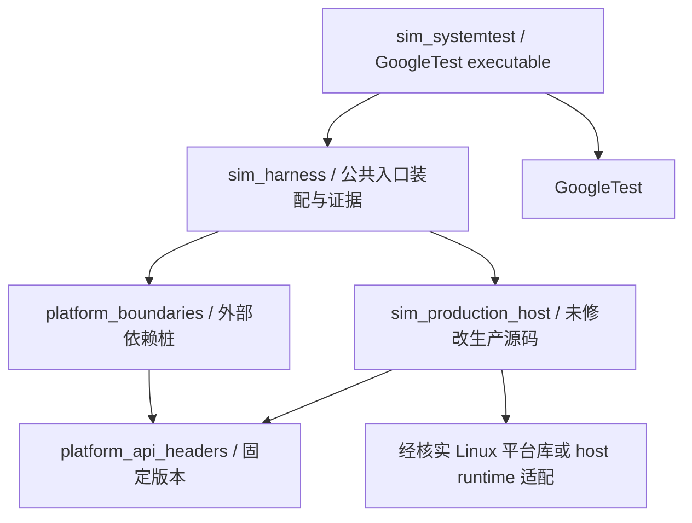

# 独立工程与 Linux 产品目标方案

首批设计历史保留；用户已批准host适配，实际容量切片配置见文末及dependencies.md，未支持路径仍BLOCKED。

## 可复用目标与工具链对照

| 项目 | 当前生产/既有测试 | Linux systemtest 方案 |
|---|---|---|
| GN 根 | 完整OHOS的 //build/ohos.gni、test.gni（当前缺失） | 本目录 .gn + gn/BUILDCONFIG.gn + Linux toolchain |
| 执行 | OHOS模板生成 Ninja | 原生 GN 生成 Ninja；保留技术栈 |
| 产品 | :tel_core_service monolithic SA .so | 独立 sim_production_host source_set/static_library，未改生产源码 |
| 测试 | ohos_unittest + 现有 core_service_test_base/ffrt_mocked | standalone executable + GoogleTest；不依赖任何旧测试实现 |
| C++标准 | 本仓没有指定，完整build模板未知 | 待核实平台默认；若缺参考，提议 C++17 兼容探针，不能声称与原配置一致 |
| GoogleTest链接 | googletest:gtest_main/gmock_main 外部平台标签 | 固定源码版本或经确认host安装；单一 main；GMock只在外部接口确有需要时加 |
| 报告 | 原有 module_out_path、设备安装属性 | GTest XML + 脱敏 JSON；运行器记录准备阶段 BLOCKED |
| 依赖库 | OHOS external_deps 多组件 | 逐项核实host可复用；否则本目录明确平台边界适配 |
| 运行目标 | 未见显式Linux host selection | x86_64 Linux WSL2；显式 target_os="linux"，禁止误链目标设备库 |

无法复用 :tel_core_service 的原因是缺少构建根、平台模板/SDK及host链接能力；不是已证明生产目标在任何OHOS环境都不支持host。不存在当前可调用的独立SIM生产target。先请求匹配版本公共build设施，再决定是否用最小GN适配。

## 产品代码编译与分层

候选源码清单见 `../configs/production_sources_candidate.json`，从实际根 BUILD.gn 提取 SIM unconditional sources，保留完整 SIM 业务，不复制 .cpp。附加入口 core_service_sim.cpp、真实 core_manager_inner.cpp、capability manager。根 BUILD.gn 有条件的 eSIM三源只在明确支持时编入；首批 pSIM 关闭 eSIM、卫星、ext功能，但不能假定普通 esim_manager.cpp 可以删除。

候选为保守全集，不是已验证的最小链接闭包。阶段一编译探针必须找出真实需要的 utils、parcel、observer、core hisysevent、ext包装等源及所有平台头/符号；全部登记，禁止通过替换 SIM 业务函数消除 unresolved symbols。保留 sim_char_decode、sim_number_decode、文件初始化/解析、账户与多卡控制实现。测试没有修改这些源码，不声称已经跑解码 fuzzer；以后如需改它们，执行对应 fuzzer 的仓库约束仍适用。

拟议依赖 DAG：

测试、桩、产品源各自独立target。产品target通过头文件接口调用外部符号，最终链接时提供边界实现；只在正式构造/组合接口装配外部对象。CoreManagerInner 保持生产实现，其管理器装配仅用于启动，不用于测试读取内部状态。禁止 include .cpp、访问修饰符宏、旧测试头目录。产品源清单固定版本并审计差异，拆分后优先改为链接新的生产目标；测试Oracle不引用SO名称。

平台适配偏差：parcel仅实现已核实类型序列化（不是Binder），参数/Preferences/DataShare使用隔离命名空间（不等同真实持久化事务），权限采用固定身份（不覆盖真实鉴权），事件只提供受控路由（不证明系统投递），FFRT/EventHandler需验证阻塞、所有权、注销、超时模型。任一真实使用API无适配则 BLOCKED；禁止静默成功。宿主库缺失范围大，当前不能给出可信适配工作量或“立即可运行”承诺。

## 目录与拟议入口

`.gn`、`BUILD.gn`、`gn/`、`tests/`、`support/`、`stubs/`、`scripts/` 将在批准实施后加入。现阶段只有 README、docs、configs，没有空壳构建伪装可执行。

拟议命令（未执行）：从本目录使用 `gn gen <absolute-output> --root=<absolute-systemtest-root>`；Ninja构建 `sim_systemtest`；runner单场景子进程调用 `--gtest_filter=<case>` 与 `--gtest_output=xml:<output>/...xml`。输出目录默认 `/tmp/sim-systemtest/<run-id>`，不落源目录。GN根之外的生产路径使用显式已校验绝对source path/配置，先验证GN允许该布局；不修改外部根 .gn，不把仓库复制为第二份产品代码。外部GoogleTest目录配置同样先验证路径解析。

## 必须确认的选择

1. 推荐：允许仅在 systemtest 内建立 Linux GN 产品源码target + 平台API适配；编译清单从候选开始经链接审计冻结。GN/Ninja+GoogleTest不变，无外部修改。需取得GoogleTest与匹配平台接口头文件，来源/版本写manifest。
2. 若希望完整服务入口：补齐匹配 OHOS build树及host库，以 CoreService 为入口，核实 ohos_unittest/host工具链后再定；更广生产闭包，不提前承诺能直接复用现有模板。
3. capability阻塞：保持真实 CoreServiceSim 时 Slot0/1例保持 BLOCKED。零外部修改的替代是以公共 InnerKit ISimManager 为较低组件边界，明确不覆盖 CoreServiceSim权限/capability/回调，需确认接受范围；不能称完整服务测试。另一替代是等待负责人单独修复生产检查后再实施服务入口例。
4. 如负责人要求修复检查：最小候选外部文件 common/capability_mgr/src/multi_sims_capability_manager.cpp（一处返回分支，语义先确认），影响所有引用它的公开API和slot3鉴权；需独立确认/回归，当前不执行。

停止点来自用户第4.2/14节的明确要求“生产源码 host 编译适配…经确认后再实施”。不是工具自加批准流程；本阶段不安装依赖、不改外部文件、不实现host适配。

## 批准后实际采用配置

用户已批准仅systemtest内host适配与ISimManager组件入口。实际root .gn与Linux GN targets已实施。工具链为Clang18.1.3 + GNU gold + full LTO，C++17；GCC13.3编译生产源成功但虚表链接失败，未宣称GCC target已可运行。Clang whole-program-vtables/virtual-function-elimination去除未调用方法，未修改源/访问权限/业务条件宏。支持范围严格限于容量读取，试图调用未纳入SIM子模块时必须扩充真实生产目标/适配，不可补业务桩。新方案不是ohos_unittest，默认OHOS C++标准仍未知。原保守全集候选未作为此切片实际源码名单；实际target是sim_manager.cpp与telephony_ext_wrapper.cpp，见dependencies.md。

当前更新：Linux 场景通过固定版本 GoogleMock 构造外部参数边界，生产目标不变；详见 [Linux GoogleMock 方案](linux_gmock_scenarios.md)。早期手写桩描述属于历史记录。原五条业务场景仍 BLOCKED。
