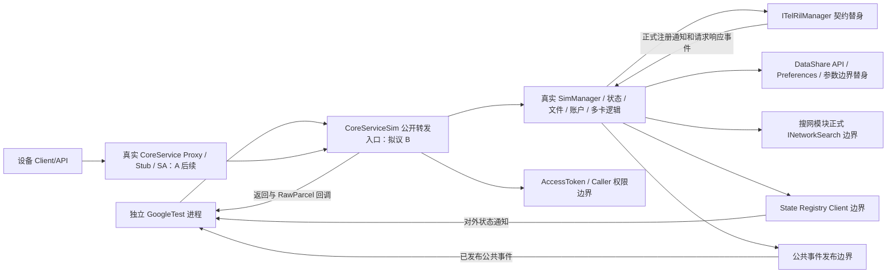

# 公开输入/输出边界与依赖图

下文是首批服务入口方案（仍未运行）。批准后的实际组件容量链路见component_entry.md；不把下图所有生产/外部模块视为当前运行覆盖。

证据基线/文件摘要见 investigation.md 与 configs/source_manifest.json。下图是拟议 B 路径；目前未构建运行。

推荐 Linux 入口是生产 CoreServiceSim 的公开服务转发方法，承载真实 SimManager，不使用它的 GetSimManager 读取内部状态。它是 CoreService 委托的公共 C++入口（core_service.cpp:479、:585、:637），不是对用户暴露的独立 SA。该路径不经过 CoreServiceClient/GetProxy、IPC transaction、CoreServiceStub、真实 Binder、OnStart SA 注册，也不验证 NAPI 的错误码转换。若必须完整 CoreService 入口，需扩大 host 链接闭包；在 architecture.md 列为选择。不能用组件内部 ISimManager 查询结果冒称已验证整个服务 API。

## 入口清单

| 输入边界 | 输出边界 | 证据/限制 |
|---|---|---|
| HasSimCard(slot, callback)、GetSimState(slot, callback) | 立即请求接收返回；异步 parcel 中业务错误码及结果 | core_service_sim.cpp:63–120；两个返回通道独立验证，不将接收成功当就绪 |
| GetSimIccId / GetIMSI(slot) | 错误码、身份字符串内存比较 | :178 起；系统应用与 GET_TELEPHONY_STATE 检查；只使用合成身份 |
| GetSimAccountInfo(slot)、GetActiveSimAccountInfoList | 错误码、IccAccountInfo、账户列表 | :376/:644；无权限可能剥离敏感字段而非统一拒绝 |
| GetSimId(slot)、GetSlotId(simId) | 标识映射或失败值 | :289/:298；sim_manager.cpp:622–651；不是 SubscriptionId 新契约 |
| SetShowName(slot, syntheticAlias, callback) | 接收/回调结果、查询后显示名、外部存储请求 | core_service_sim.h；用于双卡局部操作，不切换 Primary |
| UnlockPin(slot, syntheticPin, callback) | 接收/回调业务错误、LockStatusResponse | :688 起；只受控边界可执行，真实卡尝试禁用 |
| SetPrimary/Default Voice/SMS/Data/Active | 错误、稳定角色、外部 RIL/存储请求 | 扩展场景；联动和失效值需 Oracle 确认 |
| RIL 注册通知 + GetSimStatus/Sim IO/IMSI 响应 | 状态转移、公共事件、账户更新、下一外部请求 | ITelRilManager:34/:206；sim_state_handle.cpp:140/:551；不直接调用内部 ProcessIccCardState |

状态常量从 sim_state_type.h:87–118、JS sim.d.ts:2747–2793 核实；账户语义从 JS:2250–2290 核实。Slot 是设备索引，simId 是公开账户卡标识；当前不能强制 simId==slot 或将它命名为新 SubscriptionId。

## 替身注册表（全部拟议、没有桩代码）

| ID / 模块接口 | 真实职责 / 可注入输入与可捕获输出 | 调度/隔离 | 无法模拟与结论限制 |
|---|---|---|---|
| ST-RIL / ITelRilManager | Modem命令及上报；注入注册通知、匹配请求的卡状态/文件/IMSI/PIN响应、错误/延迟/重复；记录 slot、命令、必要参数 | 每进程脚本+关联请求句柄；向正式注册的 handler 发送 InnerEvent；注销后禁止投递 | 不覆盖 HDI转换、无线电、真实卡、Modem重试时序；不能 stub SimState/SimFile/SimAccount |
| ST-DS / DataShareHelper、ResultSet、Predicates、Values API | 外部数据服务；注入查询/写入成功、失败、连接延迟；捕获业务请求的对象/必要值 | 独立临时命名空间，按真实API语义返回；先重置再启动 | 保留生产 SimRdbHelper/TelephonyDataHelper；不以表结构作为 PASS；不覆盖真实数据库事务/跨进程通知 |
| ST-CE / CommonEventManager 发布/订阅 | 系统公共事件路由；注入外部订阅事件、发布失败，捕获 action、slot、公共载荷 | 订阅生命周期、事件队列有界；例后清空 | 保留 SIM PublishSimStateEvent 生产代码；不证明平台投递、权限或 exactly-once |
| ST-SR / TelephonyStateRegistryClient 正式更新接口 | 向独立SA上报状态；捕获 UpdateSimState 参数、注入错误 | 按场景固定响应，例后清理 | 不覆盖真实 State Registry SA 的订阅/分发 |
| ST-AUTH / AccessTokenKit、TokenIdKit、IPCSkeleton caller API | 身份和权限判断；系统/native/shell及授权/拒绝组合 | 进程内固定身份，报告 permission profile | 保留 TelephonyPermission 和 MultiSimsCapabilityMgr 生产判断；不模拟真实 token 签名/IPC调用者；不得绕过 slot 检查 |
| ST-PARAM / parameter、Preferences | 产品配置和默认角色持久化；可注入读取/写入错误，捕获必要key语义 | fresh process+临时路径；配置先于参数静态缓存初始化 | 不覆盖系统重启/真实参数服务；进程重启≠设备重启 |
| ST-NET / INetworkSearch | 生产搜网模块与 SIM 的外部通信、radio/运营商信息 | 固定radio已初始化、无网络；记录跨模块请求 | SIM 对搜网的联动只能在定义的接口语义内判断；不覆盖真实搜网 |
| AD-RUNTIME / EventRunner、InnerEvent、FFRT、parcel、日志 | 平台执行/传输载体与同步原语，不是 SIM 业务 | 优先真实host库；否则需完整最小API语义适配，保留真实线程+有界等待 | 手写串行队列可能改变等待/锁行为；不能同步内联执行导致死锁或掩盖竞态；不证明所有交错，不称真实IPC |
| ST-OTHER / ability、configpolicy、hisysevent 等链接边界 | 启动查询、文件配置、遥测 | 未支持接口显式记录 capability miss，停止/跳过，不静默 success | 只可替换平台职责；完整清单由编译/链接审计冻结 |

异步控制：RIL脚本可控投递顺序，生产线程不规定执行顺序；只判断公开收敛与契约支持的偏序。事件观察从公开发布接口捕获，不读取 observerHandler/internal event maps。允许查询、重试、多次同值事件；次数无业务依据时不作断言。

生命周期：推荐一用例一个子进程。先创建临时命名空间/固定权限/参数/RIL脚本，后装配生产对象；正常退出等待完成响应、注销外部订阅、关闭队列，父进程验证进程结束和临时目录清理。生产 SimManager 没有已核实的整体 DeInit 契约，不能声称 fixture 析构就足以隔离。残留进程或清理失败直接阻断后续例并记录基础设施失败。
