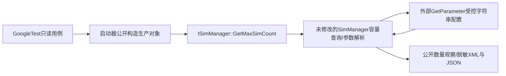

# ISimManager 组件入口核实与批准后的切片

基线：2841c6f60635853a929c1755dc08f5543a89eb83 + 当前工作树。该结论仅指同进程SIM组件间C++边界，不把它标为应用API、稳定对外ABI或独立SA。

- FACT / SOURCE_EVIDENCE：interfaces/innerkits/include/i_sim_manager.h:29–33声明public抽象ISimManager；状态、账户、容量等方法public。services/sim/include/sim_manager.h:43–48的SimManager公开继承它，公开构造(ITelRilManager)及OnInit。
- FACT：不只是SIM内部自用抽象：services/network_search/include/network_search_manager.h:162构造参数接收ISimManager，network_search_handler.cpp:345/:419/:473实际取得并使用；CoreServiceSim持有并调用；frameworks/native/src/core_manager_inner.cpp:40–47装配接口，多个导出查询转发它。interfaces/innerkits/BUILD.gn导出include config；API版本脚本导出CoreManagerInner，但不导出SimManager的构造符号。因此host需编译生产源码target，而非声称既有共享库可直接创建它。
- INFERENCE：在本次批准“公开组件边界”含义下，它是SIM向Core/搜网组件提供的正式接口；不是任意内部控制器调用。但没有公开SA工厂/跨进程获取ISimManager的证明。
- FACT：生产SimManager构造/析构和选定只读GetMaxSimCount方法位于sim_manager.cpp:34–39、:1579附近。启动器可公开构造对象，将引用上转为ISimManager后调用，不读字段、不改访问权限。
- 生命周期：本切片不调用OnInit，因为选定容量查询在当前实现中只依赖参数边界，未引用初始化管理器；此是本版本待实测行为，不是所有ISimManager API可未初始化调用的永久承诺。栈对象在调用后正常析构，每次运行独立进程，无生产worker启动。

## 选择理由与限制

Absent需OnInit：sim_manager.cpp:41–88/:114–152同时启动真实状态、文件、短信、STK、账户和多卡；缺外部EventHandler/DataShare等无法可靠驱动，保持原SIM-B-002 BLOCKED。不为它制造直接状态写入或业务桩。

选择新编号SIM-COMP-001：受控参数配置下的只读槽容量查询。真实sim_manager.cpp、telephony_types.h的参数解析参与；不声称执行状态/账户管理。production target和平台adapter独立；若编译/链接无法只保留实际可支持路径，则如实BLOCKED，不提供内部SimManager方法替身。

未覆盖：Core Service SA注册/发现；Client/Proxy/Stub/Binder IPC；CoreServiceSim入口检查；真实权限/capability；RIL/HDI/Modem、真实SIM、DataShare、State Registry、事件平台、设备/重启行为；Ready/Absent/PIN/账户/多卡隔离。原五条服务入口例保持BLOCKED，组件测试独立编号，不转移它们的PASS状态。

## 实际运行的边界图

生产源和API头直接编译/include，不读取内部字段。源级coverage仅作参与审计，不把内部函数次数当业务正确性判据。当前运行状态见run_record.md：容量切片PASS；原服务/状态/账户场景BLOCKED。
